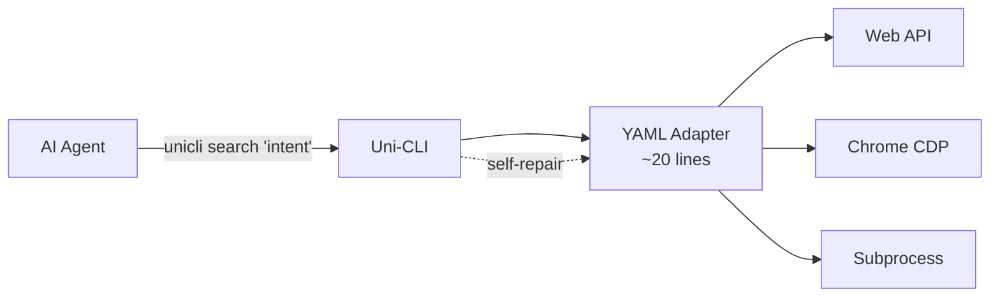
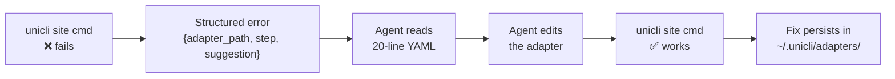
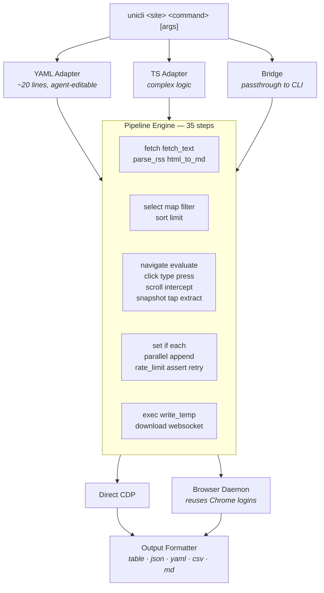

<!-- AGENT: npm install -g @zenalexa/unicli && unicli search "your intent" | hundreds of commands across ~200 sites. JSON when piped. Self-repairing YAML adapters. Bilingual search (EN/ZH). See AGENTS.md for live counts. -->

<div align="center">

<picture>
  <source media="(prefers-color-scheme: dark)" srcset="assets/logo-dark.svg">
  <source media="(prefers-color-scheme: light)" srcset="assets/logo-light.svg">
  
</picture>

<br><br>

**The compiler that turns the internet into CLI commands for AI agents.**

<br>


<a href="https://www.npmjs.com/package/@zenalexa/unicli"></a>
<a href="https://github.com/olo-dot-io/Uni-CLI/actions/workflows/ci.yml"></a>
<a href="./LICENSE"></a>

<br><br>

```
npm install -g @zenalexa/unicli
```

</div>

---

```bash
unicli search "推特热门"                   # Bilingual discovery → twitter trending
unicli hackernews top --limit 5          # Hacker News front page
unicli twitter search "AI agents"        # Twitter (authenticated)
unicli bilibili hot                      # Bilibili trending
unicli blender render scene.blend        # Render a 3D scene
unicli notion search "meeting notes"     # Search Notion
unicli macos screenshot                  # macOS screenshot
unicli ffmpeg compress video.mp4         # Compress video
```

Every command outputs **structured JSON when piped** — zero flags needed. Every error emits structured JSON to stderr with the adapter path, the failing step, and a fix suggestion. Per-call token cost is measured in [`docs/BENCHMARK.md`](docs/BENCHMARK.md) (p50/p95 across categories). Target: beat GitHub MCP 55K cold-start by 30×.



## Key Ideas

**Universal** — <!-- STATS:site_count -->195<!-- /STATS --> sites, 30+ desktop apps, 8 Electron apps, 35 CLI bridges, 51 macOS system commands. One interface: `unicli <site> <command>`.

**Discoverable** — BM25 bilingual search engine. `unicli search "推特热门"` finds `twitter trending`. `unicli search "download video"` finds `bilibili download`. Agents find what they need in one call.

**Self-repairing** — When a site changes its API, the agent reads the ~20 line YAML adapter, fixes it, retries. No human in the loop. Fixes persist across updates.

**Agent-native** — Piped output auto-switches to JSON. Errors are machine-parseable. Exit codes follow `sysexits.h`. The agent doesn't need flags or special handling.

**Cheap** — Per-call token cost is measured in [`docs/BENCHMARK.md`](docs/BENCHMARK.md) (p50/p95 across categories). Target: beat GitHub MCP 55K cold-start by 30×.

## Self-Repair

The core differentiator. When a command breaks, agents fix it themselves:



```bash
unicli repair hackernews top      # Diagnose + suggest fix
unicli test hackernews            # Validate adapter
unicli repair --loop              # Autonomous fix loop
```

Fixes are saved to `~/.unicli/adapters/` and survive `npm update`.

## Supported Platforms

<table><tr><td>

**<!-- STATS:site_count -->195<!-- /STATS --> sites** · **<!-- STATS:command_count -->956<!-- /STATS --> commands** · **<!-- STATS:pipeline_step_count -->31<!-- /STATS --> pipeline steps** · **BM25 bilingual search**

</td></tr></table>

<details open>
<summary><strong>Social Media — 25 sites, 285 commands</strong></summary>
<br>
<table>
  <tr>
    <th>Platform</th>
    <th>Commands</th>
    <th>Description</th>
  </tr>
  <tr>
    <td> <b>Twitter</b></td>
    <td>accept, article, block, bookmark, bookmarks, delete, download, follow, followers, following, hide-reply, like, likes, lists, media, mentions, mute, notifications, pin, post, profile, quotes, reply, reply-dm, retweets, search, spaces, thread, timeline, trending, unblock, unbookmark, unfollow, unmute</td>
    <td>Full Twitter/X: timeline, search, post, DM, media download, bookmarks, lists, Spaces</td>
  </tr>
  <tr>
    <td> <b>Reddit</b></td>
    <td>comment, comments, frontpage, hot, new, popular, read, rising, save, saved, search, subreddit, subscribe, top, trending, upvote, upvoted, user, user-comments, user-posts</td>
    <td>Browse frontpage, subreddits, search, comment, vote, save posts, user profiles</td>
  </tr>
  <tr>
    <td> <b>Instagram</b></td>
    <td>activity, comment, download, explore, follow, followers, following, highlights, like, note, post, profile, reel, reels, reels-trending, save, saved, search, stories, story, suggested, tags, unfollow, unlike, unsave, user</td>
    <td>Profile, stories, reels, explore, post, follow, download media, highlights</td>
  </tr>
  <tr>
    <td> <b>TikTok</b></td>
    <td>comment, explore, follow, following, friends, like, live, notifications, profile, save, search, trending, unfollow, unlike, unsave, user</td>
    <td>Trending, explore, user profiles, post interactions, live streams, search</td>
  </tr>
  <tr>
    <td> <b>Facebook</b></td>
    <td>add-friend, events, feed, friends, groups, join-group, marketplace, memories, notifications, post, profile, search</td>
    <td>Feed, groups, marketplace, events, friends, post, search, memories</td>
  </tr>
  <tr>
    <td> <b>Bluesky</b></td>
    <td>feeds, followers, following, likes, notifications, post, profile, search, starter-packs, thread, trending, user</td>
    <td>Timeline, feeds, post, search, trending, profiles, starter packs</td>
  </tr>
  <tr>
    <td> <b>Medium</b></td>
    <td>article, feed, search, trending, user</td>
    <td>Read articles, search, trending topics, user profiles, RSS feeds</td>
  </tr>
  <tr>
    <td> <b>Threads</b></td>
    <td>hot, search</td>
    <td>Browse hot topics and search Threads</td>
  </tr>
  <tr>
    <td> <b>Mastodon</b></td>
    <td>search, timeline, trending, user</td>
    <td>Public timeline, trending posts, search, user profiles</td>
  </tr>
  <tr>
    <td> <b>Bilibili</b></td>
    <td>coin, comments, download, dynamic, favorites, feed, following, history, hot, later, live, me, ranking, search, subtitle, trending, user-videos</td>
    <td>Hot, ranking, search, download, live, comments, subtitles, user videos, history</td>
  </tr>
  <tr>
    <td> <b>Weibo</b></td>
    <td>comments, feed, hot, me, post, profile, search, timeline, trending, user</td>
    <td>Hot topics, timeline, search, post, profile, comments, trending</td>
  </tr>
  <tr>
    <td> <b>Zhihu</b></td>
    <td>answer, answers, article, articles, collections, columns, comment, download, feed, followers, following, hot, me, notifications, pins, question, search, topic, topics, trending, user</td>
    <td>Hot, search, articles, Q&A, collections, topics, columns, user profiles</td>
  </tr>
  <tr>
    <td> <b>Xiaohongshu</b></td>
    <td>comments, creator-note-detail, creator-notes, creator-notes-summary, creator-profile, creator-stats, download, feed, follow, hashtag, hot, like, note, notifications, profile, publish, save, search, suggest, trending, unfollow, user</td>
    <td>Hot, search, post, download, comments, creator stats, profile, trending</td>
  </tr>
  <tr>
    <td> <b>Douyin</b></td>
    <td>activities, collections, delete, draft, drafts, hashtag, location, profile, publish, stats, update, user-videos, videos</td>
    <td>Profile, videos, collections, publish, stats, hashtags, drafts, location</td>
  </tr>
  <tr>
    <td> <b>Jike</b></td>
    <td>comment, create, feed, like, notifications, post, repost, search, topic, user</td>
    <td>Feed, search, post, comment, like, notifications, topics, user profiles</td>
  </tr>
  <tr>
    <td> <b>Douban</b></td>
    <td>book-hot, download, group-hot, marks, movie-hot, new-movies, photos, reviews, search, subject, top250, tv-hot</td>
    <td>Movie/book/TV hot lists, search, reviews, photos, download, Top 250</td>
  </tr>
  <tr>
    <td> <b>V2EX</b></td>
    <td>daily, hot, latest, me, member, node, nodes, notifications, replies, search, topic, user</td>
    <td>Hot, latest, search, nodes, notifications, user posts, topics, daily digest</td>
  </tr>
  <tr>
    <td> <b>Linux.do</b></td>
    <td>categories, category, feed, hot, latest, search, tags, topic, user-posts, user-topics</td>
    <td>Hot, latest, search, categories, tags, topics, feeds, user content</td>
  </tr>
  <tr>
    <td> <b>WeRead</b></td>
    <td>book, highlights, notebooks, notes, ranking, search, shelf</td>
    <td>Search books, shelf management, highlights, notes, rankings</td>
  </tr>
  <tr>
    <td> <b>Tieba</b></td>
    <td>hot, posts, read, search</td>
    <td>Hot topics, search, read posts</td>
  </tr>
  <tr>
    <td> <b>Zsxq</b></td>
    <td>dynamics, groups, search, topic, topics</td>
    <td>Knowledge communities: groups, search, topics, dynamics</td>
  </tr>
  <tr>
    <td> <b>Xiaoyuzhou</b></td>
    <td>episode, podcast, podcast-episodes</td>
    <td>Podcast episodes and details</td>
  </tr>
  <tr>
    <td> <b>Sinablog</b></td>
    <td>article, hot, search, user</td>
    <td>Sina blog hot, search, articles, user profiles</td>
  </tr>
  <tr>
    <td> <b>Toutiao</b></td>
    <td>hot, search</td>
    <td>Hot topics, search</td>
  </tr>
  <tr>
    <td> <b>Baidu</b></td>
    <td>hot, search</td>
    <td>Hot topics, search</td>
  </tr>
</table>
</details>

<details open>
<summary><strong>Tech & Developer — 19 sites, 82 commands</strong></summary>
<br>
<table>
  <tr>
    <th>Platform</th>
    <th>Commands</th>
    <th>Description</th>
  </tr>
  <tr>
    <td> <b>Hacker News</b></td>
    <td>ask, best, comments, item, jobs, new, search, show, top, user</td>
    <td>Top, new, best, show, ask, jobs, search, comments, user profiles</td>
  </tr>
  <tr>
    <td> <b>Stack Overflow</b></td>
    <td>bounties, hot, question, search, tags, unanswered</td>
    <td>Hot questions, bounties, search, tags, unanswered</td>
  </tr>
  <tr>
    <td> <b>DEV</b></td>
    <td>latest, search, tag, top, user</td>
    <td>Latest, top, search by tag, user articles</td>
  </tr>
  <tr>
    <td> <b>Lobsters</b></td>
    <td>active, hot, newest, search, tag</td>
    <td>Hot, newest, active, search, tag filtering</td>
  </tr>
  <tr>
    <td> <b>Product Hunt</b></td>
    <td>browse, hot, posts, search, today</td>
    <td>Today's launches, hot products, browse, search</td>
  </tr>
  <tr>
    <td> <b>GitHub Trending</b></td>
    <td>daily, developers, weekly</td>
    <td>Daily/weekly trending repos and developers</td>
  </tr>
  <tr>
    <td> <b>Substack</b></td>
    <td>feed, publication, search, trending</td>
    <td>Feed, publication details, search, trending newsletters</td>
  </tr>
  <tr>
    <td> <b>LessWrong</b></td>
    <td>comments, curated, frontpage, new, read, sequences, shortform, tag, tags, top, top-month, top-week, top-year, user, user-posts</td>
    <td>Frontpage, curated, sequences, shortform, tags, top posts by period</td>
  </tr>
  <tr>
    <td> <b>npm</b></td>
    <td>downloads, info, search, versions</td>
    <td>Package search, info, versions, download stats</td>
  </tr>
  <tr>
    <td> <b>PyPI</b></td>
    <td>info, search, versions</td>
    <td>Python package search, info, versions</td>
  </tr>
  <tr>
    <td> <b>crates.io</b></td>
    <td>info, search, versions</td>
    <td>Rust crate search, info, versions</td>
  </tr>
  <tr>
    <td> <b>CocoaPods</b></td>
    <td>info, search</td>
    <td>iOS/macOS pod search and info</td>
  </tr>
  <tr>
    <td> <b>Homebrew</b></td>
    <td>info, search</td>
    <td>macOS package search and info</td>
  </tr>
  <tr>
    <td> <b>GitLab</b></td>
    <td>projects, search, trending</td>
    <td>Projects, search, trending repos</td>
  </tr>
  <tr>
    <td> <b>Gitee</b></td>
    <td>repos, search, trending</td>
    <td>China-based Git hosting: repos, search, trending</td>
  </tr>
  <tr>
    <td> <b>npm trends</b></td>
    <td>compare, trending</td>
    <td>Compare npm package download trends</td>
  </tr>
  <tr>
    <td> <b>Docker Hub</b></td>
    <td>info, search, tags</td>
    <td>Docker image search, info, tags</td>
  </tr>
  <tr>
    <td> <b>Y Combinator</b></td>
    <td>launches</td>
    <td>Y Combinator latest launches</td>
  </tr>
  <tr>
    <td> <b>itch.io</b></td>
    <td>popular, search, top</td>
    <td>Indie games: popular, top rated, search</td>
  </tr>
</table>
</details>

<details open>
<summary><strong>AI & ML — 16 sites, 72 commands</strong></summary>
<br>
<table>
  <tr>
    <th>Platform</th>
    <th>Commands</th>
    <th>Description</th>
  </tr>
  <tr>
    <td> <b>Gemini</b></td>
    <td>ask, deep-research, deep-research-result, image, new</td>
    <td>Google Gemini: ask, deep research, image generation</td>
  </tr>
  <tr>
    <td> <b>Grok</b></td>
    <td>ask</td>
    <td>xAI Grok conversational AI</td>
  </tr>
  <tr>
    <td> <b>DeepSeek</b></td>
    <td>chat, models</td>
    <td>DeepSeek chat and model listing</td>
  </tr>
  <tr>
    <td> <b>Perplexity</b></td>
    <td>ask</td>
    <td>Perplexity AI search-powered answers</td>
  </tr>
  <tr>
    <td> <b>Doubao Web</b></td>
    <td>ask, detail, history, meeting-summary, meeting-transcript, new, read, send, status</td>
    <td>Doubao web: chat, history, meeting summary and transcript</td>
  </tr>
  <tr>
    <td> <b>NotebookLM</b></td>
    <td>current, get, history, list, note-list, notes-get, open, rpc, shared, source-fulltext, source-get, source-guide, source-list, status, summary</td>
    <td>Google NotebookLM: notebooks, sources, notes, summaries</td>
  </tr>
  <tr>
    <td> <b>Yollomi</b></td>
    <td>background, edit, face-swap, generate, models, object-remover, remove-bg, restore, try-on, upload, upscale, video</td>
    <td>AI image generation: face swap, background, try-on, upscale, video</td>
  </tr>
  <tr>
    <td> <b>Jimeng</b></td>
    <td>generate, history</td>
    <td>Jimeng AI image generation and history</td>
  </tr>
  <tr>
    <td> <b>Yuanbao</b></td>
    <td>ask, new, shared</td>
    <td>Tencent Yuanbao AI: ask, new session, shared chats</td>
  </tr>
  <tr>
    <td> <b>Ollama</b></td>
    <td>generate, list, models, ps</td>
    <td>Local LLM: generate, list models, running processes</td>
  </tr>
  <tr>
    <td> <b>OpenRouter</b></td>
    <td>models, search</td>
    <td>Multi-model API: model listing and search</td>
  </tr>
  <tr>
    <td> <b>Hugging Face</b></td>
    <td>datasets, models, spaces, top</td>
    <td>Hugging Face: models, datasets, spaces, trending</td>
  </tr>
  <tr>
    <td> <b>Replicate</b></td>
    <td>run, search, trending</td>
    <td>Run ML models, search, trending models</td>
  </tr>
  <tr>
    <td> <b>MiniMax</b></td>
    <td>chat, models, tts</td>
    <td>MiniMax AI: chat, models, text-to-speech</td>
  </tr>
  <tr>
    <td> <b>Doubao API</b></td>
    <td>ask, new, status</td>
    <td>Doubao API: ask, new session, status</td>
  </tr>
  <tr>
    <td> <b>Novita</b></td>
    <td>generate, models, status</td>
    <td>Novita AI: image generation, models, status</td>
  </tr>
</table>
</details>

<details open>
<summary><strong>Video & Streaming — 8 sites, 29 commands</strong></summary>
<br>
<table>
  <tr>
    <th>Platform</th>
    <th>Commands</th>
    <th>Description</th>
  </tr>
  <tr>
    <td> <b>YouTube</b></td>
    <td>channel, comments, playlist, search, shorts, transcript, trending, video</td>
    <td>Search, trending, video details, shorts, comments, transcripts, playlists</td>
  </tr>
  <tr>
    <td> <b>Twitch</b></td>
    <td>games, search, streams, top</td>
    <td>Top streams, games, search, stream details</td>
  </tr>
  <tr>
    <td> <b>Kuaishou</b></td>
    <td>hot, search</td>
    <td>Kuaishou hot and search</td>
  </tr>
  <tr>
    <td> <b>Douyu</b></td>
    <td>hot, search</td>
    <td>Douyu hot streams and search</td>
  </tr>
  <tr>
    <td> <b>WeChat Channels</b></td>
    <td>hot, search</td>
    <td>WeChat video channel hot and search</td>
  </tr>
  <tr>
    <td> <b>Apple Podcasts</b></td>
    <td>episodes, search, top</td>
    <td>Search, top charts, episode details</td>
  </tr>
  <tr>
    <td> <b>Spotify</b></td>
    <td>now-playing, playlists, search, top-tracks</td>
    <td>Search, now playing, playlists, top tracks</td>
  </tr>
  <tr>
    <td> <b>NetEase Music</b></td>
    <td>hot, playlist, search, top</td>
    <td>NetEase Cloud Music: hot, search, playlists, top charts</td>
  </tr>
</table>
</details>

<details open>
<summary><strong>News & Media — 10 sites, 36 commands</strong></summary>
<br>
<table>
  <tr>
    <th>Platform</th>
    <th>Commands</th>
    <th>Description</th>
  </tr>
  <tr>
    <td> <b>Bloomberg</b></td>
    <td>businessweek, economics, feeds, industries, main, markets, news, opinions, politics, tech</td>
    <td>Markets, tech, politics, economics, opinions, industries, feeds</td>
  </tr>
  <tr>
    <td> <b>Reuters</b></td>
    <td>article, latest, search, top</td>
    <td>Top news, latest, search, article details</td>
  </tr>
  <tr>
    <td> <b>BBC</b></td>
    <td>news, technology, top, world</td>
    <td>Top stories, news, technology, world</td>
  </tr>
  <tr>
    <td> <b>CNN</b></td>
    <td>technology, top</td>
    <td>Top stories, technology news</td>
  </tr>
  <tr>
    <td> <b>NYTimes</b></td>
    <td>search, top</td>
    <td>Top stories, search</td>
  </tr>
  <tr>
    <td> <b>36Kr</b></td>
    <td>article, hot, latest, news, search</td>
    <td>Tech news: hot, latest, search, article details, RSS</td>
  </tr>
  <tr>
    <td> <b>TechCrunch</b></td>
    <td>latest, search</td>
    <td>Latest tech news, search</td>
  </tr>
  <tr>
    <td> <b>The Verge</b></td>
    <td>latest, search</td>
    <td>Latest tech news, search</td>
  </tr>
  <tr>
    <td> <b>InfoQ</b></td>
    <td>articles, latest</td>
    <td>Tech articles, latest news</td>
  </tr>
  <tr>
    <td> <b>IT Home</b></td>
    <td>hot, latest, news</td>
    <td>IT Home: hot, latest, news feed</td>
  </tr>
</table>
</details>

<details open>
<summary><strong>Finance & Trading — 8 sites, 35 commands</strong></summary>
<br>
<table>
  <tr>
    <th>Platform</th>
    <th>Commands</th>
    <th>Description</th>
  </tr>
  <tr>
    <td> <b>Xueqiu</b></td>
    <td>comments, earnings-date, feed, fund-holdings, fund-snapshot, hot, hot-stock, market, quote, search, stock, watchlist</td>
    <td>Stocks, quotes, market, funds, watchlist, hot discussion, search</td>
  </tr>
  <tr>
    <td> <b>Sina Finance</b></td>
    <td>market, news, rolling-news, stock, stock-rank</td>
    <td>Market data, stock quotes, news, stock rankings</td>
  </tr>
  <tr>
    <td> <b>Barchart</b></td>
    <td>flow, greeks, options, quote</td>
    <td>Options flow, greeks, quotes</td>
  </tr>
  <tr>
    <td> <b>Yahoo Finance</b></td>
    <td>quote, search, trending</td>
    <td>Stock quotes, search, trending tickers</td>
  </tr>
  <tr>
    <td> <b>Binance</b></td>
    <td>hot, kline, ticker</td>
    <td>Crypto ticker, hot pairs, kline data</td>
  </tr>
  <tr>
    <td> <b>Futu</b></td>
    <td>hot, quote</td>
    <td>Futu hot stocks, quotes</td>
  </tr>
  <tr>
    <td> <b>Coinbase</b></td>
    <td>prices, rates</td>
    <td>Crypto prices and exchange rates</td>
  </tr>
  <tr>
    <td> <b>Eastmoney</b></td>
    <td>fund, hot, market, search</td>
    <td>Eastmoney: market, hot, search, fund data</td>
  </tr>
</table>
</details>

<details open>
<summary><strong>Shopping & Lifestyle — 14 sites, 39 commands</strong></summary>
<br>
<table>
  <tr>
    <th>Platform</th>
    <th>Commands</th>
    <th>Description</th>
  </tr>
  <tr>
    <td> <b>Amazon</b></td>
    <td>bestsellers, discussion, movers-shakers, new-releases, offer, product, rankings, search</td>
    <td>Product search, details, rankings, bestsellers, offers, reviews</td>
  </tr>
  <tr>
    <td> <b>JD</b></td>
    <td>hot, item, search</td>
    <td>JD.com: product search, item details, hot deals</td>
  </tr>
  <tr>
    <td> <b>Taobao</b></td>
    <td>hot, search</td>
    <td>Taobao hot deals, search</td>
  </tr>
  <tr>
    <td> <b>1688</b></td>
    <td>item, search, store</td>
    <td>1688 wholesale: product search, item details, store listings</td>
  </tr>
  <tr>
    <td> <b>Pinduoduo</b></td>
    <td>hot, search</td>
    <td>Pinduoduo hot deals, search</td>
  </tr>
  <tr>
    <td> <b>SMZDM</b></td>
    <td>article, hot, search</td>
    <td>SMZDM deals: articles, hot, search</td>
  </tr>
  <tr>
    <td> <b>Meituan</b></td>
    <td>hot, search</td>
    <td>Meituan hot deals, search</td>
  </tr>
  <tr>
    <td> <b>Ele.me</b></td>
    <td>hot, search</td>
    <td>Ele.me food delivery: hot, search</td>
  </tr>
  <tr>
    <td> <b>Dianping</b></td>
    <td>hot, search</td>
    <td>Dianping local services: hot, search</td>
  </tr>
  <tr>
    <td> <b>Coupang</b></td>
    <td>add-to-cart, hot, search</td>
    <td>Coupang Korea: search, hot, add to cart</td>
  </tr>
  <tr>
    <td> <b>Ctrip</b></td>
    <td>hot, search</td>
    <td>Ctrip travel: hot, search</td>
  </tr>
  <tr>
    <td> <b>Xianyu</b></td>
    <td>chat, item, search</td>
    <td>Xianyu secondhand: search, item details, chat</td>
  </tr>
  <tr>
    <td> <b>Dangdang</b></td>
    <td>hot, search</td>
    <td>Dangdang books: hot, search</td>
  </tr>
  <tr>
    <td> <b>Maoyan</b></td>
    <td>hot, search</td>
    <td>Maoyan movies: hot, search</td>
  </tr>
</table>
</details>

<details open>
<summary><strong>Jobs & Careers — 2 sites, 18 commands</strong></summary>
<br>
<table>
  <tr>
    <th>Platform</th>
    <th>Commands</th>
    <th>Description</th>
  </tr>
  <tr>
    <td> <b>Boss Zhipin</b></td>
    <td>batchgreet, chatlist, chatmsg, detail, exchange, greet, invite, joblist, mark, recommend, resume, search, send, stats</td>
    <td>Boss Zhipin jobs: search, recommend, resume, chat, greet, stats</td>
  </tr>
  <tr>
    <td> <b>LinkedIn</b></td>
    <td>jobs, profile, search, timeline</td>
    <td>LinkedIn: job search, profile, timeline</td>
  </tr>
</table>
</details>

<details open>
<summary><strong>Education & Reference — 14 sites, 39 commands</strong></summary>
<br>
<table>
  <tr>
    <th>Platform</th>
    <th>Commands</th>
    <th>Description</th>
  </tr>
  <tr>
    <td> <b>Google</b></td>
    <td>news, search, suggest, trends</td>
    <td>Google search, news, suggest, trends</td>
  </tr>
  <tr>
    <td> <b>Wikipedia</b></td>
    <td>random, search, summary, today, trending</td>
    <td>Search, summaries, random articles, today, trending</td>
  </tr>
  <tr>
    <td> <b>arXiv</b></td>
    <td>paper, search, trending</td>
    <td>Academic papers: search, details, trending by category</td>
  </tr>
  <tr>
    <td> <b>CNKI</b></td>
    <td>search</td>
    <td>CNKI academic paper search</td>
  </tr>
  <tr>
    <td> <b>Chaoxing</b></td>
    <td>assignments, exams</td>
    <td>Chaoxing LMS: assignments, exams</td>
  </tr>
  <tr>
    <td> <b>Dictionary</b></td>
    <td>examples, search, synonyms</td>
    <td>Word search, examples, synonyms</td>
  </tr>
  <tr>
    <td> <b>IMDb</b></td>
    <td>box-office, person, reviews, search, title, top, trending</td>
    <td>Movies/TV: search, title, person, reviews, box office, top rated</td>
  </tr>
  <tr>
    <td> <b>PaperReview</b></td>
    <td>feedback, review, submit</td>
    <td>Paper review: submit, review, feedback</td>
  </tr>
  <tr>
    <td> <b>Exchange Rate</b></td>
    <td>convert, list</td>
    <td>Currency conversion, rate listing</td>
  </tr>
  <tr>
    <td> <b>IP Info</b></td>
    <td>lookup</td>
    <td>IP geolocation lookup</td>
  </tr>
  <tr>
    <td> <b>QWeather</b></td>
    <td>forecast, now</td>
    <td>QWeather: current conditions, forecast</td>
  </tr>
  <tr>
    <td> <b>Unsplash</b></td>
    <td>random, search</td>
    <td>Free photos: search, random</td>
  </tr>
  <tr>
    <td> <b>Pexels</b></td>
    <td>curated, search</td>
    <td>Free stock photos: search, curated</td>
  </tr>
  <tr>
    <td> <b>Sspai</b></td>
    <td>hot, latest</td>
    <td>Sspai tech blog: hot, latest</td>
  </tr>
</table>
</details>

<details open>
<summary><strong>Other Web — 14 sites, 56 commands</strong></summary>
<br>
<table>
  <tr>
    <th>Platform</th>
    <th>Commands</th>
    <th>Description</th>
  </tr>
  <tr>
    <td> <b>Ones</b></td>
    <td>enrich-tasks, login, logout, me, my-tasks, resolve-labels, task, task-helpers, tasks, token-info, worklog</td>
    <td>Ones project management: tasks, worklog, team management</td>
  </tr>
  <tr>
    <td> <b>Pixiv</b></td>
    <td>detail, download, illusts, ranking, search, user</td>
    <td>Pixiv illustrations: search, ranking, download, user works</td>
  </tr>
  <tr>
    <td> <b>Hupu</b></td>
    <td>detail, hot, like, mentions, reply, search, unlike</td>
    <td>Hupu sports: hot, search, comments, interactions</td>
  </tr>
  <tr>
    <td> <b>Steam</b></td>
    <td>app-details, new-releases, search, specials, top-sellers, wishlist</td>
    <td>Steam store: search, details, top sellers, deals, wishlists</td>
  </tr>
  <tr>
    <td> <b>Band</b></td>
    <td>bands, mentions, post, posts</td>
    <td>Band community: groups, posts, mentions</td>
  </tr>
  <tr>
    <td> <b>Xiaoe</b></td>
    <td>catalog, content, courses, detail, play-url</td>
    <td>Xiaoe-tech courses: catalog, content, details, playback</td>
  </tr>
  <tr>
    <td> <b>Quark</b></td>
    <td>ls, search</td>
    <td>Quark cloud drive: search, file listing</td>
  </tr>
  <tr>
    <td> <b>Mubu</b></td>
    <td>list, search</td>
    <td>Mubu outlines: search, document listing</td>
  </tr>
  <tr>
    <td> <b>Ke.com</b></td>
    <td>ershoufang, xiaoqu</td>
    <td>Ke.com real estate: secondhand, community listings</td>
  </tr>
  <tr>
    <td> <b>Maimai</b></td>
    <td>search</td>
    <td>Maimai professional network: search</td>
  </tr>
  <tr>
    <td> <b>Feishu</b></td>
    <td>calendar, docs, send, tasks</td>
    <td>Feishu/Lark: calendar, docs, messaging, tasks</td>
  </tr>
  <tr>
    <td> <b>Slock</b></td>
    <td>servers</td>
    <td>Slock IoT: server management</td>
  </tr>
  <tr>
    <td> <b>Jianyu</b></td>
    <td>search</td>
    <td>Jianyu: search</td>
  </tr>
  <tr>
    <td> <b>WeChat</b></td>
    <td>article, download, hot, search</td>
    <td>WeChat public accounts: articles, download, hot, search</td>
  </tr>
</table>
</details>

<details open>
<summary><strong>Desktop Software — 30 apps, 156 commands</strong></summary>
<br>
<table>
  <tr><th colspan="3">3D / CAD</th></tr>
  <tr>
    <th>Platform</th>
    <th>Commands</th>
    <th>Description</th>
  </tr>
  <tr>
    <td> <b>Blender</b></td>
    <td>animation, camera, convert, export, import, info, lighting, materials, objects, render, scene, screenshot, script</td>
    <td>3D modeling: render, scene, camera, lighting, materials, import/export, scripting</td>
  </tr>
  <tr>
    <td> <b>FreeCAD</b></td>
    <td>assembly, bom, boolean, check, convert, export-stl, import, info, macro, measure, mesh, properties, render, section, sketch</td>
    <td>Parametric CAD: assembly, sketch, mesh, measure, render, BOM, macros</td>
  </tr>
  <tr>
    <td> <b>CloudCompare</b></td>
    <td>compare, convert, info, subsample</td>
    <td>Point cloud processing: compare, convert, info, subsample</td>
  </tr>
  <tr>
    <td> <b>Godot</b></td>
    <td>project-run, scene-export</td>
    <td>Game engine: run project, export scene</td>
  </tr>
  <tr>
    <td> <b>RenderDoc</b></td>
    <td>capture-list, frame-export</td>
    <td>GPU debugger: capture list, frame export</td>
  </tr>
</table>
<table>
  <tr><th colspan="3">Image</th></tr>
  <tr>
    <th>Platform</th>
    <th>Commands</th>
    <th>Description</th>
  </tr>
  <tr>
    <td> <b>GIMP</b></td>
    <td>adjust, batch, convert, crop, filter, flip, info, layers, merge-layers, resize, rotate, text</td>
    <td>Image editing: adjust, crop, filter, resize, layers, text, batch convert</td>
  </tr>
  <tr>
    <td> <b>Inkscape</b></td>
    <td>convert, export, optimize</td>
    <td>Vector graphics: convert, export, optimize SVG</td>
  </tr>
  <tr>
    <td> <b>ImageMagick</b></td>
    <td>compare, composite, convert, identify, montage, resize</td>
    <td>Image processing: convert, compare, composite, resize, montage</td>
  </tr>
  <tr>
    <td> <b>Krita</b></td>
    <td>batch, convert, export, info</td>
    <td>Digital painting: batch, convert, export, info</td>
  </tr>
  <tr>
    <td> <b>Sketch</b></td>
    <td>artboards, export, symbols</td>
    <td>UI design: artboards, export, symbols</td>
  </tr>
</table>
<table>
  <tr><th colspan="3">Video / Audio</th></tr>
  <tr>
    <th>Platform</th>
    <th>Commands</th>
    <th>Description</th>
  </tr>
  <tr>
    <td> <b>FFmpeg</b></td>
    <td>compress, concat, convert, extract-audio, gif, normalize, probe, resize, subtitles, thumbnail, trim</td>
    <td>Video/audio: compress, convert, concat, trim, gif, thumbnails, subtitles</td>
  </tr>
  <tr>
    <td> <b>Kdenlive</b></td>
    <td>effects, info, render</td>
    <td>Video editing: effects, info, render</td>
  </tr>
  <tr>
    <td> <b>Shotcut</b></td>
    <td>effects, info, render</td>
    <td>Video editing: effects, info, render</td>
  </tr>
  <tr>
    <td> <b>Audacity</b></td>
    <td>convert, effects, info, mix, normalize, spectrogram, split-channels, trim</td>
    <td>Audio editing: convert, effects, trim, mix, normalize, spectrogram</td>
  </tr>
  <tr>
    <td> <b>MuseScore</b></td>
    <td>convert, export, info, instruments, transpose</td>
    <td>Music notation: convert, export, instruments, transpose</td>
  </tr>
</table>
<table>
  <tr><th colspan="3">Productivity</th></tr>
  <tr>
    <th>Platform</th>
    <th>Commands</th>
    <th>Description</th>
  </tr>
  <tr>
    <td> <b>OBS Studio</b></td>
    <td>record-start, record-stop, scenes, screenshot, sources, status, stream-start, stream-stop</td>
    <td>Streaming/recording: scenes, sources, record, stream, screenshots</td>
  </tr>
  <tr>
    <td> <b>Zotero</b></td>
    <td>add-note, add-tag, collections, export, items, notes, search, tags</td>
    <td>Reference management: collections, items, tags, notes, export, search</td>
  </tr>
  <tr>
    <td> <b>VS Code</b></td>
    <td>extensions, install-ext, open</td>
    <td>Editor: extensions, install extensions, open files</td>
  </tr>
  <tr>
    <td> <b>Obsidian</b></td>
    <td>daily, open, search</td>
    <td>Knowledge base: daily note, open vault, search</td>
  </tr>
  <tr>
    <td> <b>Notion</b></td>
    <td>databases, export, favorites, new, pages, read, screenshot, search, sidebar, status, write</td>
    <td>Workspace: pages, databases, search, read, write, export, favorites</td>
  </tr>
  <tr>
    <td> <b>LibreOffice</b></td>
    <td>convert, print</td>
    <td>Document processing: convert, print</td>
  </tr>
  <tr>
    <td> <b>Pandoc</b></td>
    <td>convert</td>
    <td>Universal document converter</td>
  </tr>
  <tr>
    <td> <b>Draw.io</b></td>
    <td>export</td>
    <td>Diagram editor: export</td>
  </tr>
  <tr>
    <td> <b>Mermaid</b></td>
    <td>render</td>
    <td>Diagram renderer: render Mermaid to image</td>
  </tr>
</table>
<table>
  <tr><th colspan="3">Other</th></tr>
  <tr>
    <th>Platform</th>
    <th>Commands</th>
    <th>Description</th>
  </tr>
  <tr>
    <td> <b>Chrome</b></td>
    <td>bookmarks, tabs</td>
    <td>Browser: bookmarks, tabs</td>
  </tr>
  <tr>
    <td> <b>Zoom</b></td>
    <td>join, start</td>
    <td>Video meetings: join, start</td>
  </tr>
  <tr>
    <td> <b>WireMock</b></td>
    <td>create-stub, delete-stub, reset, stubs, verify</td>
    <td>API mocking: stubs CRUD, request verification, reset</td>
  </tr>
  <tr>
    <td> <b>AdGuard Home</b></td>
    <td>add-rule, rules, stats, status, toggle</td>
    <td>DNS ad blocking: rules, stats, status, toggle</td>
  </tr>
  <tr>
    <td> <b>ComfyUI</b></td>
    <td>generate, history, nodes, status</td>
    <td>Stable Diffusion UI: generate, workflow history, nodes, status</td>
  </tr>
  <tr>
    <td> <b>Slay the Spire II</b></td>
    <td>deck, end-turn, map, play-card, status, use-potion</td>
    <td>Roguelike card game: deck, map, play cards, potions, status</td>
  </tr>
</table>
</details>

<details open>
<summary><strong>Electron Apps — 8 apps, 71 commands</strong></summary>
<br>

All via Chrome DevTools Protocol — no extensions, no hacks.

<table>
  <tr>
    <th>Platform</th>
    <th>Commands</th>
    <th>Description</th>
  </tr>
  <tr>
    <td> <b>Cursor</b></td>
    <td>ask, composer, dump, export, extract-code, history, model, new, read, screenshot, send, status</td>
    <td>AI code editor: ask, compose, read, export, history, screenshots</td>
  </tr>
  <tr>
    <td> <b>Codex</b></td>
    <td>ask, dump, extract-diff, model, new, read, screenshot, send, status</td>
    <td>OpenAI Codex: ask, send, read, diff extraction, screenshots</td>
  </tr>
  <tr>
    <td> <b>ChatGPT</b></td>
    <td>ask, dump, model, new, read, screenshot, send, status</td>
    <td>ChatGPT desktop: ask, send, read, model switch, screenshots</td>
  </tr>
  <tr>
    <td> <b>Notion</b></td>
    <td>databases, export, favorites, new, pages, read, screenshot, search, sidebar, status, write</td>
    <td>Workspace: pages, databases, search, read, write, export, favorites</td>
  </tr>
  <tr>
    <td> <b>Discord</b></td>
    <td>channels, delete, members, read, search, send, servers, status</td>
    <td>Discord: servers, channels, read, send, search, members</td>
  </tr>
  <tr>
    <td> <b>ChatWise</b></td>
    <td>ask, dump, model, new, read, screenshot, send, status</td>
    <td>ChatWise AI: ask, send, read, model switch, screenshots</td>
  </tr>
  <tr>
    <td> <b>Doubao</b></td>
    <td>ask, dump, new, read, screenshot, send, status</td>
    <td>Doubao desktop: ask, send, read, screenshots</td>
  </tr>
  <tr>
    <td> <b>Antigravity</b></td>
    <td>ask, dump, model, new, read, screenshot, send, status</td>
    <td>Antigravity AI: ask, send, read, model switch, screenshots</td>
  </tr>
</table>
</details>

<details open>
<summary><strong>CLI Bridges — 30 tools, 46 commands</strong></summary>
<br>

Passthrough wrappers that normalize output to JSON:

<table>
  <tr>
    <th>Platform</th>
    <th>Commands</th>
    <th>Description</th>
  </tr>
  <tr>
    <td> <b>Docker</b></td>
    <td>build, images, logs, networks, ps, run, volumes</td>
    <td>Container management: ps, build, run, images, volumes, networks, logs</td>
  </tr>
  <tr>
    <td> <b>gh</b></td>
    <td>issue, pr, release, repo, run</td>
    <td>GitHub CLI: issues, PRs, releases, repos, workflow runs</td>
  </tr>
  <tr>
    <td> <b>jq</b></td>
    <td>format, query</td>
    <td>JSON processor: query, format</td>
  </tr>
  <tr>
    <td> <b>yt-dlp</b></td>
    <td>download, extract-audio, info, search</td>
    <td>Video downloader: download, extract audio, info, search</td>
  </tr>
  <tr>
    <td> <b>Vercel</b></td>
    <td>list</td>
    <td>Vercel deployments listing</td>
  </tr>
  <tr>
    <td> <b>Supabase</b></td>
    <td>projects</td>
    <td>Supabase project listing</td>
  </tr>
  <tr>
    <td> <b>Wrangler</b></td>
    <td>list</td>
    <td>Cloudflare Workers listing</td>
  </tr>
  <tr>
    <td> <b>Lark</b></td>
    <td>version</td>
    <td>Lark/Feishu CLI: version info</td>
  </tr>
  <tr>
    <td> <b>DingTalk</b></td>
    <td>version</td>
    <td>DingTalk CLI: version info</td>
  </tr>
  <tr>
    <td> <b>Hugging Face</b></td>
    <td>datasets, models, spaces, top</td>
    <td>Hugging Face: models, datasets, spaces, trending</td>
  </tr>
  <tr>
    <td> <b>Claude Code</b></td>
    <td>version</td>
    <td>Claude Code CLI: version info</td>
  </tr>
  <tr>
    <td> <b>Codex CLI</b></td>
    <td>version</td>
    <td>Codex CLI: version info</td>
  </tr>
  <tr>
    <td> <b>OpenCode</b></td>
    <td>version</td>
    <td>OpenCode CLI: version info</td>
  </tr>
  <tr>
    <td> <b>AWS</b></td>
    <td>s3-ls</td>
    <td>AWS CLI: S3 listing</td>
  </tr>
  <tr>
    <td> <b>GCloud</b></td>
    <td>projects</td>
    <td>Google Cloud: project listing</td>
  </tr>
  <tr>
    <td> <b>Azure</b></td>
    <td>account</td>
    <td>Azure CLI: account info</td>
  </tr>
  <tr>
    <td> <b>DigitalOcean</b></td>
    <td>droplets</td>
    <td>DigitalOcean: droplet listing</td>
  </tr>
  <tr>
    <td> <b>Netlify</b></td>
    <td>sites</td>
    <td>Netlify: site listing</td>
  </tr>
  <tr>
    <td> <b>Railway</b></td>
    <td>deploy</td>
    <td>Railway: deployment</td>
  </tr>
  <tr>
    <td> <b>Fly.io</b></td>
    <td>apps</td>
    <td>Fly.io: app listing</td>
  </tr>
  <tr>
    <td> <b>PlanetScale</b></td>
    <td>databases</td>
    <td>PlanetScale: database listing</td>
  </tr>
  <tr>
    <td> <b>Neon</b></td>
    <td>projects</td>
    <td>Neon: project listing</td>
  </tr>
  <tr>
    <td> <b>Slack</b></td>
    <td>channels, messages, post, search, send, status, users</td>
    <td>Slack workspace: channels, messages, post, search, users, status</td>
  </tr>
</table>
</details>

<details open>
<summary><strong> macOS System — 58 commands</strong></summary>
<br>
<table>
  <tr>
    <th>Category</th>
    <th>Commands</th>
    <th>Description</th>
  </tr>
  <tr>
    <td><b>Audio/Display</b></td>
    <td>volume, brightness, dark-mode, say</td>
    <td>Volume, screen brightness, dark mode, text-to-speech</td>
  </tr>
  <tr>
    <td><b>Power/System</b></td>
    <td>battery, lock-screen, screen-lock, caffeinate, sleep, uptime, system-info</td>
    <td>Battery, lock screen, caffeinate, sleep, uptime, system info</td>
  </tr>
  <tr>
    <td><b>Files/Search</b></td>
    <td>spotlight, disk-info, disk-usage, trash, empty-trash, open, finder-tags, finder-recent, finder-selection, finder-copy, finder-move, finder-new-folder</td>
    <td>Spotlight, disk info, trash, Finder operations, tags</td>
  </tr>
  <tr>
    <td><b>Network</b></td>
    <td>wifi, wifi-info, bluetooth</td>
    <td>Wi-Fi status and info, Bluetooth toggle</td>
  </tr>
  <tr>
    <td><b>Notifications</b></td>
    <td>notify, notification, do-not-disturb</td>
    <td>Send notifications, do-not-disturb toggle</td>
  </tr>
  <tr>
    <td><b>Apps</b></td>
    <td>apps, apps-list, active-app, open-app, safari-tabs, safari-url, safari-history, shortcuts-list, shortcuts-run</td>
    <td>App management, Safari tabs/URL/history, Shortcuts</td>
  </tr>
  <tr>
    <td><b>PIM</b></td>
    <td>calendar-list, calendar-create, calendar-today, contacts-search, mail-send, mail-status, messages-send, reminders-list, reminder-create, reminders-complete</td>
    <td>Calendar, contacts, mail, messages, reminders</td>
  </tr>
  <tr>
    <td><b>Media</b></td>
    <td>music-now, music-control, photos-search, notes-list, notes-search, screenshot, screen-recording, clipboard, processes, wallpaper</td>
    <td>Music playback, photos, notes, screenshots, clipboard, wallpaper</td>
  </tr>
</table>
</details>

<details open>
<summary><strong>Agent Platforms — 5 sites, 9 commands</strong></summary>
<br>
<table>
  <tr>
    <th>Platform</th>
    <th>Commands</th>
    <th>Description</th>
  </tr>
  <tr>
    <td> <b>Hermes</b></td>
    <td>sessions-search, skills-list, skills-read</td>
    <td>Hermes agent: sessions, skills listing</td>
  </tr>
  <tr>
    <td> <b>AutoAgent</b></td>
    <td>eval-run</td>
    <td>AutoAgent evaluation runner</td>
  </tr>
  <tr>
    <td> <b>Stagehand</b></td>
    <td>wrap-observe</td>
    <td>Stagehand browser agent: observe wrapper</td>
  </tr>
  <tr>
    <td> <b>OpenHarness</b></td>
    <td>memory-read, skills-list</td>
    <td>OpenHarness agent: memory, skills</td>
  </tr>
  <tr>
    <td> <b>CUA</b></td>
    <td>bench-list, bench-run</td>
    <td>OpenAI CUA: benchmark listing and execution</td>
  </tr>
</table>
</details>

## Architecture



Remote browser support via `UNICLI_CDP_ENDPOINT` — connect to any CDP WebSocket (Cloudflare Browser Rendering, Browserless, or self-hosted).

## Write an Adapter

Most adapters are ~20 lines of YAML:

```yaml
site: hackernews
name: top
type: web-api
strategy: public
pipeline:
  - fetch:
      url: "https://hacker-news.firebaseio.com/v0/topstories.json"
  - limit: { count: "${{ args.limit | default(30) }}" }
  - each:
      do:
        - fetch:
            url: "https://hacker-news.firebaseio.com/v0/item/${{ item }}.json"
      max: "${{ args.limit | default(30) }}"
  - map:
      title: "${{ item.title }}"
      score: "${{ item.score }}"
      url: "${{ item.url }}"
      by: "${{ item.by }}"
columns: [title, score, by, url]
```

Five adapter types: `web-api`, `desktop`, `browser`, `bridge`, `service`.

29 template filters in a sandboxed VM: `join`, `urlencode`, `truncate`, `slugify`, `sanitize`, `basename`, `strip_html`, `default`, `split`, `first`, `last`, `length`, `keys`, `json`, `replace`, `lowercase`, `uppercase`, `trim`, `slice`, `reverse`, `unique`, `abs`, `round`, `ceil`, `floor`, `int`, `float`, `str`, `ext`.

## Authentication

Five strategies, auto-detected via cascade (`PUBLIC → COOKIE → HEADER`):

| Strategy    | How                                                      |
| ----------- | -------------------------------------------------------- |
| `public`    | Direct HTTP — no credentials                             |
| `cookie`    | Injects cookies from `~/.unicli/cookies/<site>.json`     |
| `header`    | Cookie + auto-extracted CSRF token (ct0, bili_jct, etc.) |
| `intercept` | Navigates page in Chrome, captures XHR/fetch responses   |
| `ui`        | Direct DOM interaction (click, type, submit)             |

```bash
unicli auth setup twitter    # Show required cookies + template
unicli auth check twitter    # Validate cookie file
unicli auth list             # List configured sites
```

## Browser Daemon

Persistent background process that reuses your Chrome login sessions — no cookie export, no extension install:

```bash
unicli daemon status             # Check daemon
unicli operate open <url>        # Navigate
unicli operate state             # DOM accessibility snapshot
unicli operate click <ref>       # Click by ref
unicli operate type <ref> <text> # Type into element
unicli operate eval <js>         # Execute JavaScript
unicli operate screenshot        # Capture page
unicli record <url>              # Auto-generate adapter from traffic
```

13-layer anti-detection stealth: webdriver removal, `chrome.runtime` mock, CDP marker cleanup, `Error.stack` filtering, iframe consistency, and more. Auto-exits after 4h idle.

## Agent Integration

Works with every major agent platform:

```bash
# Claude Code / Codex CLI — direct shell
unicli twitter search "AI agents"

# MCP — one command to expose all 1020 commands
unicli mcp serve

# AGENTS.md — discovery file already included in repo
cat AGENTS.md
```

| Platform         | Integration                                     |
| ---------------- | ----------------------------------------------- |
| **Claude Code**  | Bash tool + MCP server + AGENTS.md              |
| **Codex CLI**    | Shell execution + MCP + AGENTS.md (first-class) |
| **OpenClaw**     | Plugin + MCP + ClawHub skill                    |
| **Hermes Agent** | MCP + Skills Hub + persistent shell             |
| **OpenCode**     | MCP via opencode.jsonc + AGENTS.md              |

```bash
# CLI direct (any agent with shell access)
npm install -g @zenalexa/unicli

# MCP server (Claude Code, Codex CLI, Hermes, OpenCode)
npx @zenalexa/unicli mcp serve

# MCP with SSE transport (remote connections)
npx @zenalexa/unicli mcp serve --transport sse --port 19826

# MCP with OAuth (enterprise)
npx @zenalexa/unicli mcp serve --transport http --auth
```

| Platform           | One-line Setup                                            |
| ------------------ | --------------------------------------------------------- |
| **Claude Code**    | `claude mcp add unicli -- npx @zenalexa/unicli mcp serve` |
| **Codex CLI**      | Add `[mcp_servers.unicli]` to `~/.codex/config.toml`      |
| **Any MCP client** | `npx @zenalexa/unicli mcp serve` (stdio)                  |

The MCP server exposes 4 meta-tools by default (~200 tokens). `unicli_search` provides bilingual semantic search across all 1020 commands.

## Development

```bash
git clone https://github.com/olo-dot-io/Uni-CLI.git && cd Uni-CLI
npm install && npm run verify
```

| Command                | Purpose               |
| ---------------------- | --------------------- |
| `npm run dev`          | Dev run               |
| `npm run build`        | Production build      |
| `npm run typecheck`    | TypeScript strict     |
| `npm run lint`         | Oxlint                |
| `npm run test`         | Unit tests (881)      |
| `npm run test:adapter` | Validate all adapters |
| `npm run verify`       | Full pipeline         |

7 production dependencies: `chalk`, `cli-table3`, `commander`, `js-yaml`, `turndown`, `undici`, `ws`.

## Contributing

The fastest way to contribute: write a [20-line YAML adapter](./CONTRIBUTING.md) for a site you use.

```bash
unicli init <site> <command>     # Scaffold new adapter
unicli dev <path>                # Hot-reload during dev
unicli test <site>               # Validate
```

## Search & Discovery

Agents find commands through bilingual semantic search — no need to memorize site names.

```bash
unicli search "推特热门"              # → twitter trending
unicli search "download video"        # → bilibili download, yt-dlp download, twitter download
unicli search "股票行情"              # → binance ticker, barchart quote, xueqiu quote
unicli search --category finance      # → all finance commands
```

The search engine uses BM25 scoring with a ~200-entry bilingual alias table (Chinese↔English). The entire index is 50KB, searches complete in <10ms.

## License

[Apache-2.0](./LICENSE)

---

<p align="center">
  <a href="https://github.com/olo-dot-io/Uni-CLI/graphs/contributors">
    
  </a>
</p>

<p align="center">
  <sub>v0.211.2 — Vostok · Volynov</sub><br>
  <sub><!-- STATS:site_count -->195<!-- /STATS --> sites · <!-- STATS:command_count -->956<!-- /STATS --> commands · <!-- STATS:pipeline_step_count -->31<!-- /STATS --> pipeline steps · BM25+TF-IDF bilingual search · MCP 2025-03-26 · <!-- STATS:test_count -->987<!-- /STATS --> tests</sub>
</p>
