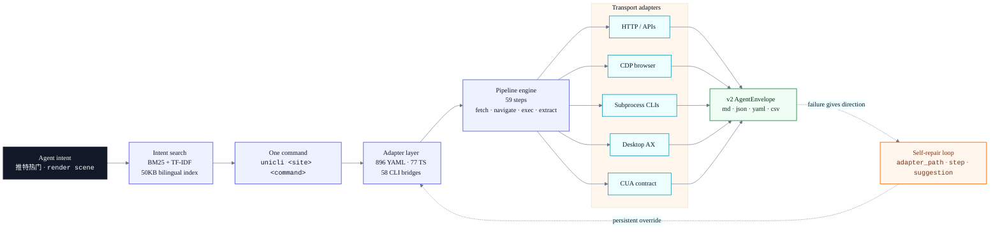

<!-- AGENT: npm install -g @zenalexa/unicli && unicli search "your intent" — 1283 commands across 220 sites. Markdown envelope by default; use -f json for JSON. Self-repairing YAML adapters. Bilingual EN/ZH search. See AGENTS.md for live counts. -->

<div align="center">

<picture>
  <source media="(prefers-color-scheme: dark)" srcset="assets/logo-dark.svg">
  <source media="(prefers-color-scheme: light)" srcset="assets/logo-light.svg">
  
</picture>

<br><br>

**One CLI that lets agents use websites, apps, and your computer.**

Uni-CLI turns a plain-language task into a real command. Agents search, run it, get Markdown/JSON back, and can fix broken site adapters themselves.

<br>


<br>

<a href="https://www.npmjs.com/package/@zenalexa/unicli"></a>
<a href="https://github.com/olo-dot-io/Uni-CLI/actions/workflows/ci.yml"></a>
<a href="./LICENSE"></a>
7160<!-- /STATS -->-44cc11?style=for-the-badge" alt="tests">


<br>

220<!-- /STATS -->_sites-111827?style=for-the-badge" alt="220 sites">
1283<!-- /STATS -->_commands-0f766e?style=for-the-badge" alt="1283 commands">


<br><br>

<pre><code>npm install -g @zenalexa/unicli
unicli search "your intent"
unicli &lt;site&gt; &lt;command&gt; -f json</code></pre>

<br>

<p align="center">
<strong>Web / Social / Knowledge</strong><br>


</p>

<p align="center">
<strong>Agent / IDE / Coding Surfaces</strong><br>


</p>

<p align="center">
<strong>Desktop / Media / DevOps / Cloud</strong><br>


</p>

<table>
  <tr>
    <td><strong>For people</strong><br>Install one binary and use hundreds of sites, apps, CLIs, and OS actions from the terminal.</td>
    <td><strong>For agents</strong><br>Search for a task, run one command, parse one envelope, and repair the YAML when a site changes.</td>
    <td><strong>For maintainers</strong><br>Keep adapters small, readable, testable, and overrideable in <code>~/.unicli/adapters/</code>.</td>
  </tr>
</table>

<br>


</div>

---

## What

Uni-CLI is a universal interface that compiles agent intent into deterministic CLI programs. One binary reaches <!-- STATS:site_count -->220<!-- /STATS --> sites, 30+ desktop apps, 58 CLI bridges, and the local OS — <!-- STATS:command_count -->1283<!-- /STATS --> commands in total. Every adapter is a 20-line YAML pipeline, so agents can read, edit, and re-run them without a compiler.

Coverage is cross-cutting: web APIs and browser automation, desktop subprocesses (ffmpeg, Blender, LibreOffice), macOS system calls (screenshot, clipboard, Calendar), macOS AX, and a pluggable CUA contract with mock/provider stubs — all behind the same `unicli <site> <command>` surface. Output is a v2 AgentEnvelope in Markdown by default; use `-f json` for JSON, `-f yaml` for YAML, or legacy `csv` / `compact` when needed. Errors include the adapter path, the failing step, and a suggestion — enough directional feedback for an agent to fix the adapter and retry.

Self-repair is a first-class capability. When a site changes its API, an agent reads the 20-line YAML, edits the selector or endpoint, saves to `~/.unicli/adapters/`, and retries. Fixes survive `npm update`. No human in the loop.

## Why

Large tool catalogs make agents pay before they act: descriptions, schemas, examples, auth notes, and edge cases all compete with task context. Uni-CLI keeps the catalog out of context by default. The agent searches by intent, receives one executable command, then gets a small v2 envelope with enough structure to retry or repair.

The agent stack is not converging on one universal runtime. It is converging on mixed native CLIs, JSON streams, MCP tool buses, editor-owned sessions, bridge control planes, and watchlist runtimes. Uni-CLI treats those as routes, not factions: native CLI/JSON/MCP first, editor gateways only where they are the right compatibility edge.

Uni-CLI is the execution layer for that world. The MCP server exposes 4 meta-tools (~200 tokens cold-start) — `unicli_run`, `unicli_list`, `unicli_search`, `unicli_explore` — and the agent pulls the exact tool it needs via BM25 bilingual search over a 50KB index. Direct shell access costs no tool-catalog tokens and one deterministic subprocess per call.

## Quick start

Five minutes, top-to-bottom:

```bash
# 1. Install
npm install -g @zenalexa/unicli

# 2. Discover
unicli list                                   # all sites + commands
unicli search "推特热门"                       # → twitter trending (bilingual)

# 3. Run
unicli reddit hot --limit 3                   # zero-config web API
unicli hackernews top -f json | jq '.data[].title' # pipe + transform

# 4. Wire into an agent
claude mcp add unicli -- npx @zenalexa/unicli mcp serve   # Claude Code (MCP stdio)
unicli mcp serve --transport streamable --port 19826      # Any MCP client (HTTP)
unicli acp                                                # avante.nvim / Zed (ACP)
```

Full walkthrough with 5 worked examples: [`docs/QUICKSTART.md`](docs/QUICKSTART.md).

## Architecture



Seven TransportAdapters, one adapter layer, one formatter. Adapters are declarative YAML by default (Rice-decidable, no imports) and TypeScript when a site genuinely needs it. The full step reference lives in [`docs/ADAPTER-FORMAT.md`](docs/ADAPTER-FORMAT.md).

## Self-repair

When a command breaks:

```
unicli <site> <cmd> fails
  → structured error envelope on stderr
    { adapter_path, step, action, suggestion }
  → agent opens the ~20-line YAML
  → agent edits the selector / URL / auth
  → unicli <site> <cmd> works
  → fix persists in ~/.unicli/adapters/ (survives npm update)
```

```bash
unicli repair hackernews top      # Diagnose + suggest fix
unicli test hackernews            # Validate adapter
unicli repair --loop              # Autonomous fix loop
```

Exit codes follow `sysexits.h`: `0` ok, `66` empty, `69` unavailable, `75` temporary, `77` auth, `78` config. Agents parse those directly — no regex over human error text.

## Feature matrix

| Capability               | What it means                                                                                                           |
| ------------------------ | ----------------------------------------------------------------------------------------------------------------------- |
| **CUA contract**         | Stable screenshot/action interface with mock backend and explicit provider stubs; not marketed as real computer-use yet |
| **MCP transports**       | stdio · Streamable HTTP (spec 2025-11-25) · SSE · OAuth 2.1 PKCE                                                        |
| **Agent backend matrix** | `unicli agents matrix/recommend` covers native CLIs, JSON streams, MCP sessions, bridges, editors, and watchlist agents |
| **ACP gateway**          | `unicli acp` remains available for avante.nvim/Zed-style clients, not the core runtime                                  |
| **Cross-vendor skills**  | Skills in `skills/` work in Claude Code, OpenCode, Codex, Cursor, Cline                                                 |
| **Self-repair envelope** | Every error ships `adapter_path` + `step` + `suggestion` (Banach-convergent)                                            |
| **Bilingual search**     | BM25 + TF-IDF, 50KB index, <10ms queries, 200-entry ZH↔EN alias table                                                   |
| **Browser operator**     | Extension-backed browser daemon with shared or isolated workspaces, background mode, bind/sessions                      |

Reproducible local benchmarks (p50/p95 token and latency by route): [`docs/BENCHMARK.md`](docs/BENCHMARK.md).

## Platform coverage

<!-- STATS:site_count -->220<!-- /STATS --> sites · <!-- STATS:command_count -->1283<!-- /STATS --> commands — the live list is auto-generated in [`AGENTS.md`](AGENTS.md) and split by domain:

| Domain                | Highlights                                                              |
| --------------------- | ----------------------------------------------------------------------- |
| **Social (25)**       | twitter, reddit, instagram, tiktok, xiaohongshu, bilibili, zhihu, weibo |
| **Tech (19)**         | hackernews, stackoverflow, producthunt, github-trending, npm, pypi      |
| **News (11)**         | bbc, reuters, bloomberg, nytimes, techcrunch, 36kr                      |
| **Finance (8)**       | xueqiu, yahoo-finance, eastmoney, binance, coinbase                     |
| **AI / ML (14)**      | huggingface, ollama, replicate, perplexity, deepseek, doubao            |
| **Desktop (30+)**     | blender, ffmpeg, imagemagick, gimp, freecad, musescore, kdenlive        |
| **macOS system (58)** | screenshot, clipboard, Calendar, Mail, Reminders, Shortcuts, Safari     |
| **CLI bridges (58)**  | claude, codex, gemini, qwen, kiro, opencode, aider, goose, mini, amp    |

Run `unicli list` for the live catalog, or `unicli list --category=<domain>` to filter.

## Agent integration

Every major agent platform works out of the box:

| Platform        | One-liner                                                  | Notes                                     |
| --------------- | ---------------------------------------------------------- | ----------------------------------------- |
| **Claude Code** | `claude mcp add unicli -- npx @zenalexa/unicli mcp serve`  | 4 meta-tools, stdio                       |
| **Codex CLI**   | Add `[mcp_servers.unicli]` to `~/.codex/config.toml`       | First-class AGENTS.md citizen             |
| **Cursor**      | MCP Settings → `unicli` → `npx @zenalexa/unicli mcp serve` | Bilingual search works inside Cursor chat |
| **avante.nvim** | `type = "acp", command = "unicli", args = { "acp" }`       | See [`docs/AVANTE.md`](docs/AVANTE.md)    |
| **OpenCode**    | MCP via `opencode.jsonc` — `command: "unicli mcp serve"`   | AGENTS.md auto-loaded                     |
| **Kiro CLI**    | Add `npx @zenalexa/unicli mcp serve` as an MCP server      | Amazon Q CLI successor path               |
| **Cline / Roo** | Add Uni-CLI in MCP settings                                | Editor owns the session                   |

Direct shell access (any agent with Bash or exec):

```bash
unicli agents matrix
unicli agents recommend cursor
unicli twitter search "AI agents"
unicli blender render scene.blend --output /tmp/frame.png
unicli macos screenshot --region 0,0,1920,1080
```

## Authentication

Five auth strategies, auto-probed in a cascade (`public → cookie → header`):

| Strategy    | How                                                    |
| ----------- | ------------------------------------------------------ |
| `public`    | Direct HTTP, no credentials                            |
| `cookie`    | `~/.unicli/cookies/<site>.json` injected into headers  |
| `header`    | Cookie + auto-extracted CSRF (ct0, bili_jct, …)        |
| `intercept` | Chrome navigates, Uni-CLI captures XHR/fetch responses |
| `ui`        | Direct DOM interaction via CDP (click, type, submit)   |

```bash
unicli auth setup twitter    # Print required cookies + target path
unicli auth check twitter    # Validate cookie file
unicli auth list             # All configured sites
```

The browser operator has two layers:

- `unicli browser start` manages a local Chrome/CDP launch path for cookie extraction and direct CDP use.
- `unicli browser ...` / `unicli daemon ...` route through the local browser daemon plus Browser Bridge extension, with explicit workspace reuse, `--daemon-port` multi-profile routing, background/focus controls, and live session diagnostics.

For agent-style interactive browsing, prefer:

```bash
unicli browser open https://example.com
unicli browser state
unicli browser find --css "button, a"
unicli browser network --raw
unicli browser extract
```

## Write an adapter

Most adapters are ~20 lines of YAML. No TypeScript, no build step, no imports:

```yaml
site: hackernews
name: top
type: web-api
strategy: public
pipeline:
  - fetch:
      url: "https://hacker-news.firebaseio.com/v0/topstories.json"
  - limit: { count: "${{ args.limit | default(30) }}" }
  - each:
      do:
        - fetch:
            url: "https://hacker-news.firebaseio.com/v0/item/${{ item }}.json"
  - map:
      title: "${{ item.title }}"
      score: "${{ item.score }}"
      url: "${{ item.url }}"
columns: [title, score, url]
```

Five adapter types: `web-api`, `desktop`, `browser`, `bridge`, `service`. 29 template filters (`join`, `urlencode`, `truncate`, `slugify`, `default`, `json`, …) run in a sandboxed VM.

Scaffold, dev, test:

```bash
unicli init <site> <command>     # Scaffold new adapter
unicli dev <path>                # Hot-reload during dev
unicli test <site>               # Validate
unicli record <url>              # Auto-generate adapter from traffic
```

Full reference: [`docs/ADAPTER-FORMAT.md`](docs/ADAPTER-FORMAT.md). Existing YAML adapters can be imported with `unicli import opencli-yaml`.

## Search

Agents find commands by intent, bilingual:

```bash
unicli search "推特热门"            # → twitter trending
unicli search "download video"      # → bilibili download, yt-dlp download, twitter download
unicli search "股票行情"            # → binance ticker, xueqiu quote, barchart quote
unicli search --category finance    # browse by category
```

BM25 + TF-IDF scoring with a 200-entry ZH↔EN alias table. The index is 50KB, queries complete in under 10ms.

## Design principles + benchmarks

The design rests on five operational principles:

1. **Rice's restriction** — every adapter has decidable semantics (YAML pipeline, no Turing-complete logic).
2. **Lehman's mandate** — no adapter is permanent; self-repair is first-class.
3. **Shannon's compression** — CLI invocations are near-optimal compression of the underlying API call.
4. **Agent tool trilemma (original)** — coverage × accuracy × performance, pick two. We choose accuracy × performance.
5. **Banach convergence** — structured errors must provide directional feedback (`adapter_path` + `step` + `suggestion`) so repair iterations converge.

Full treatment: [`docs/THEORY.md`](docs/THEORY.md). Reproducible local benchmarks: [`docs/BENCHMARK.md`](docs/BENCHMARK.md).

## Development

```bash
git clone https://github.com/olo-dot-io/Uni-CLI.git && cd Uni-CLI
npm install
npm run verify     # typecheck + lint + test + build + stats check
```

| Command                | Purpose                                                   |
| ---------------------- | --------------------------------------------------------- |
| `npm run dev`          | Run from source                                           |
| `npm run build`        | Production build                                          |
| `npm run typecheck`    | TypeScript strict                                         |
| `npm run lint`         | Oxlint                                                    |
| `npm run test`         | Unit tests (<!-- STATS:test_count -->7160<!-- /STATS -->) |
| `npm run test:adapter` | Validate all adapters                                     |
| `npm run verify`       | Full pipeline (7 gates)                                   |

Eleven production dependencies: `ajv`, `ajv-formats`, `chalk`, `cli-table3`, `commander`, `js-yaml`, `jsonpath-plus`, `turndown`, `undici`, `ws`, `zod`.

## Release cadence

Patches ship every **Friday 09:00 HKT** when substantive commits have landed since the last tag. Quiet weeks are recorded and skipped — silence is success, not failure. Dependabot bumps are grouped into one PR per Monday so they ride along in the Friday cut without flooding the commit log.

<a href="https://github.com/olo-dot-io/Uni-CLI/commits/main"></a>

Full policy — manual overrides, cancellation procedure, escalation rules: [`docs/RELEASE-CADENCE.md`](docs/RELEASE-CADENCE.md).

## Contributing

The fastest path to a merged PR: write a 20-line YAML adapter for a site you use every day. Per-domain guides live in [`contributing/`](contributing/):

| Area             | Guide                                                    |
| ---------------- | -------------------------------------------------------- |
| New adapter      | [`contributing/adapter.md`](contributing/adapter.md)     |
| New transport    | [`contributing/transport.md`](contributing/transport.md) |
| CUA backend      | [`contributing/cua.md`](contributing/cua.md)             |
| MCP server       | [`contributing/mcp.md`](contributing/mcp.md)             |
| ACP integration  | [`contributing/acp.md`](contributing/acp.md)             |
| Release process  | [`contributing/release.md`](contributing/release.md)     |
| Schema migration | [`contributing/schema.md`](contributing/schema.md)       |

## License

[Apache-2.0](./LICENSE)

Repo: <https://github.com/olo-dot-io/Uni-CLI> · npm: [`@zenalexa/unicli`](https://www.npmjs.com/package/@zenalexa/unicli) · Issues welcome.

---

<p align="center">
  <a href="https://github.com/olo-dot-io/Uni-CLI/graphs/contributors">
    
  </a>
</p>

<p align="center">
  <sub>v0.215.1</sub>
</p>
