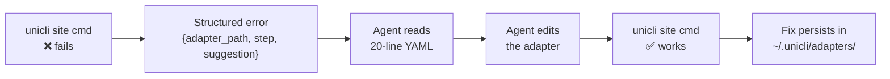
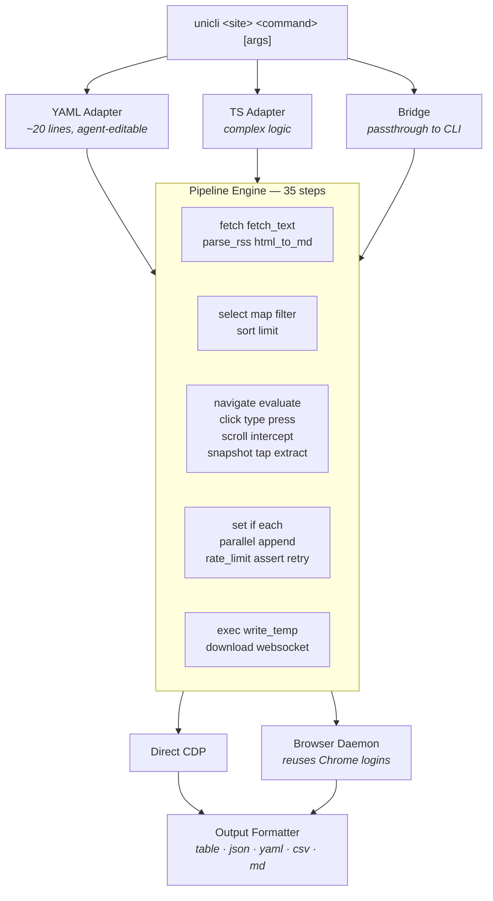

<!-- AGENT: npm install -g @zenalexa/unicli && unicli list | 756 commands across 167 sites. JSON when piped. Self-repairing YAML adapters. unicli repair --loop for autonomous fix. See AGENTS.md -->

<h1 align="center">Uni-CLI</h1>

<p align="center">
  <strong>CLI is all agents need.</strong><br>
  <sub>One command to control any website, desktop app, or local tool — with structured JSON output and self-repairing adapters.</sub>
</p>

<p align="center">
  <a href="https://github.com/olo-dot-io/Uni-CLI/actions/workflows/ci.yml"></a>
  <a href="https://www.npmjs.com/package/@zenalexa/unicli"></a>
  <a href="https://www.npmjs.com/package/@zenalexa/unicli"></a>
  <a href="https://nodejs.org"></a>
  <a href="./LICENSE"></a>
  
</p>

<p align="center">
  <code>npm install -g @zenalexa/unicli</code>
</p>

---

```bash
unicli hackernews top --limit 5          # Hacker News front page
unicli twitter search "AI agents"        # Twitter (authenticated)
unicli bilibili hot                      # Bilibili trending
unicli blender render scene.blend        # Render a 3D scene
unicli cursor ask "explain this code"    # Talk to Cursor IDE
unicli notion search "meeting notes"     # Search Notion
unicli obs scene set "Camera 2"          # Switch OBS scene
unicli ffmpeg compress video.mp4         # Compress video
```

Every command outputs **structured JSON when piped** — zero flags needed. Every error emits structured JSON to stderr with the adapter path, the failing step, and a fix suggestion. **~80 tokens per call.**

## Key Ideas

**Universal** — 167 sites, 28 desktop apps, 8 Electron apps, 23 CLI bridges. One interface: `unicli <site> <command>`.

**Self-repairing** — When a site changes its API, the agent reads the ~20 line YAML adapter, fixes it, retries. No human in the loop. Fixes persist across updates.

**Agent-native** — Piped output auto-switches to JSON. Errors are machine-parseable. Exit codes follow `sysexits.h`. The agent doesn't need flags or special handling.

**Cheap** — ~80 tokens per CLI invocation vs 550–1,400 tokens for an MCP tool definition. Two orders of magnitude cheaper in context window cost.

## Self-Repair

The core differentiator. When a command breaks, agents fix it themselves:



```bash
unicli repair hackernews top      # Diagnose + suggest fix
unicli test hackernews            # Validate adapter
unicli repair --loop              # Autonomous fix loop
```

Fixes are saved to `~/.unicli/adapters/` and survive `npm update`.

## Coverage

<details open>
<summary><strong>Web Platforms — 67 sites</strong></summary>

| Category           | Sites                                                                                                                     |
| ------------------ | ------------------------------------------------------------------------------------------------------------------------- |
| **Tech / Dev**     | hackernews, stackoverflow, devto, lobsters, producthunt, hf, github-trending, substack, lesswrong                         |
| **Social**         | twitter (25 cmds), reddit (16), instagram (19), tiktok (15), facebook (10), bluesky, medium                               |
| **Chinese Social** | bilibili (13), weibo, zhihu, xiaohongshu (13), douyin (13), jike, douban, weread, tieba, v2ex, linux-do, zsxq, xiaoyuzhou |
| **Video / Media**  | youtube (5), bilibili, douyin, tiktok                                                                                     |
| **Finance**        | xueqiu, sinafinance, barchart, yahoo-finance                                                                              |
| **News**           | bbc, bloomberg (10), reuters, 36kr, google news                                                                           |
| **Shopping**       | amazon (8), xianyu, coupang, smzdm, jd                                                                                    |
| **Jobs**           | boss (14), linkedin                                                                                                       |
| **AI Platforms**   | gemini (5), grok, doubao-web (9), notebooklm (15), yollomi (12), jimeng, yuanbao                                          |
| **Education**      | chaoxing, arxiv, wikipedia                                                                                                |
| **Other**          | ones (11), band, xiaoe, pixiv (6), hupu (7), ctrip, sinablog, steam                                                       |

</details>

<details>
<summary><strong>Desktop Software — 28 apps</strong></summary>

| Category          | Apps                                                                |
| ----------------- | ------------------------------------------------------------------- |
| **3D / CAD**      | blender (13 cmds), freecad (15), cloudcompare (4), openscad         |
| **Image**         | gimp (12), inkscape, imagemagick (6), krita (4)                     |
| **Video / Audio** | ffmpeg (11), kdenlive (3), shotcut (3), audacity (8), musescore (5) |
| **Diagram**       | drawio, mermaid                                                     |
| **Document**      | libreoffice, pandoc                                                 |
| **Streaming**     | obs (8, WebSocket)                                                  |
| **Productivity**  | zotero (8)                                                          |
| **Dev Services**  | wiremock (5), adguardhome (5), novita (3)                           |
| **Other**         | slay-the-spire-ii (6), sketch (3)                                   |

</details>

<details>
<summary><strong>Electron Apps — 8 apps, 66 commands</strong></summary>

All via Chrome DevTools Protocol — no extensions, no hacks.

| App             | Commands                                                                                       | Port |
| --------------- | ---------------------------------------------------------------------------------------------- | ---- |
| **Cursor**      | ask, send, read, model, composer, extract-code, new, status, screenshot, dump, history, export | 9226 |
| **Codex**       | ask, send, read, model, extract-diff, new, status, screenshot, dump, history, export           | 9222 |
| **ChatGPT**     | ask, send, read, model, new, status, screenshot, dump                                          | 9236 |
| **Notion**      | search, read, write, new, status, sidebar, favorites, export, screenshot                       | 9230 |
| **Discord**     | servers, channels, read, send, search, members, status                                         | 9232 |
| **ChatWise**    | ask, send, read, model, new, status, screenshot, dump                                          | 9228 |
| **Doubao**      | ask, send, read, new, status, screenshot, dump                                                 | 9225 |
| **Antigravity** | ask, send, read, model, new, status, screenshot, dump                                          | 9234 |

</details>

<details>
<summary><strong>CLI Bridges — 23 tools</strong></summary>

Passthrough wrappers that normalize output to JSON:

docker, gh, jq, yt-dlp, vercel, supabase, wrangler, lark, dingtalk, hf, claude-code, codex-cli, opencode, aws, gcloud, az, doctl, netlify, railway, flyctl, pscale, neonctl, slack

</details>

## Architecture



## Write an Adapter

Most adapters are ~20 lines of YAML:

```yaml
site: hackernews
name: top
type: web-api
strategy: public
pipeline:
  - fetch:
      url: "https://hacker-news.firebaseio.com/v0/topstories.json"
  - limit: { count: "${{ args.limit | default(30) }}" }
  - each:
      do:
        - fetch:
            url: "https://hacker-news.firebaseio.com/v0/item/${{ item }}.json"
      max: "${{ args.limit | default(30) }}"
  - map:
      title: "${{ item.title }}"
      score: "${{ item.score }}"
      url: "${{ item.url }}"
      by: "${{ item.by }}"
columns: [title, score, by, url]
```

Five adapter types: `web-api`, `desktop`, `browser`, `bridge`, `service`.

29 template filters in a sandboxed VM: `join`, `urlencode`, `truncate`, `slugify`, `sanitize`, `basename`, `strip_html`, `default`, `split`, `first`, `last`, `length`, `keys`, `json`, `replace`, `lowercase`, `uppercase`, `trim`, `slice`, `reverse`, `unique`, `abs`, `round`, `ceil`, `floor`, `int`, `float`, `str`, `ext`.

## Authentication

Five strategies, auto-detected via cascade (`PUBLIC → COOKIE → HEADER`):

| Strategy    | How                                                      |
| ----------- | -------------------------------------------------------- |
| `public`    | Direct HTTP — no credentials                             |
| `cookie`    | Injects cookies from `~/.unicli/cookies/<site>.json`     |
| `header`    | Cookie + auto-extracted CSRF token (ct0, bili_jct, etc.) |
| `intercept` | Navigates page in Chrome, captures XHR/fetch responses   |
| `ui`        | Direct DOM interaction (click, type, submit)             |

```bash
unicli auth setup twitter    # Show required cookies + template
unicli auth check twitter    # Validate cookie file
unicli auth list             # List configured sites
```

## Browser Daemon

Persistent background process that reuses your Chrome login sessions — no cookie export, no extension install:

```bash
unicli daemon status             # Check daemon
unicli operate open <url>        # Navigate
unicli operate state             # DOM accessibility snapshot
unicli operate click <ref>       # Click by ref
unicli operate type <ref> <text> # Type into element
unicli operate eval <js>         # Execute JavaScript
unicli operate screenshot        # Capture page
unicli record <url>              # Auto-generate adapter from traffic
```

13-layer anti-detection stealth: webdriver removal, `chrome.runtime` mock, CDP marker cleanup, `Error.stack` filtering, iframe consistency, and more. Auto-exits after 4h idle.

## MCP Server

For MCP-only environments:

```bash
unicli mcp serve    # All 756 commands become MCP tools
```

## Development

```bash
git clone https://github.com/olo-dot-io/Uni-CLI.git && cd Uni-CLI
npm install && npm run verify
```

| Command                | Purpose                   |
| ---------------------- | ------------------------- |
| `npm run dev`          | Dev run                   |
| `npm run build`        | Production build          |
| `npm run typecheck`    | TypeScript strict         |
| `npm run lint`         | Oxlint                    |
| `npm run test`         | Unit tests (775)          |
| `npm run test:adapter` | Validate all 601 adapters |
| `npm run verify`       | Full pipeline             |

7 production dependencies: `chalk`, `cli-table3`, `commander`, `js-yaml`, `turndown`, `undici`, `ws`.

## Contributing

The fastest way to contribute: write a [20-line YAML adapter](./CONTRIBUTING.md) for a site you use.

```bash
unicli init <site> <command>     # Scaffold new adapter
unicli dev <path>                # Hot-reload during dev
unicli test <site>               # Validate
```

## License

[Apache-2.0](./LICENSE)

---

<p align="center">
  <a href="https://github.com/olo-dot-io/Uni-CLI/graphs/contributors">
    
  </a>
</p>

<p align="center">
  <sub>v0.209.0 — Vostok · Popovich</sub><br>
  <sub>167 sites · 756 commands · 35 pipeline steps · 29 filters · 775 tests</sub>
</p>
