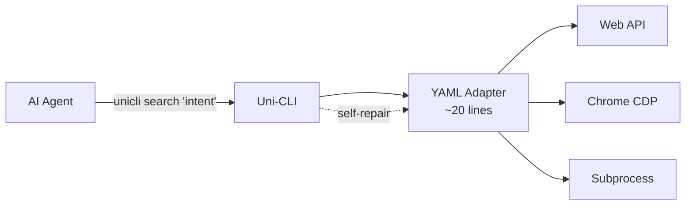
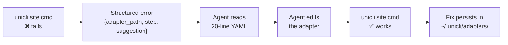
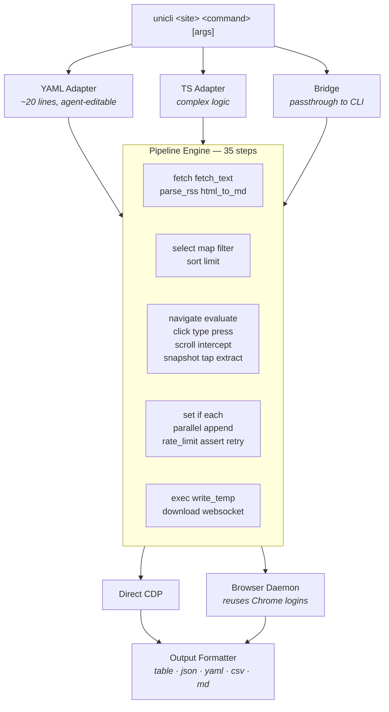

<!-- AGENT: npm install -g @zenalexa/unicli && unicli search "your intent" | 1020 commands across 198 sites. JSON when piped. Self-repairing YAML adapters. Bilingual search (EN/ZH). See AGENTS.md -->

<div align="center">

<picture>
  <source media="(prefers-color-scheme: dark)" srcset="assets/logo-dark.svg">
  <source media="(prefers-color-scheme: light)" srcset="assets/logo-light.svg">
  
</picture>

<br><br>

**The compiler that turns the internet into CLI commands for AI agents.**

<br>


<a href="https://www.npmjs.com/package/@zenalexa/unicli"></a>
<a href="https://github.com/olo-dot-io/Uni-CLI/actions/workflows/ci.yml"></a>
<a href="./LICENSE"></a>

<br><br>

```
npm install -g @zenalexa/unicli
```

</div>

---

```bash
unicli search "推特热门"                   # Bilingual discovery → twitter trending
unicli hackernews top --limit 5          # Hacker News front page
unicli twitter search "AI agents"        # Twitter (authenticated)
unicli bilibili hot                      # Bilibili trending
unicli blender render scene.blend        # Render a 3D scene
unicli notion search "meeting notes"     # Search Notion
unicli macos screenshot                  # macOS screenshot
unicli ffmpeg compress video.mp4         # Compress video
```

Every command outputs **structured JSON when piped** — zero flags needed. Every error emits structured JSON to stderr with the adapter path, the failing step, and a fix suggestion. **~80 tokens per call.**



## Key Ideas

**Universal** — 198 sites, 30+ desktop apps, 8 Electron apps, 35 CLI bridges, 51 macOS system commands. One interface: `unicli <site> <command>`.

**Discoverable** — BM25 bilingual search engine. `unicli search "推特热门"` finds `twitter trending`. `unicli search "download video"` finds `bilibili download`. Agents find what they need in one call.

**Self-repairing** — When a site changes its API, the agent reads the ~20 line YAML adapter, fixes it, retries. No human in the loop. Fixes persist across updates.

**Agent-native** — Piped output auto-switches to JSON. Errors are machine-parseable. Exit codes follow `sysexits.h`. The agent doesn't need flags or special handling.

**Cheap** — ~80 tokens per CLI invocation vs 55,000 tokens for an MCP tool catalog. Three orders of magnitude cheaper in context window cost.

## Self-Repair

The core differentiator. When a command breaks, agents fix it themselves:



```bash
unicli repair hackernews top      # Diagnose + suggest fix
unicli test hackernews            # Validate adapter
unicli repair --loop              # Autonomous fix loop
```

Fixes are saved to `~/.unicli/adapters/` and survive `npm update`.

## Supported Platforms

<table><tr><td>

**198 sites** · **1020 commands** · **35 pipeline steps** · **BM25 bilingual search**

</td></tr></table>

<!-- =========================== -->
<!--    WEB — SOCIAL MEDIA       -->
<!-- =========================== -->

<details open>
<summary><strong>Social Media — 25 sites</strong></summary>
<br>
<table>
  <tr>
    <td> <b>Twitter</b> <sup>35</sup></td>
    <td> <b>Reddit</b> <sup>20</sup></td>
    <td> <b>Instagram</b> <sup>26</sup></td>
    <td> <b>TikTok</b> <sup>16</sup></td>
  </tr>
  <tr>
    <td> <b>Facebook</b> <sup>12</sup></td>
    <td> <b>Bluesky</b> <sup>12</sup></td>
    <td> <b>Medium</b> <sup>5</sup></td>
    <td> <b>Threads</b> <sup>2</sup></td>
  </tr>
  <tr>
    <td> <b>Mastodon</b> <sup>4</sup></td>
    <td> <b>Bilibili</b> <sup>18</sup></td>
    <td> <b>Weibo</b> <sup>10</sup></td>
    <td> <b>Zhihu</b> <sup>21</sup></td>
  </tr>
  <tr>
    <td> <b>Xiaohongshu</b> <sup>24</sup></td>
    <td> <b>Douyin</b> <sup>23</sup></td>
    <td> <b>Jike</b> <sup>10</sup></td>
    <td> <b>Douban</b> <sup>12</sup></td>
  </tr>
  <tr>
    <td> <b>V2EX</b> <sup>12</sup></td>
    <td> <b>Linux.do</b> <sup>10</sup></td>
    <td> <b>WeRead</b> <sup>7</sup></td>
    <td> <b>Tieba</b> <sup>4</sup></td>
  </tr>
  <tr>
    <td> <b>Zsxq</b> <sup>5</sup></td>
    <td> <b>Xiaoyuzhou</b> <sup>3</sup></td>
    <td> <b>Sinablog</b> <sup>4</sup></td>
    <td> <b>Toutiao</b> <sup>2</sup></td>
  </tr>
  <tr>
    <td> <b>Baidu</b> <sup>2</sup></td>
    <td></td>
    <td></td>
    <td></td>
  </tr>
</table>
</details>

<!-- =========================== -->
<!--    WEB — TECH & DEV         -->
<!-- =========================== -->

<details>
<summary><strong>Tech & Developer — 19 sites</strong></summary>
<br>
<table>
  <tr>
    <td> <b>Hacker News</b> <sup>10</sup></td>
    <td> <b>Stack Overflow</b> <sup>6</sup></td>
    <td> <b>DEV</b> <sup>5</sup></td>
    <td> <b>Lobsters</b> <sup>5</sup></td>
  </tr>
  <tr>
    <td> <b>Product Hunt</b> <sup>5</sup></td>
    <td> <b>GitHub Trending</b> <sup>3</sup></td>
    <td> <b>Substack</b> <sup>4</sup></td>
    <td> <b>LessWrong</b> <sup>15</sup></td>
  </tr>
  <tr>
    <td> <b>npm</b> <sup>4</sup></td>
    <td> <b>PyPI</b> <sup>3</sup></td>
    <td> <b>crates.io</b> <sup>3</sup></td>
    <td> <b>CocoaPods</b> <sup>2</sup></td>
  </tr>
  <tr>
    <td> <b>Homebrew</b> <sup>2</sup></td>
    <td> <b>GitLab</b> <sup>3</sup></td>
    <td> <b>Gitee</b> <sup>3</sup></td>
    <td> <b>npm trends</b> <sup>2</sup></td>
  </tr>
  <tr>
    <td> <b>Docker Hub</b> <sup>3</sup></td>
    <td> <b>Y Combinator</b> <sup>1</sup></td>
    <td> <b>itch.io</b> <sup>3</sup></td>
    <td></td>
  </tr>
</table>
</details>

<!-- =========================== -->
<!--    WEB — AI & ML            -->
<!-- =========================== -->

<details>
<summary><strong>AI & ML — 16 sites</strong></summary>
<br>
<table>
  <tr>
    <td> <b>Gemini</b> <sup>5</sup></td>
    <td> <b>Grok</b> <sup>1</sup></td>
    <td> <b>DeepSeek</b> <sup>2</sup></td>
    <td> <b>Perplexity</b> <sup>1</sup></td>
  </tr>
  <tr>
    <td> <b>Doubao Web</b> <sup>9</sup></td>
    <td> <b>NotebookLM</b> <sup>15</sup></td>
    <td> <b>Yollomi</b> <sup>12</sup></td>
    <td> <b>Jimeng</b> <sup>2</sup></td>
  </tr>
  <tr>
    <td> <b>Yuanbao</b> <sup>3</sup></td>
    <td> <b>Ollama</b> <sup>4</sup></td>
    <td> <b>OpenRouter</b> <sup>2</sup></td>
    <td> <b>Hugging Face</b> <sup>6</sup></td>
  </tr>
  <tr>
    <td> <b>Replicate</b> <sup>3</sup></td>
    <td> <b>MiniMax</b> <sup>3</sup></td>
    <td> <b>Doubao API</b> <sup>3</sup></td>
    <td> <b>Novita</b> <sup>3</sup></td>
  </tr>
</table>
</details>

<!-- =========================== -->
<!--    WEB — VIDEO & STREAMING  -->
<!-- =========================== -->

<details>
<summary><strong>Video & Streaming — 8 sites</strong></summary>
<br>
<table>
  <tr>
    <td> <b>YouTube</b> <sup>9</sup></td>
    <td> <b>Twitch</b> <sup>4</sup></td>
    <td> <b>Kuaishou</b> <sup>2</sup></td>
    <td> <b>Douyu</b> <sup>2</sup></td>
  </tr>
  <tr>
    <td> <b>WeChat Channels</b> <sup>2</sup></td>
    <td> <b>Apple Podcasts</b> <sup>3</sup></td>
    <td> <b>Spotify</b> <sup>4</sup></td>
    <td> <b>NetEase Music</b> <sup>4</sup></td>
  </tr>
</table>
</details>

<!-- =========================== -->
<!--    WEB — NEWS & MEDIA       -->
<!-- =========================== -->

<details>
<summary><strong>News & Media — 10 sites</strong></summary>
<br>
<table>
  <tr>
    <td> <b>Bloomberg</b> <sup>10</sup></td>
    <td> <b>Reuters</b> <sup>4</sup></td>
    <td> <b>BBC</b> <sup>4</sup></td>
    <td> <b>CNN</b> <sup>2</sup></td>
  </tr>
  <tr>
    <td> <b>NYTimes</b> <sup>2</sup></td>
    <td> <b>36Kr</b> <sup>5</sup></td>
    <td> <b>TechCrunch</b> <sup>2</sup></td>
    <td> <b>The Verge</b> <sup>2</sup></td>
  </tr>
  <tr>
    <td> <b>InfoQ</b> <sup>2</sup></td>
    <td> <b>IT Home</b> <sup>3</sup></td>
    <td></td>
    <td></td>
  </tr>
</table>
</details>

<!-- =========================== -->
<!--    WEB — FINANCE            -->
<!-- =========================== -->

<details>
<summary><strong>Finance & Trading — 8 sites</strong></summary>
<br>
<table>
  <tr>
    <td> <b>Xueqiu</b> <sup>12</sup></td>
    <td> <b>Sina Finance</b> <sup>5</sup></td>
    <td> <b>Barchart</b> <sup>4</sup></td>
    <td> <b>Yahoo Finance</b> <sup>3</sup></td>
  </tr>
  <tr>
    <td> <b>Binance</b> <sup>3</sup></td>
    <td> <b>Futu</b> <sup>2</sup></td>
    <td> <b>Coinbase</b> <sup>2</sup></td>
    <td> <b>Eastmoney</b> <sup>4</sup></td>
  </tr>
</table>
</details>

<!-- =========================== -->
<!--    WEB — SHOPPING & LIFE    -->
<!-- =========================== -->

<details>
<summary><strong>Shopping & Lifestyle — 14 sites</strong></summary>
<br>
<table>
  <tr>
    <td> <b>Amazon</b> <sup>8</sup></td>
    <td> <b>JD</b> <sup>3</sup></td>
    <td> <b>Taobao</b> <sup>2</sup></td>
    <td> <b>1688</b> <sup>3</sup></td>
  </tr>
  <tr>
    <td> <b>Pinduoduo</b> <sup>2</sup></td>
    <td> <b>SMZDM</b> <sup>3</sup></td>
    <td> <b>Meituan</b> <sup>2</sup></td>
    <td> <b>Ele.me</b> <sup>2</sup></td>
  </tr>
  <tr>
    <td> <b>Dianping</b> <sup>2</sup></td>
    <td> <b>Coupang</b> <sup>3</sup></td>
    <td> <b>Ctrip</b> <sup>2</sup></td>
    <td> <b>Xianyu</b> <sup>3</sup></td>
  </tr>
  <tr>
    <td> <b>Dangdang</b> <sup>2</sup></td>
    <td> <b>Maoyan</b> <sup>2</sup></td>
    <td></td>
    <td></td>
  </tr>
</table>
</details>

<!-- =========================== -->
<!--    WEB — JOBS               -->
<!-- =========================== -->

<details>
<summary><strong>Jobs & Careers — 2 sites</strong></summary>
<br>
<table>
  <tr>
    <td> <b>Boss Zhipin</b> <sup>14</sup></td>
    <td> <b>LinkedIn</b> <sup>4</sup></td>
    <td></td>
    <td></td>
  </tr>
</table>
</details>

<!-- =========================== -->
<!--    WEB — REFERENCE          -->
<!-- =========================== -->

<details>
<summary><strong>Education & Reference — 14 sites</strong></summary>
<br>
<table>
  <tr>
    <td> <b>Google</b> <sup>4</sup></td>
    <td> <b>Wikipedia</b> <sup>5</sup></td>
    <td> <b>arXiv</b> <sup>3</sup></td>
    <td> <b>CNKI</b> <sup>1</sup></td>
  </tr>
  <tr>
    <td> <b>Chaoxing</b> <sup>2</sup></td>
    <td> <b>Dictionary</b> <sup>3</sup></td>
    <td> <b>IMDb</b> <sup>7</sup></td>
    <td> <b>PaperReview</b> <sup>3</sup></td>
  </tr>
  <tr>
    <td> <b>Exchange Rate</b> <sup>2</sup></td>
    <td> <b>IP Info</b> <sup>1</sup></td>
    <td> <b>QWeather</b> <sup>2</sup></td>
    <td> <b>Unsplash</b> <sup>2</sup></td>
  </tr>
  <tr>
    <td> <b>Pexels</b> <sup>2</sup></td>
    <td> <b>Sspai</b> <sup>2</sup></td>
    <td></td>
    <td></td>
  </tr>
</table>
</details>

<!-- =========================== -->
<!--    WEB — OTHER              -->
<!-- =========================== -->

<details>
<summary><strong>Other Web — 14 sites</strong></summary>
<br>
<table>
  <tr>
    <td> <b>Ones</b> <sup>11</sup></td>
    <td> <b>Pixiv</b> <sup>6</sup></td>
    <td> <b>Hupu</b> <sup>7</sup></td>
    <td> <b>Steam</b> <sup>6</sup></td>
  </tr>
  <tr>
    <td> <b>Band</b> <sup>4</sup></td>
    <td> <b>Xiaoe</b> <sup>5</sup></td>
    <td> <b>Quark</b> <sup>2</sup></td>
    <td> <b>Mubu</b> <sup>2</sup></td>
  </tr>
  <tr>
    <td> <b>Ke.com</b> <sup>2</sup></td>
    <td> <b>Maimai</b> <sup>1</sup></td>
    <td> <b>Feishu</b> <sup>4</sup></td>
    <td> <b>Slock</b> <sup>1</sup></td>
  </tr>
  <tr>
    <td> <b>Jianyu</b> <sup>1</sup></td>
    <td> <b>WeChat</b> <sup>4</sup></td>
    <td></td>
    <td></td>
  </tr>
</table>
</details>

<!-- =========================== -->
<!--    DESKTOP SOFTWARE         -->
<!-- =========================== -->

<details>
<summary><strong>Desktop Software — 30 apps</strong></summary>
<br>
<table>
  <tr>
    <th colspan="4">3D / CAD</th>
  </tr>
  <tr>
    <td> <b>Blender</b> <sup>13</sup></td>
    <td> <b>FreeCAD</b> <sup>15</sup></td>
    <td> <b>CloudCompare</b> <sup>4</sup></td>
    <td> <b>Godot</b> <sup>2</sup></td>
  </tr>
  <tr>
    <td> <b>RenderDoc</b> <sup>2</sup></td>
    <td></td>
    <td></td>
    <td></td>
  </tr>
  <tr>
    <th colspan="4">Image</th>
  </tr>
  <tr>
    <td> <b>GIMP</b> <sup>12</sup></td>
    <td> <b>Inkscape</b> <sup>3</sup></td>
    <td> <b>ImageMagick</b> <sup>6</sup></td>
    <td> <b>Krita</b> <sup>4</sup></td>
  </tr>
  <tr>
    <td> <b>Sketch</b> <sup>3</sup></td>
    <td></td>
    <td></td>
    <td></td>
  </tr>
  <tr>
    <th colspan="4">Video / Audio</th>
  </tr>
  <tr>
    <td> <b>FFmpeg</b> <sup>11</sup></td>
    <td> <b>Kdenlive</b> <sup>3</sup></td>
    <td> <b>Shotcut</b> <sup>3</sup></td>
    <td> <b>Audacity</b> <sup>8</sup></td>
  </tr>
  <tr>
    <td> <b>MuseScore</b> <sup>5</sup></td>
    <td></td>
    <td></td>
    <td></td>
  </tr>
  <tr>
    <th colspan="4">Productivity</th>
  </tr>
  <tr>
    <td> <b>OBS Studio</b> <sup>8</sup></td>
    <td> <b>Zotero</b> <sup>8</sup></td>
    <td> <b>VS Code</b> <sup>3</sup></td>
    <td> <b>Obsidian</b> <sup>3</sup></td>
  </tr>
  <tr>
    <td> <b>Notion</b> <sup>3</sup></td>
    <td> <b>LibreOffice</b> <sup>2</sup></td>
    <td> <b>Pandoc</b> <sup>1</sup></td>
    <td> <b>Draw.io</b> <sup>1</sup></td>
  </tr>
  <tr>
    <td> <b>Mermaid</b> <sup>1</sup></td>
    <td></td>
    <td></td>
    <td></td>
  </tr>
  <tr>
    <th colspan="4">Other</th>
  </tr>
  <tr>
    <td> <b>Chrome</b> <sup>2</sup></td>
    <td> <b>Zoom</b> <sup>2</sup></td>
    <td> <b>WireMock</b> <sup>5</sup></td>
    <td> <b>AdGuard Home</b> <sup>5</sup></td>
  </tr>
  <tr>
    <td> <b>ComfyUI</b> <sup>4</sup></td>
    <td> <b>Slay the Spire II</b> <sup>6</sup></td>
    <td></td>
    <td></td>
  </tr>
</table>
</details>

<!-- =========================== -->
<!--    ELECTRON APPS            -->
<!-- =========================== -->

<details>
<summary><strong>Electron Apps — 8 apps, 70+ commands</strong></summary>
<br>

All via Chrome DevTools Protocol — no extensions, no hacks.

<table>
  <tr>
    <td> <b>Cursor</b></td>
    <td>ask, send, read, model, composer, extract-code, new, status, screenshot, dump, history, export</td>
    <td><code>9226</code></td>
  </tr>
  <tr>
    <td> <b>Codex</b></td>
    <td>ask, send, read, model, extract-diff, new, status, screenshot, dump, history, export</td>
    <td><code>9222</code></td>
  </tr>
  <tr>
    <td> <b>ChatGPT</b></td>
    <td>ask, send, read, model, new, status, screenshot, dump</td>
    <td><code>9236</code></td>
  </tr>
  <tr>
    <td> <b>Notion</b></td>
    <td>search, read, write, new, status, sidebar, favorites, export, screenshot</td>
    <td><code>9230</code></td>
  </tr>
  <tr>
    <td> <b>Discord</b></td>
    <td>servers, channels, read, send, search, members, status, delete</td>
    <td><code>9232</code></td>
  </tr>
  <tr>
    <td> <b>ChatWise</b></td>
    <td>ask, send, read, model, new, status, screenshot, dump</td>
    <td><code>9228</code></td>
  </tr>
  <tr>
    <td> <b>Doubao</b></td>
    <td>ask, send, read, new, status, screenshot, dump</td>
    <td><code>9225</code></td>
  </tr>
  <tr>
    <td> <b>Antigravity</b></td>
    <td>ask, send, read, model, new, status, screenshot, dump</td>
    <td><code>9234</code></td>
  </tr>
</table>
</details>

<!-- =========================== -->
<!--    CLI BRIDGES              -->
<!-- =========================== -->

<details>
<summary><strong>CLI Bridges — 35 tools</strong></summary>
<br>

Passthrough wrappers that normalize output to JSON:

<table>
  <tr>
    <td> Docker</td>
    <td> gh</td>
    <td> jq</td>
    <td> yt-dlp</td>
  </tr>
  <tr>
    <td> Vercel</td>
    <td> Supabase</td>
    <td> Wrangler</td>
    <td> Lark</td>
  </tr>
  <tr>
    <td> DingTalk</td>
    <td> HF CLI</td>
    <td> Claude Code</td>
    <td> Codex CLI</td>
  </tr>
  <tr>
    <td> OpenCode</td>
    <td> AWS</td>
    <td> GCloud</td>
    <td> Azure</td>
  </tr>
  <tr>
    <td> DigitalOcean</td>
    <td> Netlify</td>
    <td> Railway</td>
    <td> Fly.io</td>
  </tr>
  <tr>
    <td> PlanetScale</td>
    <td> Neon</td>
    <td> Slack</td>
    <td> Kimi CLI</td>
  </tr>
  <tr>
    <td> GWS</td>
    <td> DeepAgents</td>
    <td> Stripe</td>
    <td> Firebase</td>
  </tr>
  <tr>
    <td> MMX CLI</td>
    <td> WeCom</td>
    <td> Mem0</td>
    <td>+ more</td>
  </tr>
</table>
</details>

<!-- =========================== -->
<!--    macOS SYSTEM             -->
<!-- =========================== -->

<details>
<summary><strong> macOS System — 51 commands</strong></summary>
<br>
<table>
  <tr>
    <th>Audio/Display</th>
    <td>volume, brightness, dark-mode, say</td>
  </tr>
  <tr>
    <th>Power/System</th>
    <td>battery, lock-screen, caffeinate, sleep, uptime, system-info</td>
  </tr>
  <tr>
    <th>Files/Search</th>
    <td>spotlight, disk-info, trash, empty-trash, open, finder-tags, finder-recent, finder-selection</td>
  </tr>
  <tr>
    <th>Network</th>
    <td>wifi, wifi-info, bluetooth</td>
  </tr>
  <tr>
    <th>Notifications</th>
    <td>notify, notification, do-not-disturb</td>
  </tr>
  <tr>
    <th>Apps</th>
    <td>apps, apps-list, active-app, open-app, safari-tabs, shortcuts-list, shortcuts-run</td>
  </tr>
  <tr>
    <th>PIM</th>
    <td>calendar-list, calendar-create, calendar-today, contacts-search, mail-status, mail-send, messages-send, reminders-list, reminders-create, reminders-complete</td>
  </tr>
  <tr>
    <th>Media</th>
    <td>music-now, music-control, photos-search, notes-list, notes-search, screenshot, clipboard, processes</td>
  </tr>
</table>
</details>

<!-- =========================== -->
<!--    AGENT PLATFORMS          -->
<!-- =========================== -->

<details>
<summary><strong>Agent Platforms — 5 integrations</strong></summary>
<br>
<table>
  <tr>
    <td> <b>Hermes</b> <sup>3</sup></td>
    <td> <b>AutoAgent</b> <sup>1</sup></td>
    <td> <b>Stagehand</b> <sup>1</sup></td>
  </tr>
  <tr>
    <td> <b>OpenHarness</b> <sup>2</sup></td>
    <td> <b>CUA</b> <sup>2</sup></td>
    <td></td>
  </tr>
</table>
</details>

## Architecture



Remote browser support via `UNICLI_CDP_ENDPOINT` — connect to any CDP WebSocket (Cloudflare Browser Rendering, Browserless, or self-hosted).

## Write an Adapter

Most adapters are ~20 lines of YAML:

```yaml
site: hackernews
name: top
type: web-api
strategy: public
pipeline:
  - fetch:
      url: "https://hacker-news.firebaseio.com/v0/topstories.json"
  - limit: { count: "${{ args.limit | default(30) }}" }
  - each:
      do:
        - fetch:
            url: "https://hacker-news.firebaseio.com/v0/item/${{ item }}.json"
      max: "${{ args.limit | default(30) }}"
  - map:
      title: "${{ item.title }}"
      score: "${{ item.score }}"
      url: "${{ item.url }}"
      by: "${{ item.by }}"
columns: [title, score, by, url]
```

Five adapter types: `web-api`, `desktop`, `browser`, `bridge`, `service`.

29 template filters in a sandboxed VM: `join`, `urlencode`, `truncate`, `slugify`, `sanitize`, `basename`, `strip_html`, `default`, `split`, `first`, `last`, `length`, `keys`, `json`, `replace`, `lowercase`, `uppercase`, `trim`, `slice`, `reverse`, `unique`, `abs`, `round`, `ceil`, `floor`, `int`, `float`, `str`, `ext`.

## Authentication

Five strategies, auto-detected via cascade (`PUBLIC → COOKIE → HEADER`):

| Strategy    | How                                                      |
| ----------- | -------------------------------------------------------- |
| `public`    | Direct HTTP — no credentials                             |
| `cookie`    | Injects cookies from `~/.unicli/cookies/<site>.json`     |
| `header`    | Cookie + auto-extracted CSRF token (ct0, bili_jct, etc.) |
| `intercept` | Navigates page in Chrome, captures XHR/fetch responses   |
| `ui`        | Direct DOM interaction (click, type, submit)             |

```bash
unicli auth setup twitter    # Show required cookies + template
unicli auth check twitter    # Validate cookie file
unicli auth list             # List configured sites
```

## Browser Daemon

Persistent background process that reuses your Chrome login sessions — no cookie export, no extension install:

```bash
unicli daemon status             # Check daemon
unicli operate open <url>        # Navigate
unicli operate state             # DOM accessibility snapshot
unicli operate click <ref>       # Click by ref
unicli operate type <ref> <text> # Type into element
unicli operate eval <js>         # Execute JavaScript
unicli operate screenshot        # Capture page
unicli record <url>              # Auto-generate adapter from traffic
```

13-layer anti-detection stealth: webdriver removal, `chrome.runtime` mock, CDP marker cleanup, `Error.stack` filtering, iframe consistency, and more. Auto-exits after 4h idle.

## Agent Integration

Works with every major agent platform:

```bash
# Claude Code / Codex CLI — direct shell
unicli twitter search "AI agents"

# MCP — one command to expose all 969 commands
unicli mcp serve

# AGENTS.md — discovery file already included in repo
cat AGENTS.md
```

| Platform         | Integration                                     |
| ---------------- | ----------------------------------------------- |
| **Claude Code**  | Bash tool + MCP server + AGENTS.md              |
| **Codex CLI**    | Shell execution + MCP + AGENTS.md (first-class) |
| **OpenClaw**     | Plugin + MCP + ClawHub skill                    |
| **Hermes Agent** | MCP + Skills Hub + persistent shell             |
| **OpenCode**     | MCP via opencode.jsonc + AGENTS.md              |

## Development

```bash
git clone https://github.com/olo-dot-io/Uni-CLI.git && cd Uni-CLI
npm install && npm run verify
```

| Command                | Purpose               |
| ---------------------- | --------------------- |
| `npm run dev`          | Dev run               |
| `npm run build`        | Production build      |
| `npm run typecheck`    | TypeScript strict     |
| `npm run lint`         | Oxlint                |
| `npm run test`         | Unit tests (788)      |
| `npm run test:adapter` | Validate all adapters |
| `npm run verify`       | Full pipeline         |

7 production dependencies: `chalk`, `cli-table3`, `commander`, `js-yaml`, `turndown`, `undici`, `ws`.

## Contributing

The fastest way to contribute: write a [20-line YAML adapter](./CONTRIBUTING.md) for a site you use.

```bash
unicli init <site> <command>     # Scaffold new adapter
unicli dev <path>                # Hot-reload during dev
unicli test <site>               # Validate
```

## Search & Discovery

Agents find commands through bilingual semantic search — no need to memorize site names.

```bash
unicli search "推特热门"              # → twitter trending
unicli search "download video"        # → bilibili download, yt-dlp download, twitter download
unicli search "股票行情"              # → binance ticker, barchart quote, xueqiu quote
unicli search --category finance      # → all finance commands
```

The search engine uses BM25 scoring with a ~200-entry bilingual alias table (Chinese↔English). The entire index is 50KB, searches complete in <10ms.

## Agent Integration

```bash
# CLI direct (any agent with shell access)
npm install -g @zenalexa/unicli

# MCP server (Claude Code, Codex CLI, Hermes, OpenCode)
npx @zenalexa/unicli mcp serve

# MCP with SSE transport (remote connections)
npx @zenalexa/unicli mcp serve --transport sse --port 19826

# MCP with OAuth (enterprise)
npx @zenalexa/unicli mcp serve --transport http --auth
```

| Platform           | One-line Setup                                            |
| ------------------ | --------------------------------------------------------- |
| **Claude Code**    | `claude mcp add unicli -- npx @zenalexa/unicli mcp serve` |
| **Codex CLI**      | Add `[mcp_servers.unicli]` to `~/.codex/config.toml`      |
| **Any MCP client** | `npx @zenalexa/unicli mcp serve` (stdio)                  |

The MCP server exposes 4 meta-tools by default (~200 tokens). `unicli_search` provides bilingual semantic search across all 1020 commands.

## License

[Apache-2.0](./LICENSE)

---

<p align="center">
  <a href="https://github.com/olo-dot-io/Uni-CLI/graphs/contributors">
    
  </a>
</p>

<p align="center">
  <sub>v0.211.2 — Vostok · Volynov</sub><br>
  <sub>198 sites · 1020 commands · 35 pipeline steps · BM25+TF-IDF bilingual search · MCP 2025-03-26 · 855 tests</sub>
</p>
