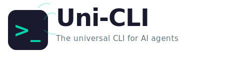
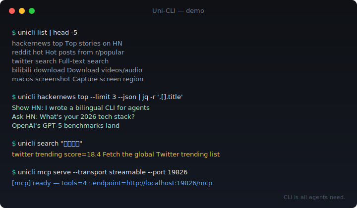
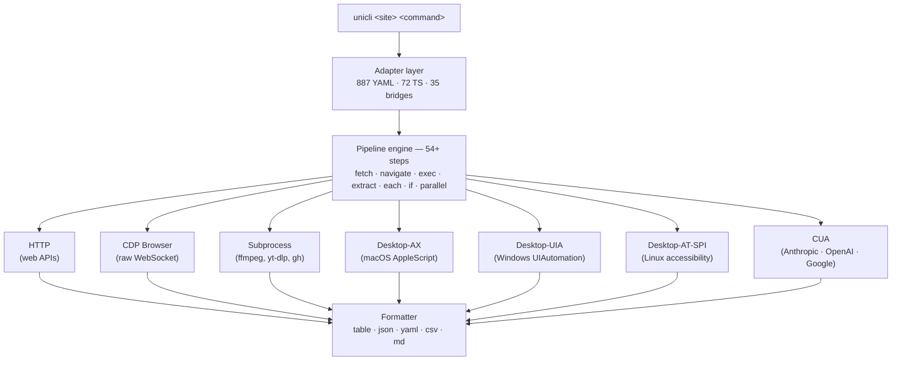

<!-- AGENT: npm install -g @zenalexa/unicli && unicli search "your intent" — hundreds of commands across ~200 sites. JSON when piped. Self-repairing YAML adapters. Bilingual EN/ZH search. See AGENTS.md for live counts. -->

<div align="center">

<picture>
  <source media="(prefers-color-scheme: dark)" srcset="assets/logo-dark.svg">
  <source media="(prefers-color-scheme: light)" srcset="assets/logo-light.svg">
  
</picture>

<br><br>

**CLI is all agents need.**

The execution layer for agent skills. Deterministic, editable, cross-vendor.

<br>

<a href="https://www.npmjs.com/package/@zenalexa/unicli"></a>
<a href="https://github.com/olo-dot-io/Uni-CLI/actions/workflows/ci.yml"></a>
<a href="./LICENSE"></a>
7080<!-- /STATS -->-44cc11?style=flat-square" alt="tests">


<br><br>

```
npm install -g @zenalexa/unicli
```

<br>



</div>

---

## What

Uni-CLI is a universal interface that compiles agent intent into deterministic CLI programs. One binary reaches <!-- STATS:site_count -->200<!-- /STATS --> sites, 30+ desktop apps, 35 CLI bridges, and the local OS — <!-- STATS:command_count -->968<!-- /STATS --> commands in total. Every adapter is a 20-line YAML pipeline, so agents can read, edit, and re-run them without a compiler.

Coverage is cross-cutting: web APIs and browser automation, desktop subprocesses (ffmpeg, Blender, LibreOffice), macOS system calls (screenshot, clipboard, Calendar), and Computer Use Agents (Anthropic, OpenAI, Google) — all behind the same `unicli <site> <command>` surface. Output is a table in a terminal and JSON when piped. Errors are structured JSON on stderr with the adapter path, the failing step, and a suggestion — enough directional feedback for an agent to fix the adapter and retry.

Self-repair is a first-class capability. When a site changes its API, an agent reads the 20-line YAML, edits the selector or endpoint, saves to `~/.unicli/adapters/`, and retries. Fixes survive `npm update`. No human in the loop.

## Why

MCP tool catalogs cost 4–35× more tokens per call than an equivalent CLI invocation, and 55K tokens of cold-start tax before the agent touches a tool (Firecrawl, Scalekit, Apideck benchmarks; see [`docs/BENCHMARK.md`](docs/BENCHMARK.md)). Agents perform better with executable programs than with catalogs of tool descriptions. Retrieval-over-catalog research in 2025–2026 (Semantic Tool Discovery, ITR Dynamic Tool Exposure, JSPLIT) reports 95–99% context reduction when tools are fetched on demand.

Uni-CLI is the execution half of that equation. The MCP server exposes 4 meta-tools (~200 tokens cold-start) — `unicli_run`, `unicli_list`, `unicli_search`, `unicli_explore` — and the agent pulls the exact tool it needs via BM25 bilingual search over a 50KB index. The CLI itself costs one subprocess per call.

## Quick start

Five minutes, top-to-bottom:

```bash
# 1. Install
npm install -g @zenalexa/unicli

# 2. Discover
unicli list                                   # all sites + commands
unicli search "推特热门"                       # → twitter trending (bilingual)

# 3. Run
unicli reddit hot --limit 3                   # zero-config web API
unicli hackernews top --json | jq '.[].title' # pipe + transform

# 4. Wire into an agent
claude mcp add unicli -- npx @zenalexa/unicli mcp serve   # Claude Code (MCP stdio)
unicli mcp serve --transport streamable --port 19826      # Any MCP client (HTTP)
unicli acp                                                # avante.nvim / Zed (ACP)
```

Full walkthrough with 5 worked examples: [`docs/QUICKSTART.md`](docs/QUICKSTART.md).

## Architecture



Seven TransportAdapters, one adapter layer, one formatter. Adapters are declarative YAML by default (Rice-decidable, no imports) and TypeScript when a site genuinely needs it. The full step reference lives in [`docs/ADAPTER-FORMAT.md`](docs/ADAPTER-FORMAT.md).

## Self-repair

When a command breaks:

```
unicli <site> <cmd> fails
  → structured JSON error on stderr
    { adapter_path, step, action, suggestion }
  → agent opens the ~20-line YAML
  → agent edits the selector / URL / auth
  → unicli <site> <cmd> works
  → fix persists in ~/.unicli/adapters/ (survives npm update)
```

```bash
unicli repair hackernews top      # Diagnose + suggest fix
unicli test hackernews            # Validate adapter
unicli repair --loop              # Autonomous fix loop
```

Exit codes follow `sysexits.h`: `0` ok, `66` empty, `69` unavailable, `75` temporary, `77` auth, `78` config. Agents parse those directly — no regex over human error text.

## Feature matrix

| Capability               | What it means                                                                                        |
| ------------------------ | ---------------------------------------------------------------------------------------------------- |
| **CUA backends**         | Anthropic `computer-use`, OpenAI Operator, Google CUA, and direct CDP — 4 transports behind one flag |
| **MCP transports**       | stdio · Streamable HTTP (spec 2025-11-25) · SSE · OAuth 2.1 PKCE                                     |
| **ACP ready**            | `unicli acp` speaks JSON-RPC 2.0 for avante.nvim, Zed, Gemini CLI                                    |
| **Cross-vendor skills**  | Skills in `skills/` work in Claude Code, OpenCode, Codex, Cursor, Cline                              |
| **Self-repair envelope** | Every error ships `adapter_path` + `step` + `suggestion` (Banach-convergent)                         |
| **Bilingual search**     | BM25 + TF-IDF, 50KB index, <10ms queries, 200-entry ZH↔EN alias table                                |
| **Browser daemon**       | Persistent Chrome via CDP, reuses your login sessions, 13-layer stealth                              |

Detailed benchmarks (p50/p95 token cost per category, vs GitHub MCP cold-start): [`docs/BENCHMARK.md`](docs/BENCHMARK.md).

## Platform coverage

<!-- STATS:site_count -->200<!-- /STATS --> sites · <!-- STATS:command_count -->968<!-- /STATS --> commands — the live list is auto-generated in [`AGENTS.md`](AGENTS.md) and split by domain:

| Domain                | Highlights                                                              |
| --------------------- | ----------------------------------------------------------------------- |
| **Social (25)**       | twitter, reddit, instagram, tiktok, xiaohongshu, bilibili, zhihu, weibo |
| **Tech (19)**         | hackernews, stackoverflow, producthunt, github-trending, npm, pypi      |
| **News (11)**         | bbc, reuters, bloomberg, nytimes, techcrunch, 36kr                      |
| **Finance (8)**       | xueqiu, yahoo-finance, eastmoney, binance, coinbase                     |
| **AI / ML (14)**      | huggingface, ollama, replicate, perplexity, deepseek, doubao            |
| **Desktop (30+)**     | blender, ffmpeg, imagemagick, gimp, freecad, musescore, kdenlive        |
| **macOS system (58)** | screenshot, clipboard, Calendar, Mail, Reminders, Shortcuts, Safari     |
| **CLI bridges (35)**  | gh, yt-dlp, jq, aws, vercel, supabase, wrangler, stripe                 |

Run `unicli list` for the live catalog, or `unicli list --category=<domain>` to filter.

## Agent integration

Every major agent platform works out of the box:

| Platform        | One-liner                                                  | Notes                                     |
| --------------- | ---------------------------------------------------------- | ----------------------------------------- |
| **Claude Code** | `claude mcp add unicli -- npx @zenalexa/unicli mcp serve`  | 4 meta-tools, stdio                       |
| **Codex CLI**   | Add `[mcp_servers.unicli]` to `~/.codex/config.toml`       | First-class AGENTS.md citizen             |
| **Cursor**      | MCP Settings → `unicli` → `npx @zenalexa/unicli mcp serve` | Bilingual search works inside Cursor chat |
| **avante.nvim** | `type = "acp", command = "unicli", args = { "acp" }`       | See [`docs/AVANTE.md`](docs/AVANTE.md)    |
| **OpenCode**    | MCP via `opencode.jsonc` — `command: "unicli mcp serve"`   | AGENTS.md auto-loaded                     |
| **Cline**       | Add MCP server in settings — stdio transport               | Same 4 meta-tools, 200-token cold start   |

Direct shell access (any agent with Bash or exec):

```bash
unicli twitter search "AI agents"
unicli blender render scene.blend --output /tmp/frame.png
unicli macos screenshot --region 0,0,1920,1080
```

## Authentication

Five auth strategies, auto-probed in a cascade (`public → cookie → header`):

| Strategy    | How                                                    |
| ----------- | ------------------------------------------------------ |
| `public`    | Direct HTTP, no credentials                            |
| `cookie`    | `~/.unicli/cookies/<site>.json` injected into headers  |
| `header`    | Cookie + auto-extracted CSRF (ct0, bili_jct, …)        |
| `intercept` | Chrome navigates, Uni-CLI captures XHR/fetch responses |
| `ui`        | Direct DOM interaction via CDP (click, type, submit)   |

```bash
unicli auth setup twitter    # Print required cookies + target path
unicli auth check twitter    # Validate cookie file
unicli auth list             # All configured sites
```

The browser daemon (`unicli browser start`) reuses your signed-in Chrome session via CDP — no cookie export, no extension install. Auto-exits after 4h idle.

## Write an adapter

Most adapters are ~20 lines of YAML. No TypeScript, no build step, no imports:

```yaml
site: hackernews
name: top
type: web-api
strategy: public
pipeline:
  - fetch:
      url: "https://hacker-news.firebaseio.com/v0/topstories.json"
  - limit: { count: "${{ args.limit | default(30) }}" }
  - each:
      do:
        - fetch:
            url: "https://hacker-news.firebaseio.com/v0/item/${{ item }}.json"
  - map:
      title: "${{ item.title }}"
      score: "${{ item.score }}"
      url: "${{ item.url }}"
columns: [title, score, url]
```

Five adapter types: `web-api`, `desktop`, `browser`, `bridge`, `service`. 29 template filters (`join`, `urlencode`, `truncate`, `slugify`, `default`, `json`, …) run in a sandboxed VM.

Scaffold, dev, test:

```bash
unicli init <site> <command>     # Scaffold new adapter
unicli dev <path>                # Hot-reload during dev
unicli test <site>               # Validate
unicli record <url>              # Auto-generate adapter from traffic
```

Full reference: [`docs/ADAPTER-FORMAT.md`](docs/ADAPTER-FORMAT.md). Migrating from OpenCLI: [`docs/MIGRATING-FROM-OPENCLI.md`](docs/MIGRATING-FROM-OPENCLI.md) and the one-shot `unicli import opencli-yaml`.

## Search

Agents find commands by intent, bilingual:

```bash
unicli search "推特热门"            # → twitter trending
unicli search "download video"      # → bilibili download, yt-dlp download, twitter download
unicli search "股票行情"            # → binance ticker, xueqiu quote, barchart quote
unicli search --category finance    # browse by category
```

BM25 + TF-IDF scoring with a 200-entry ZH↔EN alias table. The index is 50KB, queries complete in under 10ms.

## Theory + benchmarks

The design rests on five principles, each tied to a citation in [`docs/refs.bib`](docs/refs.bib):

1. **Rice's restriction** — every adapter has decidable semantics (YAML pipeline, no Turing-complete logic).
2. **Lehman's mandate** — no adapter is permanent; self-repair is first-class.
3. **Shannon's compression** — CLI invocations are near-optimal compression of the underlying API call.
4. **Agent tool trilemma (original)** — coverage × accuracy × performance, pick two. We choose accuracy × performance.
5. **Banach convergence** — structured errors must provide directional feedback (`adapter_path` + `step` + `suggestion`) so repair iterations converge.

Full treatment with 42 citations: [`docs/THEORY.md`](docs/THEORY.md). Reproducible benchmarks comparing Uni-CLI to GitHub MCP and Firecrawl MCP: [`docs/BENCHMARK.md`](docs/BENCHMARK.md).

## Development

```bash
git clone https://github.com/olo-dot-io/Uni-CLI.git && cd Uni-CLI
npm install
npm run verify     # typecheck + lint + test + build + stats check
```

| Command                | Purpose                                                   |
| ---------------------- | --------------------------------------------------------- |
| `npm run dev`          | Run from source                                           |
| `npm run build`        | Production build                                          |
| `npm run typecheck`    | TypeScript strict                                         |
| `npm run lint`         | Oxlint                                                    |
| `npm run test`         | Unit tests (<!-- STATS:test_count -->7080<!-- /STATS -->) |
| `npm run test:adapter` | Validate all adapters                                     |
| `npm run verify`       | Full pipeline (7 gates)                                   |

Seven production dependencies: `chalk`, `cli-table3`, `commander`, `js-yaml`, `turndown`, `undici`, `ws`.

## Release cadence

Patches ship every **Friday 09:00 HKT** when substantive commits have landed since the last tag. Quiet weeks are recorded and skipped — silence is success, not failure. Dependabot bumps are grouped into one PR per Monday so they ride along in the Friday cut without flooding the commit log.

<a href="https://github.com/olo-dot-io/Uni-CLI/commits/main"></a>

Full policy — manual overrides, cancellation procedure, escalation rules: [`docs/RELEASE-CADENCE.md`](docs/RELEASE-CADENCE.md).

## Contributing

The fastest path to a merged PR: write a 20-line YAML adapter for a site you use every day. Per-domain guides live in [`contributing/`](contributing/):

| Area             | Guide                                                    |
| ---------------- | -------------------------------------------------------- |
| New adapter      | [`contributing/adapter.md`](contributing/adapter.md)     |
| New transport    | [`contributing/transport.md`](contributing/transport.md) |
| CUA backend      | [`contributing/cua.md`](contributing/cua.md)             |
| MCP server       | [`contributing/mcp.md`](contributing/mcp.md)             |
| ACP integration  | [`contributing/acp.md`](contributing/acp.md)             |
| Release process  | [`contributing/release.md`](contributing/release.md)     |
| Schema migration | [`contributing/schema.md`](contributing/schema.md)       |

## License

[Apache-2.0](./LICENSE)

Repo: <https://github.com/olo-dot-io/Uni-CLI> · npm: [`@zenalexa/unicli`](https://www.npmjs.com/package/@zenalexa/unicli) · Issues welcome.

---

<p align="center">
  <a href="https://github.com/olo-dot-io/Uni-CLI/graphs/contributors">
    
  </a>
</p>

<p align="center">
  <sub>v0.213.1 — Vostok · Gagarin Patch</sub><br>
  <sub><!-- STATS:site_count -->200<!-- /STATS --> sites · <!-- STATS:command_count -->968<!-- /STATS --> commands · <!-- STATS:pipeline_step_count -->54<!-- /STATS --> pipeline steps · BM25+TF-IDF bilingual search · MCP 2025-11-25 · <!-- STATS:test_count -->7080<!-- /STATS --> tests</sub>
</p>
