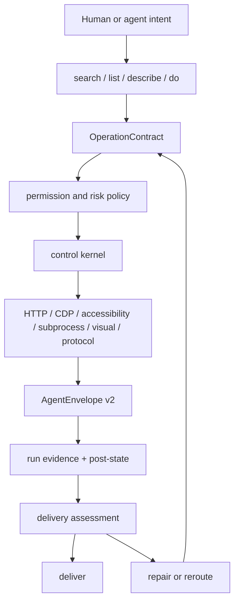

# Uni-CLI Architecture

Uni-CLI is the universal computer-control platform for agents. The stable
product primitive is not a browser session, a sandbox, a protocol server, a
visual cursor, or a generated tool list. It is an operation that lets an agent
control real software through a governed, observable, repairable path.

The current generated operation catalog is the source of truth:
**<span><!-- STATS:site_count -->320<!-- /STATS --></span> sites**,
**<span><!-- STATS:command_count -->1798<!-- /STATS --></span> commands**,
**<span><!-- STATS:adapter_count_total -->1225<!-- /STATS --></span> adapters**,
**<span><!-- STATS:pipeline_step_count -->103<!-- /STATS --></span> pipeline steps**,
and **<span><!-- STATS:test_count -->9256<!-- /STATS --></span> tests** in v0.226.0.

## Computer-Control Thesis

Vehicle assistants work because the car exposes a bounded control layer above
navigation, media, climate, and driving assistance. General computers have the
same shape at larger scale. Browser state, desktop apps, local tools, files,
operating-system services, accessibility trees, screenshots, protocol servers,
and website-specific paths are the environment. Uni-CLI is the hand agents use
to control that environment.

Adjacent projects usually own one concrete technical function: browser
automation, a computer-use sandbox, natural-language local execution, an MCP
server, or a per-application wrapper. Uni-CLI treats those as substrates. The
platform boundary is larger: agent intent enters once, the system selects a
controllable boundary, policy gates the effect, real software is acted on,
evidence returns, failure is diagnosed, and the path is repaired or rerouted
until the result is delivered.

The computer-control loop is:

1. Accept human or agent intent without preloading a giant tool list.
2. Select the smallest operation boundary that can act on the target software.
3. Govern the operation through permission profile, risk, capability scope, and
   local policy.
4. Act through the selected substrate: API, browser, desktop, subprocess,
   protocol, visual, or app-specific wrapper.
5. Observe result data, context, retryability, timing, and evidence through one
   envelope.
6. Diagnose failure into auth, policy, missing context, upstream drift,
   environment trouble, or adapter defect.
7. Repair or reroute through a bounded verification command and alternatives.
8. Deliver the objective state, then expose the same operation through CLI, MCP,
   ACP, docs, skills, CI, and scripts.

That loop is the product. The command lifecycle, YAML format, MCP gateway,
browser automation, computer-use actions, and self-repair tools are internal
machinery or substrates below it.

## Priority Model

These roots define product semantics and must stay shared by every runtime
surface.

| Priority | Layer                      | Contract                                                                                   |
| -------- | -------------------------- | ------------------------------------------------------------------------------------------ |
| P0       | Computer-control platform  | Intent, selection, governance, action, observation, diagnosis, repair/reroute, delivery    |
| P0       | Operation contract         | Args, output, auth posture, effect, safety, capability, source path, and repair path       |
| P0       | Control kernel             | Validate, harden, authorize, invoke a substrate, observe, and envelope                     |
| P0       | Action substrates          | HTTP, browser CDP, desktop accessibility, subprocess, visual fallback, protocols, wrappers |
| P0       | Evidence and delivery loop | AgentEnvelope v2, run traces, post-state evidence, objective gates, trajectory, repair     |
| P1       | Discovery                  | `search`, `list`, `describe`, `do`, generated catalog, docs index                          |
| P1       | Governance                 | Permission profiles, deny rules, approvals, effect/risk/capability metadata                |
| P1       | Authoring                  | YAML first, TypeScript escape hatch, schema-v2 lint, repair verification                   |
| P1       | Runtime exposure           | Native CLI, JSON stream, MCP, ACP, streamable HTTP, agent packs, skills export             |
| P2       | Broad coverage             | Hundreds of site commands, vertical meta-commands, external CLI hub                        |
| P2       | Public docs UI             | Homepage, operation catalog, architecture, compute evidence demo                           |

## Substrate Boundary

Substrate plurality is a strength only while it remains below the platform
boundary.

- Browser UI automation is one action substrate, not the architecture.
- Computer-use sandboxing is one environment substrate, not the product category.
- MCP is an exposure and protocol substrate; expanded MCP mode is opt-in.
- Natural-language local execution is a useful substrate when typed command
  contracts and policy still hold.
- Visual control is valid only when it can see, act, and verify post-state
  evidence.
- External CLI passthrough is a bridge to mature tools, not a replacement for
  operation contracts.
- Generated public files under `docs/public/` are build artifacts, not
  hand-edited architecture sources.

## Capability Matrix And Workflow Readiness

`unicli architecture audit -f json` emits two catalog-derived views that keep
the vehicle-assistant analogy honest without pretending every path has already
passed live smoke.

The `capability_matrix` groups live registry commands by the real control
surface they touch:

- `web`: HTTP, RSS, public/cookie/header web paths, and web target surfaces.
- `browser`: CDP, browser refs, browser evidence, and browser-backed adapters.
- `desktop`: installed app, accessibility, local UI, and desktop target
  surfaces.
- `system`: operating-system state, macOS commands, local services, and system
  target surfaces.
- `protocol`: MCP, ACP, delivery/runs/architecture control services, and
  service/protocol boundaries.
- `bridge`: passthrough to mature external CLIs such as `gh`, `yt-dlp`, or
  cloud CLIs.

Rows include command counts, adapter/core split, write-sensitive count, local
computer-use count, source-path coverage, and representative commands. A command
can appear in more than one row when it genuinely crosses surfaces, for example
a browser-backed web adapter or a macOS command that controls both desktop and
system state.

The `workflow_readiness` table tracks the real user workflows implied by the
vehicle assistant comparison:

- play or inspect media;
- search video platforms;
- operate browser tabs;
- operate installed apps;
- read and write productivity state;
- open or navigate to a destination.

Readiness is intentionally conservative:

- `cataloged` means operation contracts exist in the live catalog, with at
  least one action-capable command when the workflow requires action.
- `partial` means the catalog has related read/discovery paths but lacks the
  action shape needed to claim the workflow.
- `gap` means the live catalog has no matching operation path.

No workflow row claims live success. Each row carries `required_next_evidence`
so Step 5 capability work can turn cataloged intent into behavior evidence:
run the command, capture the envelope, verify post-state, record auth/policy
posture, and only then promote a capability claim.

## System Tree

```text
Uni-CLI
|-- Computer-control platform
|   |-- Intent: src/discovery/search.ts, src/commands/do.ts
|   |-- Select: src/core/command-contract.ts, src/registry.ts
|   |-- Govern: src/engine/permission-runtime.ts
|   |-- Act: src/engine/kernel/*, src/engine/executor.ts
|   |-- Observe: src/output/*, src/engine/session/*
|   |-- Diagnose: src/engine/delivery/*, src/output/error-map.ts
|   |-- Repair/reroute: src/commands/repair.ts, src/engine/repair/*
|   `-- Deliver/expose: src/commands/delivery.ts, src/commands/agents.ts
|
|-- Operation catalog
|   |-- Runtime registry: src/registry.ts
|   |-- Core catalog: src/discovery/core-catalog.ts
|   |-- Adapter catalog: src/adapters/<site>/<command>.yaml or .ts
|   |-- Schema v2: src/core/schema-v2.ts
|   |-- Aliases and categories: src/discovery/aliases.ts
|   `-- Generated manifests: registry.json, stats.json, server.json
|
|-- Control kernel
|   |-- Compile and cache: src/engine/kernel/compile.ts
|   |-- Input stages: src/engine/kernel/stages.ts
|   |-- Execution: src/engine/kernel/execute.ts
|   |-- Compatibility export: src/engine/invoke.ts
|   |-- Args and hardening: src/engine/args.ts, src/engine/harden.ts
|   |-- Policy runtime: src/engine/permission-runtime.ts
|   `-- Output envelope: src/output/*
|
|-- Action substrates
|   |-- Web/API: src/engine/steps/fetch*.ts, src/engine/steps/parse*.ts
|   |-- Browser/CDP: src/browser/*, src/transport/adapters/cdp-browser.ts
|   |-- Desktop/OS: src/commands/compute.ts, src/compute/*, src/transport/adapters/desktop-*.ts
|   |-- Local tools/files: src/hub/*, src/engine/steps/exec*.ts, src/adapters/pdf/*
|   |-- Protocols: src/mcp/*, src/commands/acp.ts, src/protocol/*
|   `-- Visual fallback: src/transport/adapters/visual.ts, src/compute/visual-timeline.ts
|
|-- Evidence, delivery, and repair
|   |-- Run recording: src/engine/session/*
|   |-- Replay and compare: src/commands/runs.ts, src/engine/session/replay.ts
|   |-- Objective state: src/engine/delivery/*
|   |-- Operator CLI: src/commands/delivery.ts
|   |-- Adapter repair: src/commands/repair.ts, src/engine/repair/*
|   `-- Eval and probes: src/commands/eval.ts, tests/integration/*
|
|-- Runtime exposure
|   |-- Native CLI: src/cli.ts, src/main.ts, src/commands/*
|   |-- MCP: src/mcp/*, src/mcp/profiles/computer-use.ts
|   |-- ACP: src/commands/acp.ts, src/protocol/*
|   |-- Streamable HTTP: src/mcp/streamable-http/*
|   |-- Agent packs and skills: src/commands/agents.ts, scripts/build-agents.ts
|   `-- Public docs: docs/, docs/.vitepress/theme/*
|
|-- Authoring and repair machinery
|   |-- Loader: src/discovery/loader.ts
|   |-- YAML pipeline executor: src/engine/executor.ts
|   |-- Step registry: src/engine/step-registry.ts
|   |-- Built-in steps: src/engine/steps/*
|   |-- Health, lint, migrate, generate: src/commands/{health,lint,migrate*,generate}.ts
|   |-- User adapters: ~/.unicli/adapters
|   `-- Plugins and custom steps: src/plugin/*
|
`-- Verification and release
    |-- Unit tests: tests/unit/*
    |-- Adapter tests: tests/adapter/*
    |-- Integration tests: tests/integration/*
    |-- Perf tests: tests/perf/*
    |-- Build and stats scripts: scripts/*
    |-- Boundary guard: scripts/boundary-guard.ts
    `-- Full release gate: npm run verify
```

## Runtime Flow



The invariant is that CLI, MCP, ACP, HTTP, docs, and skills must not implement
their own semantics. They resolve inputs, call the same control kernel, and
render the same envelope.

## Internal Command Lifecycle

The command lifecycle is internal authoring and maintenance machinery. It keeps
operations inspectable and repairable, but it is below the product boundary. The
public product loop remains intent -> select -> govern -> act -> observe ->
diagnose -> repair/reroute -> deliver -> expose.

### 1. Create

YAML is the default authoring unit because it is cheap for agents to inspect,
patch, and verify.

Creation paths:

- `unicli init` scaffolds adapters.
- `unicli record`, `explore`, `synthesize`, and `generate` discover candidate
  browser/API paths.
- TypeScript adapters use `cli()` only when a finite YAML pipeline is the wrong
  tool.
- Plugins and user adapters register into the same runtime registry.

Creation requirements:

- Declare args, output columns, target surface, capability needs, auth strategy,
  trust/confidentiality metadata, and repair source path.
- Prefer one command per reusable user operation.
- Put site-specific complexity in the adapter, not in the protocol wrappers.
- Add or update tests when the command is first-class, write-capable, or used by
  a vertical meta-command.

### 2. Discover

Discovery is a first-class runtime, not only documentation.

Discovery surfaces:

- `unicli search "<intent>"` for natural-language routing.
- `unicli list` for inventory and filtering.
- `unicli describe <site> <command>` for contracts.
- `unicli do "<intent>"` for a best-fit execution plan.
- Public docs catalog and generated `llms.txt`.
- MCP meta-tools: `unicli_search`, `unicli_list`, `unicli_run`,
  `unicli_explore`.

Discovery must optimize for a large operation catalog by keeping the default
resident surface small. The agent should search or describe before loading the
full registry.

### 3. Invoke

Invocation goes through the same kernel regardless of wrapper:

1. Resolve site and command from the registry.
2. Resolve args from stdin JSON, `--args-file`, flags, positionals, and defaults.
3. Validate against the adapter input schema.
4. Harden paths, selectors, IDs, shell-sensitive values, and URLs.
5. Evaluate permission profile, deny rules, approval memory, and operation risk.
6. Execute YAML pipeline or TypeScript function.
7. Normalize result into `AgentEnvelope v2`.
8. Record usage and optional run trace.

This path protects the product from drift between CLI, MCP, ACP, and docs.

### 4. Observe

Observation is what turns a tool call into evidence.

- Every result has command context, duration, surface, data, error, retryability,
  and next actions.
- An empty successful observation is still a successful observation: adapters
  that legitimately return `[]` keep `ok: true` and exit `0`. Absence becomes
  exit `66` only when the command emits an explicit `empty_result` error, such
  as no discovery match or a domain-specific not-found condition.
- Browser actions can attach pre/post evidence, target identity, movement data,
  and stale-reference diagnostics.
- Computer-use actions can attach `visual_action`, target point, overlay status,
  dispatch result, and post-action capture.
- `--record` writes append-only local traces under the run store.
- Replay, compare, eval, and delivery consume these traces rather than inventing
  a parallel audit model.

### 5. Repair

Repair is bounded by source path and verification command.

Failure envelopes must expose:

- error code and message;
- `adapter_path`;
- failing step or boundary;
- suggestion;
- retryability;
- alternatives;
- relevant auth, policy, or platform gap.

Repair flow:

1. Reproduce the failure.
2. Read the named adapter or runtime boundary.
3. Patch the real source, not the symptom.
4. Re-run the same failing command or adapter test.
5. Broaden to the nearest adjacent suite.
6. Record the result in progress, findings, or the run trace.

### 6. Publish

Release builds regenerate manifests, docs, stats, agents assets, and public
indices. Written counts are secondary to generated artifacts. `unicli list`,
`stats.json`, `registry.json`, and build outputs are more authoritative than
hand-maintained tables.

## Local Computer Use

Local Computer Use is a P0 substrate because agents must operate installed
software, not only web pages. It is essential, but it is still below the
computer-control platform boundary.

The preferred execution order is:

1. Stable app API, file format, local CLI, or service endpoint.
2. Electron/CDP or application debug protocol.
3. Native accessibility tree with semantic refs.
4. Scoped background input to a known app/window/ref.
5. Visual planning plus action verification.

Visual control is not a decorative cursor. It is valid only when the evidence
packet proves what target was resolved, what overlay plan was rendered, which
transport dispatched the action, and what post-state was observed.

Current compute surface:

- `compute apps`, `windows`, `snapshot`, `capture`, `find`;
- `compute click`, `type`, `press`, `scroll`, `launch`, `screenshot`;
- `compute attach`, `eval`, `wait`, `observe`, `assert`;
- `doctor compute` for transport and overlay availability;
- MCP `computer-use` profile for agent callers.

## Public Front-End

The docs front-end is not a marketing landing page. It is an operator console
and learning surface for the computer-control loop.

First viewport priorities:

1. State the product: universal computer-control platform for agents.
2. Show the smallest real command path.
3. Expose catalog scale without making command count the main claim.
4. Send users to install, catalog, repair, and agent integration routes.
5. Show Local Computer Use as a first-class substrate, including evidence.

The public UI should keep these components honest:

- `HomePage.vue`: positioning, install path, capability overview.
- `CommandLifecycleIsland.vue`: discover -> execute -> evidence -> repair loop.
- `ComputeCursorDemo.vue`: visual replay backed by a checked-in
  `visual_action` fixture, not a detached animation.
- `SiteCatalog.vue` and `SiteStats.vue`: generated catalog inspection.
- `llms.txt` and `docs/public/markdown/*`: agent-readable mirrors generated by
  build scripts.

## Removal And Consolidation Targets

These are architecture cleanup targets, not immediate deletions without tests.

| Target                                       | Why                                    | Safe direction                                               |
| -------------------------------------------- | -------------------------------------- | ------------------------------------------------------------ |
| Wrapper-specific semantics                   | Causes CLI/MCP/ACP drift               | Move behavior into CommandContract and kernel stages         |
| Regex-based TS adapter stub extraction       | Fragile metadata discovery             | Prefer explicit registration metadata or generated contracts |
| Internal imports from `src/engine/invoke.ts` | Compatibility shim hides owner modules | New code imports kernel modules directly                     |
| Hand-maintained counts in docs               | Drift from generated artifacts         | Use stats replacement scripts only                           |
| Expanded MCP as default                      | Too much resident context              | Keep compact/deferred profile first                          |
| Visual-first control language                | Encourages brittle automation          | Require structured substrate before visual fallback          |
| Adapter health theater                       | Passing load is not working behavior   | Health gates must run real owned runner/probe surfaces       |
| Generated public docs edits                  | Source of truth is upstream docs files | Edit `docs/` sources, regenerate `docs/public/`              |

## Design Options For The Rebuild

### Option A: Rewrite Everything Around One Autonomous Orchestrator

This creates a conceptually clean root, but the blast radius is too large. It
would touch registry, adapters, browser, compute, repair, delivery, docs,
protocols, and persistence at once.

### Option B: Keep Adding Commands And Adapters

This preserves momentum but leaves architecture pressure unresolved. Breadth
without a stricter operation model makes discovery, verification, and repair
harder.

### Option C: Rebuild Around The Computer-Control Platform

This keeps the existing broad catalog and runtime, but makes
intent -> select -> govern -> act -> observe -> diagnose -> repair/reroute ->
deliver -> expose the explicit architecture spine. Command lifecycle remains
the internal authoring cycle below that product model.

Chosen direction: **Option C**. It matches the current code shape and gives the
team a safe path to remove drift without freezing feature work.

## Optimization Roadmap

### Step 1: Freeze The Computer-Control Model

- Treat operation contracts as the metadata source for docs, MCP, ACP, agent
  packs, repair, and benchmarks.
- Add parity tests whenever a wrapper gains behavior.
- Keep default MCP compact and search-driven.
- Keep `architecture tree` and `architecture audit` aligned with the
  computer-control stages.

### Step 2: Mature Local Computer Control As A Substrate

- Keep `compute` independent from website adapter assumptions.
- Preserve the action evidence contract across CLI and MCP.
- Run native smokes on each platform before claiming cross-OS support.
- Keep visual overlay optional until platform labs prove it reliable.

### Step 3: Normalize Adapter Authoring

- Prefer YAML for finite operations.
- Require `schema-v2` metadata and command contracts.
- Replace fragile metadata scraping with explicit contracts.
- Gate first-class adapters with real runner, fixture, or live smoke evidence.

### Step 4: Collapse Drift Between Surfaces

- CLI, MCP, ACP, HTTP, docs, and skills read the same contract projection.
- Remove wrapper-only descriptions, safety hints, and schema copies.
- Keep generated public docs and agent assets reproducible from source.

### Step 5: Close The Delivery Loop

- Treat `delivery` as the objective-level loop above individual invocations.
- Route adapter repair through delivery when the failure is repairable.
- Keep auth, policy, environment, upstream, and missing-context states explicit.
- Record trajectories, not just final green commands.

### Step 6: Raise The Public Front-End Bar

- Use the docs UI to teach the computer-control loop, not just list features.
- Keep Local Computer Use visible as a first-class substrate.
- Use real fixtures for demos and catalog data.
- Verify docs build and at least one browser screenshot after visual changes.

## Verification Ladder

Use the smallest credible ladder for the claim under change:

| Claim                              | Minimum evidence                                                      |
| ---------------------------------- | --------------------------------------------------------------------- |
| Pure contract or metadata function | Unit test plus typecheck                                              |
| CLI/MCP/ACP parity                 | Wire parity test over the same command                                |
| Adapter behavior                   | `unicli test <site>` or adapter runner with real owned code           |
| Browser/session behavior           | Browser evidence test or live daemon smoke                            |
| Local computer-use behavior        | `doctor compute`, snapshot/find/action smoke, post-capture evidence   |
| Real CLI workflow matrix           | `npm run e2e:real`                                                    |
| Public docs UI                     | `npm run docs:build` plus screenshot/visual inspection for UI changes |
| Release readiness                  | `npm run verify`                                                      |

## Done Definition

A system change is done only when:

- the changed behavior has a falsifiable claim;
- the relevant source files and tests were observed before editing;
- a failing or proving experiment was run;
- root cause and design choice were recorded;
- implementation changed the real boundary;
- original and adjacent verification passed;
- docs, progress, and generated surfaces were updated when their truth changed;
- hack-risk is explicitly reported.

For this repository, the normal local gate remains:

```bash
npm run typecheck && npm run lint && npm test
```

The full release gate remains:

```bash
npm run verify
```
