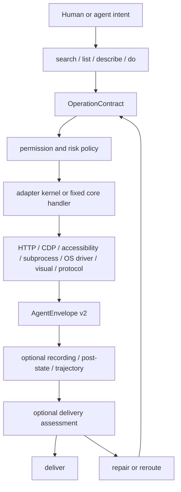

# Uni-CLI Architecture

Uni-CLI is the open Agent-Computer Interface runtime for real software. The
stable product primitive is not a browser session, sandbox, protocol server,
visual cursor, or generated tool list. It is the executable boundary that lets
an agent discover and select operations, govern supported effects, act across
software substrates, inspect results, and repair supported failures.

Normalized live command descriptors are the source of truth. The generated
manifest is a reproducible, parity-tested projection for cold discovery. It contains
<span><!-- STATS:site_count -->326<!-- /STATS --></span> adapter sites.

Those sites expose
<span><!-- STATS:command_count -->1829<!-- /STATS --></span> registered adapter
commands.

The catalog implements them across
<span><!-- STATS:adapter_count_total -->1226<!-- /STATS --></span> adapters.

The pipeline surface contains
<span><!-- STATS:pipeline_step_count -->113<!-- /STATS --></span> built-in
actions.

Of these,
<span><!-- STATS:pipeline_registered_step_count -->58<!-- /STATS --></span> are
registered steps.

The remaining
<span><!-- STATS:pipeline_transport_step_count -->55<!-- /STATS --></span> are
transport-native.

Version 0.400.2 includes
<span><!-- STATS:test_count -->9984<!-- /STATS --></span> tests in v1.0.1.
Fixed core and host-discovered commands are separate runtime surfaces and are
not included in the static site or command totals.

## Agent-Computer Interface Thesis

Language-model agents are a different software user. They have a bounded
context window, issue structured actions, and need concise feedback about state
changes and failure. Human GUIs, raw developer APIs, and resident catalogs were
not designed as one coherent interface for that user.

Adjacent projects usually own one concrete function: lifting an app into a CLI,
driving a browser, hosting a sandbox, running MCP servers, managing SaaS OAuth,
or publishing capability metadata. Uni-CLI treats those as providers,
substrates, or exposure formats. The owned boundary is the runtime between the
agent and all of them.

The compact product story is **discover → select → govern → act → observe →
repair**. It maps onto the nine stages emitted by `unicli architecture audit`:

| Product concern | Executable stage(s)              | Current boundary                                                                                             |
| --------------- | -------------------------------- | ------------------------------------------------------------------------------------------------------------ |
| Discover        | `intent`                         | `search` and plan-only `do` rank operations without performing the external action                           |
| Select          | `select`                         | the caller selects an operation with a declared strategy/substrate; universal semantic arbitration is future |
| Govern          | `govern`                         | permission profiles and policy evaluate the effects and capabilities currently covered                       |
| Act             | `act`                            | adapter commands use the adapter kernel; fixed core commands keep native CLI handlers                        |
| Observe         | `observe`, `diagnose`, `deliver` | every rendered call distinguishes success/error; evidence and delivery detail are operation-specific         |
| Repair          | `repair-or-reroute`              | errors and delivery tools bound a next attempt only when the required context exists                         |
| Project         | `expose`                         | native CLI is complete; MCP projects adapter operations; other integrations expose documented subsets        |

This runtime boundary is the product. The command lifecycle, YAML format, MCP
gateway, browser automation, computer-use actions, and self-repair tools are
machinery or substrates below it. The table is intentionally explicit about
current gaps: positioning is not evidence that a future arbitration or parity
feature has shipped.

## Priority Model

These roots define the intended product semantics. The current-support column
above and the roadmap determine which runtime surfaces implement each root now.

| Priority | Layer                    | Contract                                                                                                                                               |
| -------- | ------------------------ | ------------------------------------------------------------------------------------------------------------------------------------------------------ |
| P0       | Agent-Computer Interface | Discovery, selection, governance, action, observation, repair, and exposure                                                                            |
| P0       | Operation contract       | Args, output, auth posture, effect, safety, capability, source path, and repair path                                                                   |
| P0       | Adapter control kernel   | Validate, harden, authorize, invoke an adapter substrate, observe, and envelope                                                                        |
| P0       | Execution operators      | Structured API, browser protocol, native CLI, browser semantics, desktop accessibility, visual observation, explicit visual coordinates, local runtime |
| P0       | Result and delivery loop | AgentEnvelope v2 plus optional run traces, post-state checks, objective gates, and repair                                                              |
| P1       | Discovery                | `search`, `list`, `describe`, `do`, generated catalog, docs index                                                                                      |
| P1       | Governance               | Permission profiles, deny rules, approvals, effect/risk/capability metadata                                                                            |
| P1       | Authoring                | YAML first, TypeScript escape hatch, schema-v2 lint, repair verification                                                                               |
| P1       | Runtime exposure         | Native CLI; MCP adapter projection; documented ACP/HTTP/agent-pack/skills subsets                                                                      |
| P2       | Broad coverage           | Hundreds of site commands, vertical meta-commands, external CLI hub                                                                                    |
| P2       | Public docs UI           | Homepage, operation catalog, architecture, compute evidence demo                                                                                       |

## Substrate Boundary

Substrate plurality is a strength only while it remains below the runtime
boundary.

- Browser UI automation is one action substrate, not the architecture.
- Computer-use sandboxing is one environment substrate, not the product category.
- MCP is an exposure and protocol substrate; expanded MCP mode is opt-in.
- Natural-language local execution is a useful substrate when typed command
  contracts and policy still hold.
- Visual control is valid only when it can see, act, and verify post-state
  evidence.
- External CLI passthrough is a bridge to mature tools, not a replacement for
  operation contracts.
- Generated public files under `docs/public/` are build artifacts, not
  hand-edited architecture sources.

## Task-Directed Operator Boundary

Discovery and execution routing are separate boundaries. Search retrieves
operation contracts by intent. The selected contract projects one execution
operator, effect, verification channel, and target scope. Compute routing then
binds an exact target and selects one provider before any provider is opened.

The operator classes are structured API, browser protocol, native CLI, browser
semantics, desktop accessibility, visual observation, explicit visual
coordinates, and local runtime. A website label does not imply browser control,
and an application label does not imply desktop input. The command contract
and target evidence make that choice.

Compute provider declarations compile into an exact provider hash index and
per-action posting lists. Exact refs, renderer endpoints, window ids, and
intrinsic operation constraints are hard constraints. Coordinate control is
split into explicit OS-driver and visual providers; neither is an implicit
semantic fallback. Ordinary failures stay on the selected provider; retry,
repair, replan, outcome inspection, session escalation, and privilege
escalation are separate transitions.

Inline driver and visual screenshots issue opaque, 256-bit observation refs.
Coordinate actions atomically claim one ref and require the same provider,
desktop scope, named session, unexpired 30-second lifetime, and in-bounds image
coordinates. Authoritative metadata stays in an owner-only local record;
provider open happens only after validation. Screenshot pixels are transformed
to provider action coordinates from recorded dimensions rather than inferred
display scale.

See [Task-Directed Capability Routing](operate/task-routing.md) for the formal
axes, selection algorithm, complexity, recovery graph, and provider conformance
requirements.

## Capability Matrix And Workflow Readiness

`unicli architecture audit -f json` emits two catalog-derived views that keep
the vehicle-assistant analogy honest without pretending every path has already
passed live smoke.

The `capability_matrix` groups live registry commands by the real control
surface they touch:

- `web`: HTTP, RSS, public/cookie/header web paths, and web target surfaces.
- `browser`: CDP, browser refs, browser evidence, and browser-backed adapters.
- `desktop`: installed app, accessibility, local UI, and desktop target
  surfaces.
- `system`: operating-system state, macOS commands, local services, and system
  target surfaces.
- `protocol`: MCP, ACP, delivery/runs/architecture control services, and
  service/protocol boundaries.
- `bridge`: passthrough to mature external CLIs such as `gh`, `yt-dlp`, or
  cloud CLIs.

Rows include command counts, adapter/core split, write-sensitive count, local
computer-use count, source-path coverage, and representative commands. A command
can appear in more than one row when it genuinely crosses surfaces, for example
a browser-backed web adapter or a macOS command that controls both desktop and
system state.

The `workflow_readiness` table tracks the real user workflows implied by the
vehicle assistant comparison:

- play or inspect media;
- search video platforms;
- operate browser tabs;
- operate installed apps;
- read and write productivity state;
- open or navigate to a destination.

Readiness is intentionally conservative:

- `cataloged` means operation contracts exist in the live catalog, with at
  least one action-capable command when the workflow requires action.
- `partial` means the catalog has related read/discovery paths but lacks the
  action shape needed to claim the workflow.
- `gap` means the live catalog has no matching operation path.

No workflow row claims live success. Each row carries `required_next_evidence`
so Step 5 capability work can turn cataloged intent into behavior evidence:
run the command, capture the envelope, verify post-state, record auth/policy
posture, and only then promote a capability claim.

## System Tree

```text
Uni-CLI
|-- Agent-Computer Interface runtime
|   |-- Intent: src/discovery/search.ts, src/commands/do.ts
|   |-- Select: src/core/command-contract.ts, src/registry.ts
|   |-- Govern: src/engine/permission-runtime.ts
|   |-- Act: src/engine/kernel/*, src/engine/executor.ts
|   |-- Observe: src/output/*, src/engine/session/*
|   |-- Diagnose: src/engine/delivery/*, src/output/error-map.ts
|   |-- Repair/reroute: src/commands/repair.ts, src/engine/repair/*
|   `-- Deliver/expose: src/commands/delivery.ts, src/commands/agents.ts
|
|-- Operation catalog
|   |-- Runtime registry: src/registry.ts
|   |-- Core catalog and O(1) id/category indexes: src/discovery/core-catalog.ts
|   |-- Adapter catalog: src/adapters/<site>/<command>.yaml or .ts
|   |-- Schema v2: src/core/schema-v2.ts
|   |-- Aliases and categories: src/discovery/aliases.ts
|   `-- Generated manifests: registry.json, stats.json, server.json
|
|-- Control kernel
|   |-- Compile and cache: src/engine/kernel/compile.ts
|   |-- Input stages: src/engine/kernel/stages.ts
|   |-- Execution: src/engine/kernel/execute.ts
|   |-- Compatibility export: src/engine/invoke.ts
|   |-- Args and hardening: src/engine/args.ts, src/engine/harden.ts
|   |-- Policy runtime: src/engine/permission-runtime.ts
|   `-- Output envelope: src/output/*
|
|-- Action substrates
|   |-- Task/operator projection: src/core/operator-model.ts
|   |-- Compute route planning: src/transport/routing.ts
|   |-- Single-provider dispatch: src/transport/compute-dispatch.ts
|   |-- Visual observation capabilities: src/compute/visual-observation.ts
|   |-- Web/API: src/engine/steps/fetch*.ts, src/engine/steps/parse*.ts
|   |-- Browser/CDP: src/browser/*, src/transport/adapters/cdp-browser.ts
|   |-- Desktop/OS: src/commands/compute.ts, src/compute/*, src/transport/adapters/desktop-*.ts
|   |-- Local tools/files: src/hub/*, src/engine/steps/exec*.ts, src/adapters/pdf/*
|   |-- Protocols: src/mcp/*, src/commands/acp.ts, src/protocol/*
|   |-- Explicit OS driver: src/transport/adapters/cua-driver.ts
|   `-- Explicit visual control: src/transport/adapters/visual.ts, src/compute/visual-timeline.ts
|
|-- Evidence, delivery, and repair
|   |-- Run recording: src/engine/session/*
|   |-- Replay and compare: src/commands/runs.ts, src/engine/session/replay.ts
|   |-- Objective state: src/engine/delivery/*
|   |-- Operator CLI: src/commands/delivery.ts
|   |-- Adapter repair: src/commands/repair.ts, src/engine/repair/*
|   `-- Eval and probes: src/commands/eval.ts, tests/integration/*
|
|-- Runtime exposure
|   |-- Native CLI: src/cli.ts, src/main.ts, src/commands/*
|   |-- MCP: src/mcp/*, src/mcp/profiles/computer-use.ts
|   |-- ACP: src/commands/acp.ts, src/protocol/*
|   |-- Streamable HTTP: src/mcp/streamable-http/*
|   |-- Agent packs and skills: src/commands/agents.ts, scripts/build-agents.ts
|   `-- Public docs: docs/, docs/.vitepress/theme/*
|
|-- Authoring and repair machinery
|   |-- Loader: src/discovery/loader.ts
|   |-- YAML pipeline executor: src/engine/executor.ts
|   |-- Step registry: src/engine/step-registry.ts
|   |-- Built-in steps: src/engine/steps/*
|   |-- Health, lint, migrate, generate: src/commands/{health,lint,migrate*,generate}.ts
|   |-- User adapters: ~/.unicli/adapters
|   `-- Plugins and custom steps: src/plugin/*
|
`-- Verification and release
    |-- Unit tests: tests/unit/*
    |-- Adapter tests: tests/adapter/*
    |-- Integration tests: tests/integration/*
    |-- Perf tests: tests/perf/*
    |-- Build and stats scripts: scripts/*
    |-- Boundary guard: scripts/boundary-guard.ts
    `-- Full release gate: npm run verify
```

## Runtime Flow



The invariant today is narrower: adapter execution semantics stay in adapter
contracts and the adapter kernel, not in each adapter-facing wrapper. Native
CLI is the full runtime surface; MCP profiles project adapter commands from the
same registry. Fixed core commands have separate Commander handlers and are not
yet callable merely because MCP discovery lists them. ACP, HTTP, docs, and
skills expose documented subsets. Closing those projection gaps is roadmap
work, not a current capability claim.

## Internal Command Lifecycle

The command lifecycle is internal authoring and maintenance machinery. It keeps
operations inspectable and repairable, but it is below the product boundary. The
public product loop remains intent -> select -> govern -> act -> observe ->
diagnose -> repair/reroute -> deliver -> expose.

### 1. Create

YAML is the default authoring unit because it is cheap for agents to inspect,
patch, and verify.

Creation paths:

- `unicli init` scaffolds adapters.
- `unicli record`, `explore`, `synthesize`, and `generate` discover candidate
  browser/API paths.
- TypeScript adapters use `cli()` only when a finite YAML pipeline is the wrong
  tool.
- Plugins and user adapters register into the same runtime registry.

Creation requirements:

- Declare args, output columns, target surface, capability needs, auth strategy,
  trust/confidentiality metadata, and repair source path.
- Prefer one command per reusable user operation.
- Put site-specific complexity in the adapter, not in the protocol wrappers.
- Add or update tests when the command is first-class, write-capable, or used by
  a vertical meta-command.

### 2. Discover

Discovery is a first-class runtime, not only documentation.

Discovery surfaces:

- `unicli search "<intent>"` for natural-language routing.
- `unicli list` for inventory and filtering.
- `unicli describe <site> <command>` for contracts.
- `unicli do "<intent>"` for a best-fit execution plan.
- Public docs catalog and generated `llms.txt`.
- MCP meta-tools: `unicli_search`, `unicli_list`, `unicli_run`,
  `unicli_explore`.

Discovery must optimize for a large operation catalog by keeping the default
resident surface small. The agent should search or describe before loading the
full registry.

### 3. Invoke

Adapter invocation through native CLI and MCP uses the adapter registry and
kernel:

1. Resolve site and command from the registry.
2. Resolve args from stdin JSON, `--args-file`, flags, positionals, and defaults.
3. Validate against the adapter input schema.
4. Harden paths, selectors, IDs, shell-sensitive values, and URLs.
5. Evaluate permission profile, deny rules, approval memory, and operation risk.
6. Execute YAML pipeline or TypeScript function.
7. Normalize result into `AgentEnvelope v2`.
8. Record usage and optional run trace.

This path protects adapter-facing wrappers from duplicating adapter behavior.
Fixed core commands use their own Commander handlers; other integrations expose
documented subsets rather than claiming universal kernel parity.
Direct browser/operate CLI commands, direct compute CLI commands, and
computer-use MCP tools enter the same policy runtime before they acquire a
broker target, transport, overlay, file, clipboard, or desktop side effect.
Permission schema v2 is deny-first, supports an explicit default decision and
bounded argument constraints, and evaluates actual arguments without storing
them in approval memory.
Cookie/header commands read one persisted site credential source. An explicit
`--auth-retry` obtains fresh values from one selected browser source and wraps
them in an opaque one-shot capability. A new kernel invocation consumes that
capability inside an AsyncLocalStorage scope; matching site/domain acquisitions
see the fresh values, concurrent or later invocations do not, and cookie values
never enter the public handle. No automatic 401/403 browser navigation or
credential-source cascade runs inside the pipeline.

### 4. Observe

Observation is what turns a tool call into evidence.

- Every rendered result has `ok`, schema version, command, duration metadata,
  data, and an error arm. Surface, retryability, next actions, artifacts, and
  evidence are conditional.
- An empty successful observation is still a successful observation: adapters
  that legitimately return `[]` keep `ok: true` and exit `0`. Absence becomes
  exit `66` only when the command emits an explicit `empty_result` error, such
  as no discovery match or a domain-specific not-found condition.
- Browser actions can attach pre/post evidence, target identity, movement data,
  and stale-reference diagnostics.
- Computer-use actions can attach `visual_action`, target point, overlay status,
  dispatch result, and post-action capture.
- Inline driver/visual screenshots can attach a single-use observation
  capability for one subsequent coordinate action.
- `--record` writes append-only local traces under the run store.
- Replay, compare, eval, and delivery consume these traces rather than inventing
  a parallel audit model.

### 5. Repair

Repair is bounded by source path and verification command.

Failure envelopes must expose:

- error code and message;
- `adapter_path`;
- failing step or boundary;
- suggestion;
- retryability;
- alternatives;
- relevant auth, policy, or platform gap.

Repair flow:

1. Reproduce the failure.
2. Read the named adapter or runtime boundary.
3. Patch the real source, not the symptom.
4. Re-run the same failing command or adapter test.
5. Broaden to the nearest adjacent suite.
6. Record the result in progress, findings, or the run trace.

### 6. Publish

Release builds regenerate manifests, docs, stats, agents assets, and public
indices. Written counts are secondary to generated artifacts. `unicli list`,
`stats.json`, `registry.json`, and build outputs are more authoritative than
hand-maintained tables.

## Current Ecosystem Signal

Primary sources dated through 2026-07-31 show a stack specializing by
boundary. [ARD](https://agenticresourcediscovery.org/spec/) and the
[MCP Registry](https://modelcontextprotocol.io/registry/about) publish where
capabilities exist. [MCP](https://modelcontextprotocol.io/) and
[WebMCP](https://developer.chrome.com/docs/ai/webmcp) expose tool/data and
page-native execution surfaces. [OpenAI Tool Search](https://developers.openai.com/api/docs/guides/tools-tool-search)
and [Anthropic MCP tool search](https://docs.anthropic.com/en/docs/claude-code/mcp)
document deferred schema loading. [WeaveBench](https://arxiv.org/abs/2606.09426)
and [OSWorld 2.0](https://arxiv.org/abs/2606.29537) evaluate hybrid interfaces,
long-lived state, and trajectory evidence.

The architecture consequences are concrete:

- capability discovery, transport, execution, and agent collaboration remain
  separate contracts;
- large capability sets use search-first or deferred loading;
- browser and computer-use boundaries need explicit ownership, cancellation,
  post-state evidence, and replayable traces;
- hybrid tasks hand work across GUI, CLI, files, browser, and external tools;
- completion is judged by operation-specific outcome evidence rather than
  dispatch alone.

These sources update direction. Files, executable checks, and git evidence
remain the authority for claims about Uni-CLI itself.

## Category Candidates And Choice

| Candidate                            | What it gets right                                                         | Why it is not the primary category                                                  |
| ------------------------------------ | -------------------------------------------------------------------------- | ----------------------------------------------------------------------------------- |
| **Agent-Computer Interface runtime** | names agent commands plus computer feedback and says the boundary executes | **Chosen:** established enough to explain, broad enough to survive substrate change |
| Agent capability runtime             | emphasizes discovery and invocation                                        | crowded by hosted tool routers and does not clearly name the computer boundary      |
| Agent I/O runtime                    | emphasizes commands and feedback                                           | commonly reads as event, stream, or communication normalization                     |
| Agent interface layer                | accommodates many protocols                                                | too broad to distinguish an executable runtime from schemas or SDKs                 |
| Agent control plane                  | suggests policy and coordination                                           | implies distributed authority and collides with MCP/infra operations                |
| Universal CLI for everything         | accurately names the package entry point                                   | describes an implementation surface, not the durable product category               |

The selected category comes from the Agent-Computer Interface definition in
[SWE-agent](https://arxiv.org/abs/2405.15793), extended here from a coding
environment to heterogeneous real software. The qualifier “runtime” is
load-bearing: Uni-CLI is executable, while a registry, skill, schema, or docs
site alone is not.

## Storytelling Contract

| Question            | Answer grounded in the current runtime                                                                                                             |
| ------------------- | -------------------------------------------------------------------------------------------------------------------------------------------------- |
| What is it?         | The open Agent-Computer Interface runtime for real software                                                                                        |
| What does it do?    | Ranks cataloged operations, lets the caller select one, applies supported policy, invokes its declared substrate, and reports the call             |
| How does it work?   | Generated catalog + operation contracts + adapter kernel or fixed handler + v2 envelope + optional recording/delivery/repair context               |
| How good is it?     | Claims are separated into cataloged, executable, and evidence-backed layers; generated counts, audits, tests, and live smokes are the gates        |
| What is the result? | Agents can cross web, browser, desktop, file, local-tool, and protocol boundaries through one product model without preloading one giant tool list |

The memorable line is: **Find the operation. Cross the boundary. Keep the
outcome inspectable.** It is a product promise about interface shape, not a
claim that every operation has automatic routing, post-state proof, or protocol
parity today.

## Local Computer Use

Local Computer Use is a P0 substrate because agents must operate installed
software, not only web pages. It is essential, but it is still below the
Agent-Computer Interface boundary.

The preferred execution order is:

1. Stable app API, file format, local CLI, or service endpoint.
2. Electron/CDP or application debug protocol.
3. Native accessibility tree with semantic refs.
4. Scoped background input to a known app/window/ref.
5. Visual planning plus action verification.

Visual control is not a decorative cursor. It is valid only when the evidence
packet proves what target was resolved, what overlay plan was rendered, which
transport dispatched the action, and what post-state was observed.

Current compute surface:

- `compute apps`, `windows`, `snapshot`, `capture`, `find`;
- `compute click`, `type`, `press`, `scroll`, `launch`, `screenshot`;
- `compute attach`, `eval`, `wait`, `observe`, `assert`;
- `doctor compute` for transport and overlay availability;
- MCP `computer-use` profile for agent callers.

## Bounded protocol state

Modern MCP work is partitioned by verified OAuth principal or an
unauthenticated bearer-handle owner. Task admission is atomic at 32 active
tasks per principal and 200 globally. Streamable HTTP sessions are bounded at
25 per principal and 100 globally. Terminal or cancelled tasks release active
capacity, while session expiry/removal releases session capacity. Principal
exhaustion and global exhaustion return distinct errors, preserving
cross-principal fairness while protecting the process ceiling.

Task-to-subscription delivery uses an inverted index keyed by task id, so
notification work is proportional to matching subscribers. Registry,
transport, ref, core-command, and category lookups use maps or bounded posting
lists rather than repeated catalog scans. Generated manifest commands carry
the canonical effect decision produced from the complete live command; the
cold path never reclassifies effects from an incomplete pipeline projection.

## Public Front-End

The docs front-end is a public product surface, operator console, and learning
path for the Agent-Computer Interface loop.

First viewport priorities:

1. State the product: operation-first Agent-Computer Interface for real software.
2. Show the smallest real command path.
3. Expose catalog scale without making command count the main claim.
4. Send users to install, catalog, repair, and agent integration routes.
5. Show Local Computer Use as a first-class substrate, including evidence.

The public UI should keep these components honest:

- `HomePage.vue`: positioning, first route, task-directed substrate map.
- `OperationReceipt.vue`: intent, candidates, explicit selection, and receipt.
- `ComputeCursorDemo.vue`: visual replay backed by a checked-in
  `visual_action` fixture, not a detached animation.
- `SiteCatalog.vue` and `SiteStats.vue`: generated catalog inspection.
- `llms.txt` and `docs/public/markdown/*`: agent-readable mirrors generated by
  build scripts.

## Removal And Consolidation Targets

These are architecture cleanup targets, not immediate deletions without tests.

| Target                                       | Why                                    | Safe direction                                                 |
| -------------------------------------------- | -------------------------------------- | -------------------------------------------------------------- |
| Wrapper-specific semantics                   | Causes CLI/MCP/ACP drift               | Move behavior into CommandContract and kernel stages           |
| Regex-based TS adapter stub extraction       | Fragile metadata discovery             | Prefer explicit registration metadata or generated contracts   |
| Internal imports from `src/engine/invoke.ts` | Compatibility shim hides owner modules | New code imports kernel modules directly                       |
| Hand-maintained counts in docs               | Drift from generated artifacts         | Use stats replacement scripts only                             |
| Expanded MCP as default                      | Too much resident context              | Keep default/deferred profile first                            |
| Visual-first control language                | Encourages brittle automation          | Require an explicit pixel route after semantic target analysis |
| Adapter health theater                       | Passing load is not working behavior   | Health gates must run real owned runner/probe surfaces         |
| Generated public docs edits                  | Source of truth is upstream docs files | Edit `docs/` sources, regenerate `docs/public/`                |

## Design Options For The Rebuild

### Option A: Rewrite Everything Around One Autonomous Orchestrator

This creates a conceptually clean root, but the blast radius is too large. It
would touch registry, adapters, browser, compute, repair, delivery, docs,
protocols, and persistence at once.

### Option B: Keep Adding Commands And Adapters

This preserves momentum but leaves architecture pressure unresolved. Breadth
without a stricter operation model makes discovery, verification, and repair
harder.

### Option C: Rebuild Around The Agent-Computer Interface Runtime

This keeps the existing broad catalog and runtime, but makes
intent -> select -> govern -> act -> observe -> diagnose -> repair/reroute ->
deliver -> expose the explicit architecture spine. Command lifecycle remains
the internal authoring cycle below that product model.

Chosen direction: **Option C**. It matches the current code shape and gives the
team a safe path to remove drift without freezing feature work.

## Optimization Roadmap

### Step 1: Freeze The Agent-Computer Interface Model

- Treat operation contracts as the metadata source for docs, MCP, ACP, agent
  packs, repair, and benchmarks.
- Add parity tests whenever a wrapper gains behavior.
- Keep default MCP compact and search-driven.
- Keep `architecture tree` and `architecture audit` aligned with the
  Agent-Computer Interface stages.

### Step 2: Mature Local Computer Control As A Substrate

- Keep `compute` independent from website adapter assumptions.
- Preserve the action evidence contract across CLI and MCP.
- Run native smokes on each platform before claiming cross-OS support.
- Keep visual overlay optional until platform labs prove it reliable.

### Step 3: Normalize Adapter Authoring

- Prefer YAML for finite operations.
- Require `schema-v2` metadata and command contracts.
- Replace fragile metadata scraping with explicit contracts.
- Gate first-class adapters with real runner, fixture, or live smoke evidence.

### Step 4: Collapse Drift Between Surfaces

- Target CLI, MCP, ACP, HTTP, docs, and skills at one contract projection;
  preserve the current native-CLI and MCP-adapter support boundary until parity
  is executable.
- Remove wrapper-only descriptions, safety hints, and schema copies.
- Keep generated public docs and agent assets reproducible from source.

### Step 5: Close The Delivery Loop

- Treat `delivery` as the objective-level loop above individual invocations.
- Route adapter repair through delivery when the failure is repairable.
- Keep auth, policy, environment, upstream, and missing-context states explicit.
- Record trajectories, not just final green commands.

### Step 6: Raise The Public Front-End Bar

- Use the docs UI to teach the Agent-Computer Interface loop, not just list features.
- Keep Local Computer Use visible as a first-class substrate.
- Use real fixtures for demos and catalog data.
- Verify docs build and at least one browser screenshot after visual changes.

## Verification Ladder

Use the smallest credible ladder for the claim under change:

| Claim                              | Minimum evidence                                                      |
| ---------------------------------- | --------------------------------------------------------------------- |
| Pure contract or metadata function | Unit test plus typecheck                                              |
| CLI/MCP/ACP parity                 | Wire parity test over the same command                                |
| Adapter behavior                   | `unicli test <site>` or adapter runner with real owned code           |
| Browser/session behavior           | Broker/provider integration test or live hidden-browser smoke         |
| Local computer-use behavior        | `doctor compute`, snapshot/find/action smoke, post-capture evidence   |
| Real CLI workflow matrix           | `npm run e2e:real`                                                    |
| Public docs UI                     | `npm run docs:build` plus screenshot/visual inspection for UI changes |
| Release readiness                  | `npm run verify`                                                      |

## Done Definition

A system change is done only when:

- the changed behavior has a falsifiable claim;
- the relevant source files and tests were observed before editing;
- a failing or proving experiment was run;
- root cause and design choice were recorded;
- implementation changed the real boundary;
- original and adjacent verification passed;
- docs, progress, and generated surfaces were updated when their truth changed;
- hack-risk is explicitly reported.

For this repository, the normal local gate remains:

```bash
npm run typecheck && npm run lint && npm test
```

The full release gate remains:

```bash
npm run verify
```
