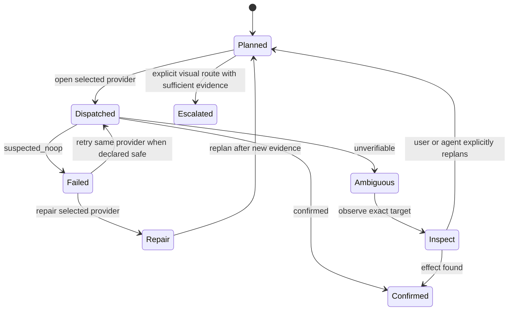

# Task-Directed Capability Routing

Uni-CLI treats task discovery and execution routing as separate decisions.
Discovery answers **which operation matches the intent**. Routing answers
**which operator and provider can execute that operation against this exact
target**. The selected provider is fixed before it is opened.

This separation prevents a website task from becoming generic computer use
merely because several providers implement verbs named `click`, `type`, or
`screenshot`.

## Operator classes

| Task evidence                                                    | Operator                | Typical provider         | Target scope     | Use when                                                                           |
| ---------------------------------------------------------------- | ----------------------- | ------------------------ | ---------------- | ---------------------------------------------------------------------------------- |
| Declared HTTP or service contract                                | `structured-api`        | HTTP, WebSocket, app API | service          | The target exposes a stable structured operation                                   |
| Browser-context JSON or renderer protocol                        | `browser-protocol`      | CDP browser              | browser renderer | Structured data exists only inside an authenticated browser context                |
| Installed executable with a typed command contract               | `native-cli`            | subprocess               | host process     | A CLI already owns the operation                                                   |
| DOM, accessibility tree, selector, CDP endpoint, or renderer ref | `browser-semantic`      | CDP browser              | browser renderer | A web or Electron UI has semantic browser structure but no suitable adapter or CLI |
| OS accessibility ref, native window id, pid, or app identity     | `desktop-accessibility` | AX, UIA, AT-SPI          | native window    | A native application has an accessibility surface but no structured API or CLI     |
| Pixels needed only as observation evidence                       | `visual-observation`    | screen capture           | renderer/desktop | The task reads pixels but performs no coordinate actuation                         |
| Pixels plus explicit coordinates or visual target evidence       | `visual-coordinate`     | Cua Driver or visual     | desktop          | The required control has no usable semantic handle                                 |
| Registry, ref store, planner, or pure transform                  | `local-runtime`         | Uni-CLI runtime          | local runtime    | The work is local selection, indexing, validation, or transformation               |

The axes stay independent.

- **Target surface** says whether the target lives on web, desktop, system, or
  mobile.
- **Operator** says how the operation is perceived and actuated.
- **Provider** names the concrete implementation.
- **Effect** classifies the external state transition.
- **Verification** says which observation can confirm the result.

A desktop application can therefore use a native CLI for one task, CDP for an
Electron renderer task, OS accessibility for a native-window task, and an
explicit visual route for a canvas-only task. The application label does not
force every task through one mechanism.

## Agent decision sequence

Agents should follow this order.

1. Run `unicli search "<intent>"` or inspect the relevant site.
2. Select the exact command contract whose arguments and effect match the task.
3. Read `execution.operator`, `execution.provider`, target scope, effect, and
   verification from discovery or `unicli describe`.
4. Bind an exact target. Durable refs, native window ids, CDP renderer
   endpoints, and process identities outrank broad app names.
5. For compute work, inspect the plan with
   `unicli compute route <operation> --params '<json>'`.
6. Execute once through the selected provider.
7. Read `meta.effect_verdict` before deciding whether replay is safe.
8. On failure, retry or repair that provider when the envelope permits it.
   Replanning and visual escalation are new explicit decisions.

When the task already fixes a hard dimension, apply it during retrieval. This
avoids filtering a short ranked list afterward.

```bash
unicli -f json search "publish release" \
  --operator native-cli \
  --surface web \
  --effect remote_resource

unicli -f json do "read research papers" \
  --operator structured-api \
  --surface web \
  --effect read \
  --max-impact background
```

MCP `unicli_search` accepts the same fields, including `operator`,
`target_surface`, `effect`, `max_interaction_impact`, `platform`, and
`allow_coordinate_actuation`. Each result returns its operation family,
operator, effect, target surface, target scope, interaction impact, and named
ranking evidence. `ranking.signals` identifies decisive site, command,
operation, intent, and operator matches without granting execution authority.

## Effect settlement

Every executed operation reaches one terminal effect verdict.

| Status           | Meaning                                                                 | Agent action                                               |
| ---------------- | ----------------------------------------------------------------------- | ---------------------------------------------------------- |
| `not_applicable` | The command contract is read-only.                                      | Consume the result normally.                               |
| `confirmed`      | An authoritative protocol response or fresh postcondition proves state. | Continue; do not replay.                                   |
| `unverifiable`   | Dispatch occurred, but external state is not proven.                    | Inspect the exact target before any replay.                |
| `suspected_noop` | Dispatch was rejected beforehand or fresh state stayed unchanged.       | Repair or retry only when the command contract permits it. |

`confirmed` is evidence-gated. A successful process exit, click receipt, or
generic HTTP `200` proves dispatch completion only. HTTP responses with
authoritative creation or deletion semantics,
committed download files, and provider-supplied fresh postconditions can confirm
an effect. Provider verdicts are parsed against a closed status/evidence
compatibility table; malformed claims are discarded and settled
conservatively.

The verdict appears in CLI AgentEnvelope metadata, MCP structured results and
computer-use evidence, transport envelopes, run records, and visual action
records. This gives every surface one replay boundary instead of relying on
provider-specific booleans.

### Web task examples

| Task                                                     | Route                      |
| -------------------------------------------------------- | -------------------------- |
| Read Hacker News through its registered HTTP operation   | structured API             |
| Read or create a GitHub release through the `gh` bridge  | native CLI                 |
| Operate an unadapted authenticated page with DOM refs    | browser semantic           |
| Capture a screenshot for visual evidence                 | visual observation         |
| Click a canvas control with no DOM or accessibility node | explicit visual coordinate |

Browser semantics and visual computer use enter only after the selected
operation and target evidence require them. Neither is an automatic response
to the word “website.”

Authentication is a separate declared precondition. A cookie or header
strategy may obtain browser-owned credentials through its auth contract. A
generic structured `fetch` does not guess a site, acquire CDP cookies, or
change auth strategy after a `401` or `403`; it returns the original HTTP
failure for repair or explicit replanning.

### Application task examples

| Task                                                     | Route                      |
| -------------------------------------------------------- | -------------------------- |
| Launch an installed app                                  | process                    |
| List and address native windows                          | platform accessibility     |
| Act on an Electron renderer with an exact CDP target     | browser semantic           |
| Click a native button identified by an AX/UIA/AT-SPI ref | platform accessibility     |
| Act on a rendered canvas region                          | explicit visual coordinate |

## Compute route contract

`compute route` is plan-only. It validates the operation and target, resolves
durable ref ownership, and returns one selection plus visible alternatives.
Every candidate reports whether the current target evidence makes it feasible.
The command opens no provider and performs no host action.

```bash
unicli -f json compute route snapshot \
  --params '{"app":"Calculator"}'

unicli -f json compute route click \
  --params '{"selector":"#submit","port":9222}'

unicli -f json compute route screenshot \
  --params '{}' \
  --via visual

unicli -f json compute route point-click \
  --params '{"x":640,"y":480,"observation":"visual-observation:<opaque>"}' \
  --via driver
```

The normal compute commands accept the same explicit route.

```bash
unicli compute snapshot --app Calculator --via native
unicli compute screenshot /tmp/figma.png --app Figma --via native
unicli -f json compute screenshot --via driver
unicli compute point-click 640 480 \
  --observation 'visual-observation:<opaque>' --via driver
unicli compute launch Calculator --via process
```

`native`, `browser`, `process`, `driver`, and `visual` select provider
families. A provider must implement the requested logical action on the current
platform. Driver and visual routes are never implicit for coordinate actions.
Both are desktop-scoped, so they reject app, window, renderer, and foreign-ref
fields that they cannot honor. Bring the intended surface to the foreground
separately, capture fresh pixels, and then issue an explicit coordinate action.
Driver session lifecycle commands are self-identifying and select only the
driver lifecycle provider.

An inline `compute screenshot --via driver|visual` returns a 256-bit opaque
`observation.ref`. `point-click`, `drag`, `point-scroll`, and `move-cursor`
require that ref. It is valid for 30 seconds, can be claimed once, and must
match the action's provider, desktop scope, and named session. Coordinates are
validated in screenshot-pixel space and transformed to provider action space
from the recorded dimensions. A screenshot written directly to `path` is an
artifact. It returns no actuation capability or observation ref.

## Selection algorithm

The planner applies hard constraints before preference.

1. Validate the requested route and operation.
2. Resolve a durable ref owner when present.
3. Reject route/ref and visual-observation provider, scope, or session
   conflicts.
4. Apply intrinsic operation constraints such as process launch and CDP
   evaluation.
5. Apply exact target evidence such as a CDP endpoint or DOM selector.
6. Select the platform-native provider for ordinary native-window operations.
7. Return `route_unavailable` when no declared provider satisfies the
   constraints.

Coordinate authority never crosses providers. The screenshot owner issues the
observation, and the same provider must claim it before opening an action
transport. Missing, expired, replayed, foreign-session, and out-of-bounds
observations fail before dispatch. Semantic refs and visual observations remain
separate capability types.

The result is lexicographic and deterministic. No provider health probe or
provider open occurs during selection, so environmental timing cannot reorder
the candidates.

## Data structures and complexity

The route planner compiles immutable provider declarations into two indexes.

- `PROFILE_BY_TRANSPORT` provides a hash lookup from provider kind to profile.
- `PROFILES_BY_ACTION` provides a posting list from logical action to implementing
  providers.

Direct selection and physical-action adaptation are expected `O(1)`. Route
explanation is `O(k)`, where `k` is the number of providers implementing one
logical action and is currently bounded by seven compute provider declarations.
The planner does not scan the adapter catalog.

Task discovery compiles the request once. The compiled plan keeps task text,
entity, cardinality, site hints, operation family, explicit operator, and
browser negation together. Capability routing and ranking therefore consume
one semantic interpretation.

Each indexed manifest or core command carries a compact feasibility profile
and a precomputed operation family. Provider ids, aliases, and phrases use
immutable lookup indexes. A symmetric-delete index proposes typo candidates at
edit distance two or less. Bounded Damerau-Levenshtein validation accepts only
one nearest provider, so an ambiguous spelling does not become a routing hint.

BM25 and TF-IDF generate the candidate posting-list union. Entity, workflow,
operation-family, and site signals adjust those candidates. Exact operation,
site, operator, target, effect, platform, coordinate-actuation, and interaction
constraints remove infeasible documents before bounded top-k selection. Live
registry commands resolve missing profiles lazily only for candidate documents,
while the generated manifest fast path uses preprojected profiles. Retrieval
score never grants execution authority.

Let `q` be request length, `p` the postings visited, `c` the resulting
candidates, and `k` the requested output size. Intent compilation is `O(q)`.
Typo resolution visits deletion variants from bounded-length query tokens and
validates only indexed candidates. Lexical accumulation is `O(p)`, feasibility
intersection is `O(c)`, and bounded top-k maintenance is `O(c log k)` with
`O(k)` heap storage and a hard limit of 25. Contract projection is cached by
registry version, so repeated feasibility checks use `O(1)` lookups.

Independent dimensions use product types. One inheritance tree cannot represent
these axes without false coupling.

```text
Operation
  × Operator
  × Provider
  × Perception
  × Actuation
  × Target scope
  × Effect
  × Verification
  × Interaction impact
```

Provider profiles hold stable provider defaults. Action bindings override
perception, actuation, verification, or interaction impact when an operation
differs from the provider default. For example, native screenshot capture
perceives pixels and uses screen capture even though the owning provider also
implements accessibility actions.

The manifest fast path preserves the same operator and effect contract as the
live adapter registry. `unicli describe` therefore distinguishes structured
HTTP, browser protocol, native CLI, browser semantic, desktop accessibility,
visual observation, visual coordinate, and local runtime commands without
loading every adapter.

## Recovery state graph

Provider recovery uses a small state graph. An ordered provider list could
silently change the selected physical capability after failure.



The transitions have different meanings.

- **Retry** repeats the same operation through the same provider.
- **Repair** restores that provider or its declared dependency.
- **Replan** produces a new route decision from new target evidence.
- **Escalation** expands perception or actuation authority and must be explicit.
- **Outcome inspection** contains ambiguous mutations before any replay.

A selected provider may reconnect or retry the same physical primitive when
that recovery is declared safe. It may not change perception or actuation
modality while retaining the old route label. In particular, an AX semantic
failure no longer enters coordinate click or background text input. Moving
from AX semantics to desktop input, CDP, or pixels requires a new explicit
route.

Provider profiles declare a recovery policy per logical-to-physical action.
Read observations and captures may use one bounded
`same-primitive-retry` after a retryable provider failure. Before the second
attempt, an optional provider hook retires only local stale state. CDP drops the
failed page connection, UIA/AT-SPI retire the failed sidecar generation, and AX
clears its warm accessibility session. The dispatcher then invokes the same
adapter instance, physical action, exact target, perception, actuation, scope,
and verification channel.

Mutations declare `strategy: none` and `max_attempts: 1`. A retryable provider
flag cannot override that rule. Every compute result carries
`recovery_trace` with provider, physical action, attempts, triggering failures,
and whether recovery succeeded. Route explanation exposes the policy before
execution, while CLI metadata, MCP computer-use results, and visual evidence
expose the trace afterward.

Pipeline `fallback` is rejected at compile time. Alternative strategies must be
separate ranked operations with independent contracts; execution never changes
provider or operator under the original operation identity.

## Source boundaries

| Concern                                           | Owning source                       |
| ------------------------------------------------- | ----------------------------------- |
| Intent compilation and substrate requirements     | `src/discovery/intent-plan.ts`      |
| Lexical, semantic, and top-k ranking              | `src/discovery/search.ts`           |
| Site identity and bounded typo resolution         | `src/discovery/site-resolver.ts`    |
| Candidate contract feasibility                    | `src/discovery/feasibility.ts`      |
| Task-facing operator projection                   | `src/core/operator-model.ts`        |
| Compute provider declarations and indexes         | `src/transport/routing.ts`          |
| Exact target binding and single-provider dispatch | `src/transport/compute-dispatch.ts` |
| Legal step/provider membership                    | `src/transport/capability.ts`       |
| Exact provider registry                           | `src/transport/bus.ts`              |
| Command effect metadata                           | adapter command or CLI registration |
| Route explanation                                 | `unicli compute route`              |
| Executed route evidence                           | computer-use visual action evidence |

The capability matrix records which providers can implement a step. It is
order-free. `TransportBus.require(step)` succeeds only when exactly one
registered provider is possible; ambiguous step-only lookup requires the
caller to provide a route decision.

## Conformance expectations

A provider or new operator is ready when it supplies the following contracts.

1. A declared operator, perception, actuation, target scope, verification
   channel, interaction impact, and logical-to-physical action bindings.
2. Exact target identity rules and ref ownership.
3. Structured failures that preserve the selected provider.
4. Tests proving visual control is not selected implicitly.
5. Tests proving a provider failure does not call another provider.
6. Route-explanation coverage for intrinsic, exact-target, ref-owned, explicit,
   and unavailable cases.
7. Real smoke evidence on each supported host where the provider performs
   native effects.
8. Effect-verdict conformance proving that a dispatch receipt cannot become a
   confirmed mutation.
9. Coordinate conformance proving observation refs are single-use and bound to
   provider, scope, session, TTL, and screenshot bounds.

See [Compute](compute.md), [Focus Behavior](focus-behavior.md), and
[Troubleshooting](troubleshooting.md) for command and provider details.
