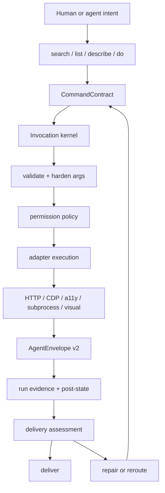

<!-- Generated from docs/ARCHITECTURE.md. Do not edit this copy directly. -->

# Architecture

- Canonical: https://olo-dot-io.github.io/Uni-CLI/ARCHITECTURE
- Markdown: https://olo-dot-io.github.io/Uni-CLI/markdown/ARCHITECTURE.md
- Section: Explanation

Uni-CLI is the bridge between agents and real software. The stable product
primitive is not a browser session, a protocol server, or a generated tool list.
It is a searchable command contract that can be invoked, governed, observed,
recorded, repaired, and re-exposed through multiple agent runtimes.

The current generated catalog is the source of truth:
**<span><!-- STATS:site_count -->311<!-- /STATS --></span> sites**,
**<span><!-- STATS:command_count -->1756<!-- /STATS --></span> commands**,
**<span><!-- STATS:adapter_count_total -->1212<!-- /STATS --></span> adapters**,
**<span><!-- STATS:pipeline_step_count -->103<!-- /STATS --></span> pipeline steps**,
and **<span><!-- STATS:test_count -->8967<!-- /STATS --></span> tests** in v0.224.0.

## Architectural Thesis

Agents already have a shell. Uni-CLI should make that shell an operating layer
for websites, logged-in browser state, desktop apps, local tools, system
capabilities, and protocol servers.

The correct loop is:

1. Discover the smallest useful operation by intent.
2. Inspect its command contract, args, auth posture, effect, and risk.
3. Execute through the shared invocation kernel.
4. Return a structured envelope with data, evidence, retryability, and next
   actions.
5. Diagnose failure into auth, policy, upstream drift, missing context,
   environment trouble, or adapter defect.
6. Repair or reroute through a bounded verification command.
7. Reuse the repaired command from CLI, MCP, ACP, docs, skills, and scripts.

That loop is the product. Everything else is a wrapper, transport, authoring
tool, or documentation surface around it.

## Priority Model

### First-Class Citizens

These are product roots. They must stay small, testable, and shared by every
surface.

| Priority | Surface             | Contract                                                                        |
| -------- | ------------------- | ------------------------------------------------------------------------------- |
| P0       | Command contract    | Site, command, args, output, auth, safety, capability, source path, repair path |
| P0       | Invocation kernel   | Validate, harden, authorize, execute, observe, envelope                         |
| P0       | Local computer use  | Native accessibility/CDP/subprocess/visual cascade for installed software       |
| P0       | Evidence loop       | AgentEnvelope v2, run traces, post-state evidence, delivery trajectory          |
| P1       | Discovery           | `search`, `list`, `describe`, `do`, generated catalog, docs index               |
| P1       | Adapter authoring   | YAML first, TypeScript escape hatch, schema-v2 lint, repair verification        |
| P1       | Governance          | Permission profiles, deny rules, approvals, safety metadata                     |
| P1       | Repair and delivery | Adapter repair, health gates, objective-level delivery assessment               |
| P2       | Protocol exposure   | MCP, ACP, streamable HTTP, agent packs, skills export                           |
| P2       | Broad catalog scale | Hundreds of site commands, vertical meta-commands, external CLI hub             |
| P2       | Public docs UI      | Homepage, catalog, lifecycle visualizations, compute evidence demo              |

### Second-Class Citizens

Second-class does not mean unimportant. It means these surfaces must not define
the architecture or fork semantics.

- Expanded MCP mode is opt-in; the default agent surface stays compact.
- Visual control is a real fallback only when it can see, act, and verify.
- Browser UI automation is not the first transport when API, CDP, app API,
  accessibility, or subprocess control exists.
- TypeScript adapters are for cases where YAML pipeline primitives are not
  enough.
- External CLI passthrough is a bridge to mature tools, not a replacement for
  command contracts.
- Generated public files under `docs/public/` are build artifacts, not hand-edited
  architecture sources.

## System Tree

```text
Uni-CLI
|-- Product surfaces
|   |-- Native CLI: src/cli.ts, src/main.ts, src/commands/*
|   |-- MCP: src/mcp/*, src/mcp/profiles/computer-use.ts
|   |-- ACP: src/commands/acp.ts, src/protocol/*
|   |-- Streamable HTTP: src/mcp/streamable-http/*
|   |-- Agent packs and skills: src/commands/agents.ts, scripts/build-agents.ts
|   `-- Public docs: docs/, docs/.vitepress/theme/*
|
|-- Discovery and catalog
|   |-- Runtime registry: src/registry.ts
|   |-- Command contracts: src/core/command-contract.ts
|   |-- Schema v2: src/core/schema-v2.ts
|   |-- BM25 search: src/discovery/search.ts
|   |-- Core catalog: src/discovery/core-catalog.ts
|   |-- Aliases and categories: src/discovery/aliases.ts
|   `-- Generated manifests: registry.json, stats.json, server.json
|
|-- Invocation kernel
|   |-- Compile and cache: src/engine/kernel/compile.ts
|   |-- Input stages: src/engine/kernel/stages.ts
|   |-- Execution: src/engine/kernel/execute.ts
|   |-- Compatibility export: src/engine/invoke.ts
|   |-- Args and hardening: src/engine/args.ts, src/engine/harden.ts
|   |-- Policy runtime: src/engine/permission-runtime.ts
|   `-- Output envelope: src/output/*
|
|-- Adapter runtime
|   |-- Loader: src/discovery/loader.ts
|   |-- YAML pipeline executor: src/engine/executor.ts
|   |-- Step registry: src/engine/step-registry.ts
|   |-- Built-in steps: src/engine/steps/*
|   |-- Repair engine: src/engine/repair/*
|   |-- Health, lint, migrate, generate: src/commands/{health,lint,migrate*,generate}.ts
|   `-- Catalog: src/adapters/<site>/<command>.yaml or .ts
|
|-- Transport layer
|   |-- Transport bus: src/transport/bus.ts
|   |-- Browser/CDP: src/transport/adapters/cdp-browser.ts
|   |-- Desktop accessibility: src/transport/adapters/desktop-ax.ts
|   |-- Windows UIA: src/transport/adapters/desktop-uia.ts
|   |-- Linux AT-SPI: src/transport/adapters/desktop-atspi.ts
|   |-- Subprocess bridge: src/transport/adapters/subprocess.ts
|   |-- Visual fallback: src/transport/adapters/visual.ts
|   `-- Native sidecars: crates/unicli-uia, crates/unicli-atspi
|
|-- Local computer use
|   |-- CLI surface: src/commands/compute.ts, src/commands/doctor-compute.ts
|   |-- Action executor: src/compute/action-execution.ts
|   |-- Capture packet: src/compute/capture.ts
|   |-- Cascade order: src/transport/cascade.ts
|   |-- Ref store: src/transport/refs.ts
|   |-- Platform overlays: src/compute/platform-overlays.ts
|   |-- macOS HUD: src/compute/macos-overlay.ts
|   |-- Windows HUD: src/compute/windows-overlay.ts
|   |-- Linux HUD: src/compute/linux-overlay.ts
|   `-- Visual action evidence: src/compute/visual-timeline.ts
|
|-- Browser operations
|   |-- Daemon and launcher: src/browser/daemon.ts, src/browser/launcher.ts
|   |-- Session runtime: src/browser/session-runtime.ts
|   |-- Auth sync and cookies: src/browser/auth-sync.ts, src/engine/cookies.ts
|   |-- Page actions and snapshots: src/browser/page.ts, src/browser/snapshot.ts
|   |-- Network and record: src/browser/network-cache.ts, src/commands/record.ts
|   `-- Evidence: src/engine/browser/action-evidence.ts
|
|-- Delivery and repair loop
|   |-- Run recording: src/engine/session/*
|   |-- Replay and compare: src/commands/runs.ts, src/engine/session/replay.ts
|   |-- Objective state: src/engine/delivery/*
|   |-- Operator CLI: src/commands/delivery.ts
|   |-- Adapter repair: src/commands/repair.ts, src/engine/repair/*
|   `-- Eval and probes: src/commands/eval.ts, tests/integration/*
|
|-- Extensibility
|   |-- User adapters: ~/.unicli/adapters
|   |-- Plugins: src/plugin/*
|   |-- Custom steps: src/plugin/step-registry.ts
|   |-- External CLI hub: src/hub/*
|   `-- MCP server package: src/bin/unicli-mcp.ts
|
`-- Verification and release
    |-- Unit tests: tests/unit/*
    |-- Adapter tests: tests/adapter/*
    |-- Integration tests: tests/integration/*
    |-- Perf tests: tests/perf/*
    |-- Build and stats scripts: scripts/*
    |-- Boundary guard: scripts/boundary-guard.ts
    `-- Full release gate: npm run verify
```

## Runtime Flow



The invariant is that CLI, MCP, ACP, and HTTP wrappers must not implement their
own semantics. They resolve inputs, call the same kernel, and render the same
envelope.

## Command Lifecycle

### 1. Create

YAML is the default authoring unit because it is cheap for agents to inspect,
patch, and verify.

Creation paths:

- `unicli init` scaffolds adapters.
- `unicli record`, `explore`, `synthesize`, and `generate` discover candidate
  browser/API paths.
- TypeScript adapters use `cli()` only when a finite YAML pipeline is the wrong
  tool.
- Plugins and user adapters register into the same runtime registry.

Creation requirements:

- Declare args, output columns, target surface, capability needs, auth strategy,
  trust/confidentiality metadata, and repair source path.
- Prefer one command per reusable user operation.
- Put site-specific complexity in the adapter, not in the protocol wrappers.
- Add or update tests when the command is first-class, write-capable, or used by
  a vertical meta-command.

### 2. Discover

Discovery is a first-class runtime, not only documentation.

Discovery surfaces:

- `unicli search "<intent>"` for natural-language routing.
- `unicli list` for inventory and filtering.
- `unicli describe <site> <command>` for contracts.
- `unicli do "<intent>"` for a best-fit execution plan.
- Public docs catalog and generated `llms.txt`.
- MCP meta-tools: `unicli_search`, `unicli_list`, `unicli_run`,
  `unicli_explore`.

Discovery must optimize for a large command catalog by keeping the default
resident surface small. The agent should search or describe before loading the
full registry.

### 3. Invoke

Invocation goes through the same kernel regardless of wrapper:

1. Resolve site and command from the registry.
2. Resolve args from stdin JSON, `--args-file`, flags, positionals, and defaults.
3. Validate against the adapter input schema.
4. Harden paths, selectors, IDs, shell-sensitive values, and URLs.
5. Evaluate permission profile, deny rules, approval memory, and operation risk.
6. Execute YAML pipeline or TypeScript function.
7. Normalize result into `AgentEnvelope v2`.
8. Record usage and optional run trace.

This path protects the product from drift between CLI, MCP, ACP, and docs.

### 4. Observe

Observation is what turns a tool call into evidence.

- Every result has command context, duration, surface, data, error, retryability,
  and next actions.
- Browser actions can attach pre/post evidence, target identity, movement data,
  and stale-reference diagnostics.
- Computer-use actions can attach `visual_action`, target point, overlay status,
  dispatch result, and post-action capture.
- `--record` writes append-only local traces under the run store.
- Replay, compare, eval, and delivery consume these traces rather than inventing
  a parallel audit model.

### 5. Repair

Repair is bounded by source path and verification command.

Failure envelopes must expose:

- error code and message;
- `adapter_path`;
- failing step or boundary;
- suggestion;
- retryability;
- alternatives;
- relevant auth, policy, or platform gap.

Repair flow:

1. Reproduce the failure.
2. Read the named adapter or runtime boundary.
3. Patch the real source, not the symptom.
4. Re-run the same failing command or adapter test.
5. Broaden to the nearest adjacent suite.
6. Record the result in progress, findings, or the run trace.

### 6. Publish

Release builds regenerate manifests, docs, stats, agents assets, and public
indices. Written counts are secondary to generated artifacts. `unicli list`,
`stats.json`, `registry.json`, and build outputs are more authoritative than
hand-maintained tables.

## Local Computer Use

Local Computer Use is a P0 product root because agents must operate installed
software, not only web pages.

The preferred execution order is:

1. Stable app API, file format, local CLI, or service endpoint.
2. Electron/CDP or application debug protocol.
3. Native accessibility tree with semantic refs.
4. Scoped background input to a known app/window/ref.
5. Visual planning plus action verification.

Visual control is not a decorative cursor. It is valid only when the evidence
packet proves what target was resolved, what overlay plan was rendered, which
transport dispatched the action, and what post-state was observed.

Current compute surface:

- `compute apps`, `windows`, `snapshot`, `capture`, `find`;
- `compute click`, `type`, `press`, `scroll`, `launch`, `screenshot`;
- `compute attach`, `eval`, `wait`, `observe`, `assert`;
- `doctor compute` for transport and overlay availability;
- MCP `computer-use` profile for agent callers.

## Public Front-End

The docs front-end is not a marketing landing page. It is an operator console
and learning surface for the command lifecycle.

First viewport priorities:

1. State the product: operations substrate for agents that use real software.
2. Show the smallest real command path.
3. Expose catalog scale without making command count the main claim.
4. Send users to install, catalog, repair, and agent integration routes.
5. Show Local Computer Use as a first-class capability, including evidence.

The public UI should keep these components honest:

- `HomePage.vue`: positioning, install path, capability overview.
- `CommandLifecycleIsland.vue`: discover -> execute -> evidence -> repair loop.
- `ComputeCursorDemo.vue`: visual replay backed by a checked-in
  `visual_action` fixture, not a detached animation.
- `SiteCatalog.vue` and `SiteStats.vue`: generated catalog inspection.
- `llms.txt` and `docs/public/markdown/*`: agent-readable mirrors generated by
  build scripts.

## Removal And Consolidation Targets

These are architecture cleanup targets, not immediate deletions without tests.

| Target                                       | Why                                    | Safe direction                                               |
| -------------------------------------------- | -------------------------------------- | ------------------------------------------------------------ |
| Wrapper-specific semantics                   | Causes CLI/MCP/ACP drift               | Move behavior into CommandContract and kernel stages         |
| Regex-based TS adapter stub extraction       | Fragile metadata discovery             | Prefer explicit registration metadata or generated contracts |
| Internal imports from `src/engine/invoke.ts` | Compatibility shim hides owner modules | New code imports kernel modules directly                     |
| Hand-maintained counts in docs               | Drift from generated artifacts         | Use stats replacement scripts only                           |
| Expanded MCP as default                      | Too much resident context              | Keep compact/deferred profile first                          |
| Visual-first control language                | Encourages brittle automation          | Require structured substrate before visual fallback          |
| Adapter health theater                       | Passing load is not working behavior   | Health gates must run real owned runner/probe surfaces       |
| Generated public docs edits                  | Source of truth is upstream docs files | Edit `docs/` sources, regenerate `docs/public/`              |

## Design Options For The Rebuild

### Option A: Rewrite Everything Around One Autonomous Orchestrator

This creates a conceptually clean root, but the blast radius is too large. It
would touch registry, adapters, browser, compute, repair, delivery, docs,
protocols, and persistence at once.

### Option B: Keep Adding Commands And Adapters

This preserves momentum but leaves architecture pressure unresolved. Breadth
without a stricter lifecycle makes discovery, verification, and repair harder.

### Option C: Rebuild Around A Command Lifecycle Spine

This keeps the existing broad catalog and runtime, but makes
create -> discover -> invoke -> observe -> repair -> publish the explicit
architecture spine. Each subsystem can be simplified against that lifecycle.

Chosen direction: **Option C**. It matches the current code shape and gives the
team a safe path to remove drift without freezing feature work.

## Optimization Roadmap

### Step 1: Freeze The Spine

- Treat `CommandContract` as the metadata source for docs, MCP, ACP, agent
  packs, repair, and benchmarks.
- Add parity tests whenever a wrapper gains behavior.
- Keep default MCP compact and search-driven.

### Step 2: Make Compute A Product Root

- Keep `compute` independent from website adapter assumptions.
- Preserve the action evidence contract across CLI and MCP.
- Run native smokes on each platform before claiming cross-OS support.
- Keep visual overlay optional until platform labs prove it reliable.

### Step 3: Normalize Adapter Authoring

- Prefer YAML for finite operations.
- Require `schema-v2` metadata and command contracts.
- Replace fragile metadata scraping with explicit contracts.
- Gate first-class adapters with real runner, fixture, or live smoke evidence.

### Step 4: Collapse Drift Between Surfaces

- CLI, MCP, ACP, HTTP, docs, and skills read the same contract projection.
- Remove wrapper-only descriptions, safety hints, and schema copies.
- Keep generated public docs and agent assets reproducible from source.

### Step 5: Close The Delivery Loop

- Treat `delivery` as the objective-level loop above individual invocations.
- Route adapter repair through delivery when the failure is repairable.
- Keep auth, policy, environment, upstream, and missing-context states explicit.
- Record trajectories, not just final green commands.

### Step 6: Raise The Public Front-End Bar

- Use the docs UI to teach the command lifecycle, not just list features.
- Keep Local Computer Use visible as a first-class bridge.
- Use real fixtures for demos and catalog data.
- Verify docs build and at least one browser screenshot after visual changes.

## Verification Ladder

Use the smallest credible ladder for the claim under change:

| Claim                              | Minimum evidence                                                      |
| ---------------------------------- | --------------------------------------------------------------------- |
| Pure contract or metadata function | Unit test plus typecheck                                              |
| CLI/MCP/ACP parity                 | Wire parity test over the same command                                |
| Adapter behavior                   | `unicli test <site>` or adapter runner with real owned code           |
| Browser/session behavior           | Browser evidence test or live daemon smoke                            |
| Local computer-use behavior        | `doctor compute`, snapshot/find/action smoke, post-capture evidence   |
| Public docs UI                     | `npm run docs:build` plus screenshot/visual inspection for UI changes |
| Release readiness                  | `npm run verify`                                                      |

## Done Definition

A system change is done only when:

- the changed behavior has a falsifiable claim;
- the relevant source files and tests were observed before editing;
- a failing or proving experiment was run;
- root cause and design choice were recorded;
- implementation changed the real boundary;
- original and adjacent verification passed;
- docs, progress, and generated surfaces were updated when their truth changed;
- hack-risk is explicitly reported.

For this repository, the normal local gate remains:

```bash
npm run typecheck && npm run lint && npm test
```

The full release gate remains:

```bash
npm run verify
```
