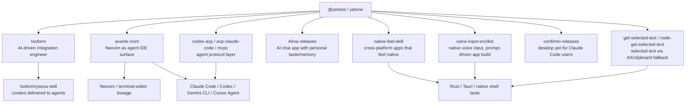

# 2026-05-21 — Yetone-Centered Taste Map For Uni-CLI Positioning

This is an internal reference note, not public README copy.

## Source Posture

Primary X access was partially blocked. The public `x.com/yetone` page was readable through Jina Reader, but `with_replies`, search result pages, and following pages returned login walls or generic X error pages. `opencli twitter` and `unicli twitter` could import cookies but still returned either `auth_required`, empty timelines, or pre-navigation aborts for several read paths. Because of that, the reply graph below is an evidence-backed first cut, not a complete X interaction graph.

The stronger evidence comes from:

- X public profile/posts page: <https://x.com/yetone>
- GitHub profile: <https://github.com/yetone>
- Yetone repositories and release feeds: <https://github.com/yetone>
- Isoform org metadata: <https://github.com/Isoform>

## Observable Taste Signals

| Signal | Evidence | Interpretation For Uni-CLI |
| --- | --- | --- |
| Native-feel over web-wrapper compromise | `native-feel-skill` frames its thesis as refusing the trade-off between cross-platform development and near-native performance. | We should not position as "make websites into CLIs." That sounds wrapper-ish. We should position as an execution substrate that preserves native affordances where possible. |
| Small, fast, real apps | X public posts highlight OpenAI Translator moving from Electron to Tauri and shrinking app size from 100MB+ to 5MB+. | Avoid generic "browser automation platform" language. Emphasize low-resident-token, local-first, policy/evidence, native transports, and boring process boundaries. |
| Agent UX belongs inside serious tools, not toy chat shells | `avante.nvim` argues that terminal agent CLIs inherit TUI limits and that Neovim already solves prompt/code interaction ergonomics. | Uni-CLI should not compete as another agent UI. It should be the command substrate behind editors, CLIs, MCP/ACP, skills, and local runtimes. |
| Skill-first knowledge delivery | `native-feel-skill` and Isoform `yansu-skill` both package taste/context as agent-consumable skills. | We should describe generated skills and LLM-facing docs as first-class distribution surfaces, not side docs. |
| Agent-native desktop and local control | Repos include `voice-input-src`, `get-selected-text`, `accessibility-ng`, `tauri-nspanel`, `confirmo-releases`, `alma-releases`. | The strongest differentiation is local app operation + computer use + accessibility + evidence, not just web adapters. |
| CLI is useful when it composes, not when it becomes a new silo | Repos include `ctxgrep`, `smart-suggestion`, `metaclaw`, `codex-acp`, `acp-claude-code`, `mcpc`, `Claudable` forks. | Uni-CLI should talk about command contracts, adapter repair, and protocol re-exposure. It should avoid "one more CLI catalog" as the headline. |

## Relationship Graph

## What This Says About Current Taste

The taste is not "AI can click the web." That is already table stakes and, by itself, feels cheap. The taste is closer to:

1. **Local-first agency**: agents should operate the user's real environment, not just remote SaaS pages.
2. **Native-first fallbacks**: use platform APIs, accessibility trees, CDP, subprocesses, and typed contracts before visual last-mile control.
3. **Receipts over demos**: every operation should return a replayable, inspectable artifact.
4. **Skills and protocols as packaging**: the same capability should become CLI, MCP, ACP, skill, and LLM-facing docs without rewriting.
5. **Small surfaces, deep behavior**: fewer resident tools, richer command metadata, better repair loops.
6. **Editor/agent convergence**: agent UX should plug into serious existing environments, not force users into a novelty UI.

## Positioning Implication

OpenCLI and CLI-Anything are easy to frame as "site-to-command" or "software-to-CLI" projects. That framing makes them look like adapter generators or browser wrappers. Uni-CLI should move up one level:

> Uni-CLI is the agent operations substrate for real software.

This is stronger than "CLI surface" because it names the layer, not the interface. It is still grounded in actual capabilities:

- web adapters and browser sessions;
- local computer use and desktop transports;
- policy profiles and evidence;
- AgentEnvelope v2;
- self-repairing adapter paths;
- CLI, MCP, ACP, skills, and LLM indexes from one catalog.

## Suggested Public Positioning

Hero line:

> The operations substrate for agents that use real software.

Subline:

> Uni-CLI turns websites, browsers, desktop apps, local tools, MCP servers, and system capabilities into searchable, governed, repairable operations.

Tag:

> Search by intent. Execute with policy. Return evidence. Repair the failing step. Reuse the same capability everywhere.

Contrast block:

| They sell | We should say |
| --- | --- |
| "Make any website a CLI" | Websites are only one surface. Real agent work crosses browser, desktop, subprocess, protocol, and OS boundaries. |
| "Generate a CLI for any app" | Generation is not enough. Agents need policy, output contracts, evidence, replay, and repair. |
| "Thousands of tools" | Resident tool count is a tax. Searchable operations and compact catalogs are the product. |
| "Browser automation" | Browser control is fallback and last-mile glue. Native/semantic routes should win first. |

## Missing Data

To build the "large detailed replies and relationship graph" the user asked for, we still need one of:

- a working X login session readable by `opencli twitter` or `bb-browser`;
- a user-provided X archive/export;
- a scrapeable public mirror with replies and quote tweets;
- a paid/authorized X API path.

Without that, it would be dishonest to claim a full reply graph. The current graph is built from public profile posts plus GitHub/project relationships.
